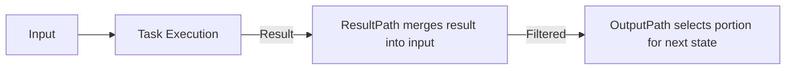

Great question—this is one of those subtle but crucial distinctions in AWS Step Functions that makes workflows flexible.  

---

🔑 Difference Between ResultPath and OutputPath

ResultPath
- Purpose: Controls where the result of a state’s task is inserted into the state’s input.  
- Behavior:
  - If you set ResultPath to a JSON path, the task’s output will be placed at that path inside the input.  
  - If you set it to null, the task’s result is discarded and the input passes through unchanged.  
- Analogy: Think of it as merging the task’s result into the input payload.  

Example:
```json
"ResultPath": "$.taskResult"
```
If the input is:
```json
{ "orderId": 123 }
```
and the task returns:
```json
{ "status": "processed" }
```
then the merged output becomes:
```json
{ "orderId": 123, "taskResult": { "status": "processed" } }
```

---

OutputPath
- Purpose: Controls what portion of the state’s final JSON output is passed to the next state.  
- Behavior:
  - Filters the merged input+result before passing it downstream.  
  - If set to $, the entire payload is passed.  
  - If set to a specific path, only that portion is passed.  
- Analogy: Think of it as trimming the payload before handing it off.  

Example:
```json
"OutputPath": "$.taskResult.status"
```
From the previous merged output:
```json
{ "orderId": 123, "taskResult": { "status": "processed" } }
```
the next state would only receive:
```json
"processed"
```

---

🧩 Putting It Together
- ResultPath = Where do I put the task’s result inside the input?  
- OutputPath = What part of the final payload do I send forward?  

---

📐 Visual Flow


---

👉 In practice, you often use ResultPath to enrich the payload with new data, and OutputPath to slim down what the next state sees.  

