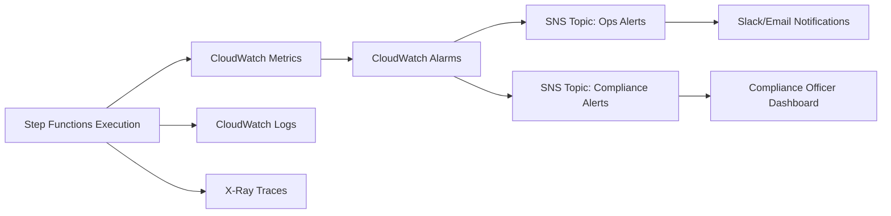

Here’s how you can extend the resilient, governance-enabled Step Functions workflow into a full observability stack—tying in CloudWatch, X-Ray, and SNS/Slack notifications for end-to-end visibility.  

---

🔎 Observability Layers

1. CloudWatch Metrics & Logs
- Metrics: Track executions, retries, failures, compliance escalations.  
- Logs: Capture state transitions, inputs/outputs, retry attempts.  
- Alarms: Trigger alerts when thresholds are exceeded (e.g., too many failures in 5 minutes).  

2. AWS X-Ray Tracing
- Enable X-Ray in Step Functions → provides distributed tracing across Lambda, DynamoDB, S3, etc.  
- Trace Maps: Show latency hotspots (e.g., slow payment processing).  
- Annotations: Add claim IDs, decision outcomes for searchable traces.  

3. SNS Notifications
- Ops Alerts: SNS topic for operational failures (e.g., retries exceeded).  
- Compliance Alerts: SNS topic for escalations to ComplianceAuditQueue.  
- Integration: SNS can push to email, SMS, or Slack via webhook.  

---

📐 Visual Observability Flow


---

🛠 Example Configurations

Step Functions with X-Ray
```json
{
  "tracingConfiguration": {
    "enabled": true
  }
}
```

SNS Notification for Compliance
```hcl
resource "awssnstopic" "compliance_alerts" {
  name = "ComplianceAlerts"
}

resource "awscloudwatchmetricalarm" "complianceescalations" {
  alarm_name          = "StepFunctionsComplianceEscalations"
  comparison_operator = "GreaterThanThreshold"
  evaluation_periods  = 1
  metric_name         = "ExecutionsFailed"
  namespace           = "AWS/States"
  period              = 300
  statistic           = "Sum"
  threshold           = 10
  alarmactions       = [awssnstopic.compliancealerts.arn]
}
```

Slack Integration via SNS
- Create an HTTPS endpoint (Slack webhook).  
- Subscribe Slack webhook to the SNS topic.  
- Compliance officers get real-time Slack alerts when claims escalate.  

---

✅ Benefits of Full Observability
- Ops Visibility: Engineers see retries, latencies, and bottlenecks in X-Ray.  
- Compliance Oversight: Regulators get notified of anomalies in real time.  
- Audit Trail: Logs + traces provide forensic evidence for every claim.  
- Resilience: Alerts prevent silent failures, ensuring no claim is lost.  

---

Would you like me to show a complete architecture diagram (Mermaid) that ties together Step Functions, Lambda, DynamoDB, S3, CloudWatch, X-Ray, and SNS/Slack? That would give you a holistic view of the observability-enabled pipeline.
