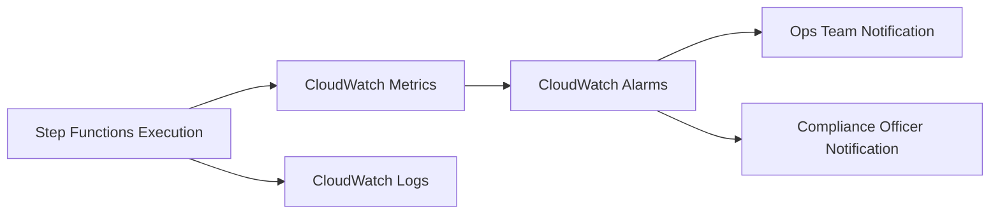

Here’s how we can add monitoring hooks to the resilient, governance-enabled workflow so you can track retries, failures, and compliance escalations in real time using CloudWatch metrics and alarms.  

---

🏥 Enhanced Workflow with Monitoring

In Step Functions, you don’t embed CloudWatch alarms directly into the state machine JSON. Instead, you configure CloudWatch metrics, logs, and alarms tied to the workflow’s executions. Here’s how it behaves:

CloudWatch Metrics
- ExecutionsStarted → Counts how many claims batches begin.  
- ExecutionsSucceeded → Counts successful runs.  
- ExecutionsFailed → Counts failures routed to ComplianceAuditQueue.  
- ExecutionsTimedOut → Tracks timeouts.  
- Retries → Each retry attempt is logged.  

CloudWatch Logs
- Every state transition (input, output, error, retry) is logged.  
- You can enable Data Logging to capture payloads for compliance audits.  

CloudWatch Alarms
You can set alarms on key metrics:
- High Failure Rate: If ExecutionsFailed > 5 in 1 minute, trigger an alert.  
- Excessive Retries: If Retries > 20 in 5 minutes, alert operations.  
- Compliance Escalations: If ComplianceAuditQueue is invoked more than a threshold, notify compliance officers.  

---

📐 Visual Monitoring Flow


---

✅ Behavior with Monitoring Hooks
- Retries: Logged with exponential backoff details.  
- Failures: Escalated to ComplianceAuditQueue and counted in CloudWatch.  
- Alerts: Ops team notified if retries spike (possible service degradation).  
- Compliance: Regulators notified if audit queue receives too many claims.  

---

🔎 Example Alarm (Terraform/IaC Style)
```hcl
resource "awscloudwatchmetricalarm" "highfailures" {
  alarm_name          = "StepFunctionsHighFailures"
  comparison_operator = "GreaterThanThreshold"
  evaluation_periods  = 1
  metric_name         = "ExecutionsFailed"
  namespace           = "AWS/States"
  period              = 60
  statistic           = "Sum"
  threshold           = 5
  alarm_actions       = ["arn:aws:sns:region:account:OpsAlerts"]
}
```

---

🌐 Governance + Resilience + Monitoring
- Governance Layer → Ensures anomalies are captured.  
- Resilience Layer → Retries transient errors before escalation.  
- Monitoring Layer → Provides visibility, alerts, and compliance oversight.  

---

Would you like me to extend this into a full observability stack—tying Step Functions into AWS X-Ray for tracing and SNS/Slack notifications for real-time compliance alerts? That would give you end-to-end visibility across retries, failures, and audit escalations.
