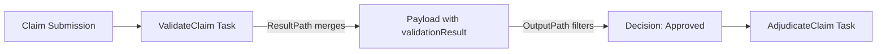

Perfect—let’s ground this in a healthcare claim processing workflow where both ResultPath and OutputPath are used to enrich and filter state data.  

---

🏥 Real-World Example: Claim Validation Workflow

Workflow Goal
- Receive a claim submission.  
- Validate it against business rules.  
- Enrich the payload with validation results.  
- Pass only the decision outcome downstream for adjudication.  

---

JSON Snippet
```json
{
  "StartAt": "ValidateClaim",
  "States": {
    "ValidateClaim": {
      "Type": "Task",
      "Resource": "arn:aws:lambda:region:account:function:ValidateClaim",
      "ResultPath": "$.validationResult",
      "OutputPath": "$.validationResult.decision",
      "Next": "AdjudicateClaim"
    },
    "AdjudicateClaim": {
      "Type": "Task",
      "Resource": "arn:aws:lambda:region:account:function:AdjudicateClaim",
      "End": true
    }
  }
}
```

---

Step-by-Step Behavior
1. Input Payload (from submission):
  ```json
   { "claimId": "C123", "amount": 5000 }
   ```

2. Lambda Output (validation result):
  ```json
   { "decision": "Approved", "errors": [] }
  ```

3. ResultPath Merge ($.validationResult):
   ```json
   {
     "claimId": "C123",
     "amount": 5000,
     "validationResult": { "decision": "Approved", "errors": [] }
   }
   ```

4. OutputPath Filter ($.validationResult.decision):
  ```json
   "Approved"
   ```

5. AdjudicateClaim State receives only "Approved" as input.  

---

📐 Visualizing the Flow


---

✅ Why This Matters in Regulated Workflows
- ResultPath ensures the full audit trail (claim + validation details) is preserved for compliance.  
- OutputPath ensures downstream states only see what they need (decision outcome), reducing payload size and complexity.  
- This separation supports governance: auditors can review enriched payloads, while business logic stays lean.  

---
