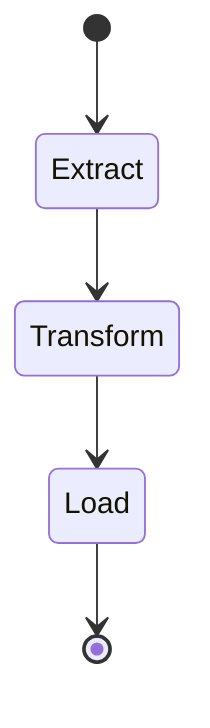

---

🔑 Core Concepts
- State Machine: A workflow definition written in Amazon States Language (JSON-based).
  
- States: Each step in the workflow. Types include:
  - Task: Executes a unit of work (e.g., Lambda function, API call).  
  - Choice: Branching logic based on conditions.  
  - Parallel: Run multiple branches simultaneously.  
  - Wait: Introduce delays.  
  - Fail/Succeed: Explicitly end workflows.  
- Execution: A running instance of a workflow.  

---

🚀 Key Benefits
- Visual Orchestration: Drag-and-drop Workflow Studio for designing workflows.  
- Error Handling & Retries: Built-in retry logic, catch blocks, and fallback states.  
- Scalability: Serverless—no infrastructure to manage.  
- Integration: Works with Lambda, S3, DynamoDB, SageMaker, ECS, and more.  
- Auditability: Logs every state transition for compliance and debugging.  

---

📊 Example Use Cases
- Data Pipelines: ETL workflows pulling from S3, transforming with Lambda, storing in RDS/DynamoDB.  
- Microservices Orchestration: Coordinate multiple APIs with retries and error handling.  
- Machine Learning: Automate training, validation, and deployment pipelines.  
- Incident Response: Trigger workflows via EventBridge for automated remediation.  

---

🛠 Example Workflow (JSON Snippet)
```json
{
  "Comment": "Simple ETL Workflow",
  "StartAt": "Extract",
  "States": {
    "Extract": {
      "Type": "Task",
      "Resource": "arn:aws:lambda:region:account:function:ExtractData",
      "Next": "Transform"
    },
    "Transform": {
      "Type": "Task",
      "Resource": "arn:aws:lambda:region:account:function:TransformData",
      "Next": "Load"
    },
    "Load": {
      "Type": "Task",
      "Resource": "arn:aws:lambda:region:account:function:LoadData",
      "End": true
    }
  }
}
```

---

📐 Visualizing with Mermaid
Here’s a simplified diagram of a Step Functions ETL pipeline:



---

⚠️ Challenges & Trade-offs
- Cost: Charged per state transition; complex workflows can add up.  
- Latency: Each state adds overhead compared to direct service calls.  
- Complexity: Large workflows may require modular design for maintainability.  

---

✅ Best Practices
- Use modular workflows (nested state machines) for clarity.  
- Apply retry policies with exponential backoff for resilience.  
- Leverage Choice states for dynamic branching.  
- Store workflow definitions in version-controlled repositories for governance.  

---

Would you like me to walk you through building a real-world workflow (e.g., a healthcare claim processing pipeline using Step Functions with Lambda, DynamoDB, and S3)? That would tie directly into your interest in regulated document workflows.
