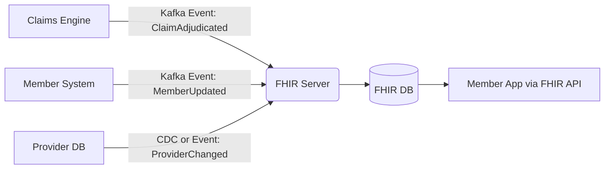
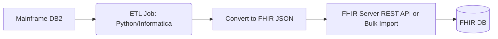
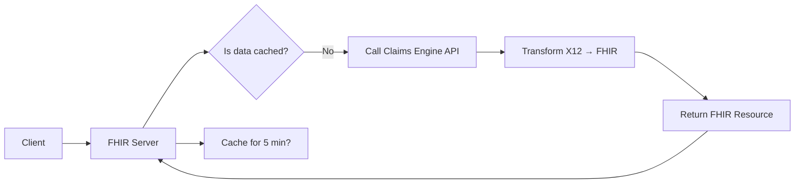
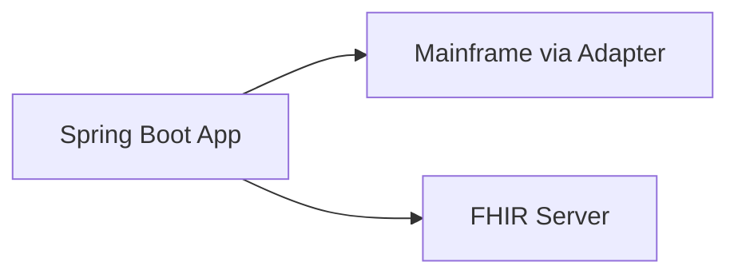

This is a **critical and often misunderstood** question in healthcare interoperability.

> 🎯 **The source data for a FHIR API is *not* stored inside the FHIR server by default — it’s typically synchronized from core operational systems like claims engines, member enrollment databases, provider directories, EHRs, or mainframes.**

The FHIR server is usually a **facade or synchronized data layer** — not the system of record.

---

# 🧩 Let’s Break This Down

---

## ✅ 1. FHIR Server ≠ Source of Truth (Usually)

In most payer and provider systems:

> 🔁 **FHIR APIs expose data — but do not originate it.**

They act as:
- A **standardized interface layer**
- A **synchronized cache** of operational data
- A **translation layer** from legacy formats (X12, HL7 v2, COBOL) to FHIR JSON

---

## 🏢 2. Where Does the Source Data Come From? (Payer Domain)

Here are the **real source systems** for common FHIR resources in a healthcare insurance (payer) context:

| FHIR Resource         | Typical Source System                          | Data Origin Example                                  |
|-----------------------|------------------------------------------------|------------------------------------------------------|
| `Patient`             | Member Enrollment System                       | Demographics, subscriber ID, plan ID, effective dates |
| `Coverage`            | Benefits Administration System                 | Plan details, copays, deductibles, network tier      |
| `Claim` / `ExplanationOfBenefit` | Claims Processing Engine (Mainframe/COBOL) | Submitted claims, adjudication results, payment info |
| `Practitioner` / `Organization` | Provider Network Management System       | NPI, taxonomy, contract status, location, specialties |
| `MedicationRequest`   | Prior Authorization System / Pharmacy Benefit Mgr | Approved drugs, quantity, duration, prescriber     |
| `Observation`         | Clinical Data Exchange (from EHRs via APIs)    | Lab results, vitals, HbA1c, LDL (via FHIR from Epic/Cerner) |
| `Encounter`           | Claims or EHR Integration                      | Dates of service, diagnosis codes, procedure codes   |

> 💡 Think: **FHIR is the “API view” of data that lives elsewhere.**

---

## 🔄 3. How Data Gets into the FHIR Server

There are several synchronization patterns — here are the most common:

---

### 🔄 Pattern 1: Event-Driven Sync (Recommended)

> Core systems emit events → FHIR server consumes and upserts resources.



✅ Pros:
- Near real-time
- Decoupled
- Scalable

🛠️ Tools: Kafka, AWS Kinesis, Debezium (CDC), Azure Event Hubs

---

### 🔄 Pattern 2: Batch ETL (Legacy-Friendly)

> Nightly jobs extract from source → transform to FHIR → load into FHIR server.



✅ Pros:
- Works with legacy systems that don’t support events
- Predictable, auditable

⚠️ Cons:
- Delayed data (not real-time)
- Hard to handle deletes/updates

---

### 🔄 Pattern 3: On-Demand Proxy (API Facade)

> FHIR server doesn’t store data — it proxies requests to source systems in real-time.



✅ Pros:
- Always fresh data
- No sync lag or storage cost

⚠️ Cons:
- Slower response (depends on backend)
- Tight coupling to source system availability
- Hard to support FHIR search/history

> 🏆 Used by some startups or for read-only eligibility checks.

---

### 🔄 Pattern 4: Dual-Write (Not Recommended)

> App writes to both legacy system and FHIR server.



❌ Risks:
- Data inconsistency if one write fails
- Hard to rollback
- Violates single source of truth

> 🚫 Avoid unless you have distributed transactions (rare in healthcare).

---

## 🖼️ 4. Visual: End-to-End Data Flow in Payer System

```
[Provider Submits X12 837 Claim]
            ↓
   [Claims Engine (Mainframe/Go)]
            ↓ → emits → [Kafka: ClaimAdjudicated]
            ↓
   [Adjudicated → Payment Engine → X12 835]
            ↓
   [Kafka Event → FHIR Adapter Service]
            ↓ (transforms claim → FHIR Claim/EOB)
            ↓
   [FHIR Server (HAPI/Smile CDR) ← stores resource]
            ↓
   [Member App → GET /ExplanationOfBenefit?claim=123]
            ↓
   [FHIR Server → returns JSON]
```

---

## 🧠 5. Key Architecture Decisions

| Decision Point                  | Recommendation for Payers                                  |
|---------------------------------|------------------------------------------------------------|
| **Storage**                     | FHIR server should persist data (for performance, search)  |
| **Sync Method**                 | Event-driven (Kafka) > Batch ETL > Proxy                   |
| **Ownership**                   | FHIR server = read-optimized view; source system = SoT     |
| **Deletes/Updates**             | Use logical deletes + versioning (_history)                |
| **Data Freshness SLA**          | Define: Real-time (events) vs Delayed (batch) per resource |
| **Terminology Mapping**         | Map internal codes → SNOMED/LOINC/RxNorm in sync layer      |

---

## ⚠️ 6. Common Pitfalls

| Pitfall                          | Consequence                                  | Fix                                               |
|----------------------------------|----------------------------------------------|---------------------------------------------------|
| Treating FHIR server as SoT      | Data drift, compliance risk                  | Sync from authoritative source; audit trails      |
| No sync mechanism                | Stale data → member/provider frustration     | Implement Kafka/ETL with monitoring               |
| Direct DB reads from FHIR server | Bypasses business logic, breaks consistency  | Always sync via application/events                |
| Ignoring code systems            | FHIR resources not interoperable             | Map to standard terminologies (LOINC, SNOMED CT)  |
| No _history or versioning        | Can’t audit or roll back                     | Enable versioning in FHIR server                  |

---

## 🌍 7. Real-World Examples

### 🏆 UnitedHealthcare
- Claims adjudicated on mainframe → Kafka event → Java adapter → HAPI FHIR Server.
- Member data from enrollment DB → nightly sync → FHIR Patient/Coverage.
- Uses **Smile CDR** for terminology services + SMART on FHIR.

### 🏆 Cigna (AWS)
- Claims engine (Go) → publishes to **Amazon Kinesis** → Lambda transforms to FHIR → loads into **AWS HealthLake** (managed FHIR service).
- Provider directory → CDC from SQL Server → FHIR Practitioner/Organization.

### 🏆 Centene (Medicaid)
- Legacy COBOL claims → nightly ETL (Informatica) → FHIR Server (IBM FHIR).
- Real-time eligibility: FHIR server proxies to core benefits engine.

---

## 🛠️ 8. Sample Sync Service (Spring Boot + Kafka → FHIR)

```java
@Component
public class ClaimEventListener {

    @Autowired
    private IFhirResourceDao<Claim> claimDao;

    @KafkaListener(topics = "claim.adjudicated")
    public void handleClaimEvent(String x12Message) {
        // 1. Parse X12 837
        Claim claim = X12ToClaimConverter.convert(x12Message);

        // 2. Map internal codes to FHIR/LOINC/SNOMED
        TerminologyService.mapCodes(claim);

        // 3. Save to FHIR server
        claimDao.update(claim); // upsert by claim ID

        // 4. Also create ExplanationOfBenefit if paid
        if (claim.getOutcome() == Claim.Outcome.ACCEPTED) {
            ExplanationOfBenefit eob = buildEOB(claim);
            eobDao.update(eob);
        }
    }
}
```

---

## ✅ 9. Summary: Where is the Source Data?

| Layer               | Role                                  | Example Technologies                     |
|---------------------|----------------------------------------|------------------------------------------|
| **Source Systems**  | System of Record (SoT)                 | Mainframe, Claims Engine, Member DB, EHR  |
| **Sync Layer**      | Transforms & pushes to FHIR            | Kafka, ETL, CDC, Spring Boot Adapters    |
| **FHIR Server**     | Standardized API + Storage (optional)  | HAPI FHIR, Smile CDR, IBM FHIR, HealthLake |
| **Consumer Apps**   | Read via FHIR APIs                     | Member Portal, Provider App, Analytics   |

> 💡 **Golden Rule**:  
> “The FHIR server is the face — not the brain — of your interoperability strategy.”

---

## 🚀 Want Me to Generate?

I can create for you:
- A **Kafka-to-FHIR sync service in Spring Boot**
- An **ETL script (Python) to convert X12 → FHIR**
- A **Debezium CDC config** to stream from PostgreSQL → FHIR
- A **sequence diagram** of real-time FHIR data flow

Just say: “Generate the [XYZ] sync example!” — and I’ll give you production-ready code. 🛠️
