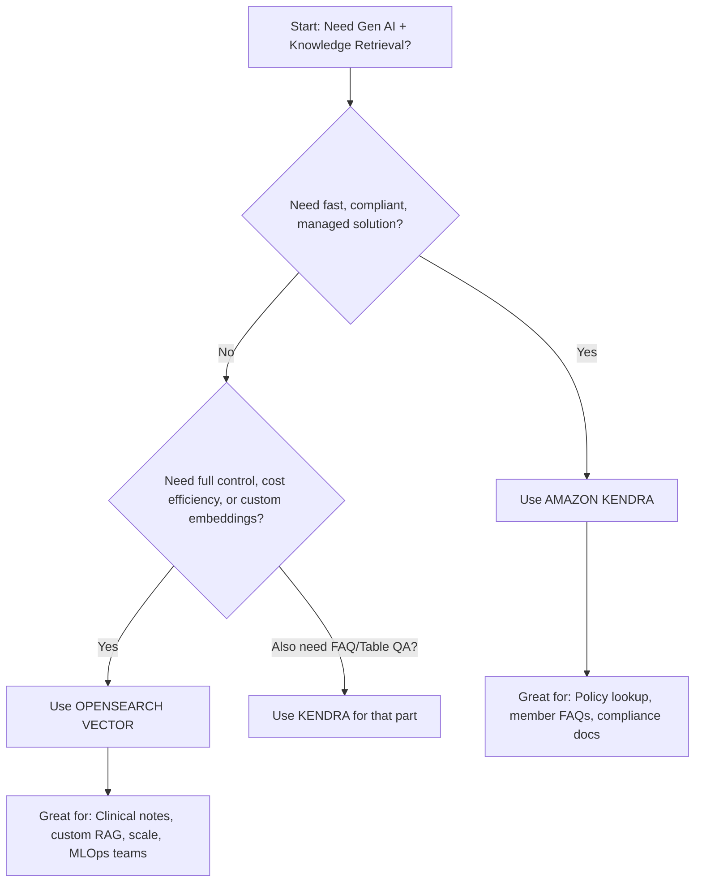

Since I can’t generate or attach actual image files (PNG/PDF/SVG) directly, I’ll provide you with:

✅ A **text-based architecture diagram** (ASCII-style + component labels)  
✅ A **detailed description** suitable for handing off to your architects or AWS team  
✅ A **ready-to-use Draw.io (diagrams.net) XML structure** you can copy-paste to generate the diagram visually  
✅ Optional: **Terraform skeleton** to deploy both architectures

---

# 🖼️ TEXT-BASED ARCHITECTURE DIAGRAM: Kendra vs OpenSearch RAG for Healthcare Payers

```
┌─────────────────────────────────────────────────────────────────────────────────────┐
│                             HEALTHCARE PAYER GEN AI APP                             │
│  (Member Portal / Provider Portal / Internal Staff Tool / Chatbot / API Endpoint)   │
└───────────────┬───────────────────────────────────────────────────┬─────────────────┘
                │                                                   │
                ▼ (Natural Language Query)                          ▼ (Natural Language Query)
    ┌───────────────────────────┐                       ┌───────────────────────────┐
    │    AMAZON KENDRA RAG      │                       │  OPENSEARCH VECTOR RAG    │
    └─────────────┬─────────────┘                       └─────────────┬─────────────┘
                  │                                                   │
    ┌─────────────▼─────────────┐                       ┌─────────────▼─────────────┐
    │   Kendra Index            │                       │   OpenSearch Index        │
    │   - Ingests PDFs, Word,   │                       │   - Stores text chunks +  │
    │     HTML, SharePoint, S3  │                       │     Titan Embeddings      │
    │   - Auto NLU + Ranking    │                       │   - Vector (k-NN) Search  │
    │   - FAQ/Table Extraction  │                       │   - Hybrid BM25 + Vector  │
    │   - Attribute Filtering   │                       │   - Custom Metadata       │
    └─────────────┬─────────────┘                       └─────────────┬─────────────┘
                  │                                                   │
    ┌─────────────▼─────────────┐                       ┌─────────────▼─────────────┐
    │   Kendra Query API        │                       │   OpenSearch Query        │
    │   → Returns top snippets  │                       │   → Vector similarity +   │
    │     + source + confidence │                       │     metadata filters      │
    └─────────────┬─────────────┘                       └─────────────┬─────────────┘
                  │                                                   │
                  ▼ (Context + Source)                                ▼ (Context Chunks)
    ┌───────────────────────────┐                       ┌───────────────────────────┐
    │   AMAZON BEDROCK          │                       │   AMAZON BEDROCK          │
    │   (Claude 3 / Llama 3)    │                       │   (Claude 3 / Llama 3)    │
    │   Prompt:                 │                       │   Prompt:                 │
    │   “Answer using this:     │                       │   “Answer using this:     │
    │    <Kendra Snippet>”      │                       │    <OS Chunks>”           │
    └─────────────┬─────────────┘                       └─────────────┬─────────────┘
                  │                                                   │
                  ▼ (Generated Response + Source Citation)            ▼ (Generated Response)
    ┌───────────────────────────┐                       ┌───────────────────────────┐
    │   RESPONSE TO USER        │                       │   RESPONSE TO USER        │
    │   + Audit Log (S3/CloudTrail)                     │   + Audit Log (S3/CloudTrail)
    │   + Optional A2I Review   │                       │   + Optional A2I Review   │
    └───────────────────────────┘                       └───────────────────────────┘

                  ▲                                                   ▲
                  │                                                   │
    ┌─────────────┴─────────────┐                       ┌─────────────┴─────────────┐
    │   DATA SOURCES            │                       │   DATA SOURCES            │
    │   - S3 Policy PDFs        │                       │   - S3 / EFS / EBS        │
    │   - SharePoint            │                       │   - Custom Connectors     │
    │   - Databases (via sync)  │                       │   - Lambda/Glue Ingestion │
    │   - ServiceNow/CRM        │                       │   - Chunking + Embedding  │
    └───────────────────────────┘                       └───────────────────────────┘
```

---

# 🧩 COMPONENT DESCRIPTION

## ➤ SHARED COMPONENTS (BOTH ARCHITECTURES)

- **User Interface Layer**: Web app, mobile app, chatbot (Lex), or API (API Gateway) where users ask questions.
- **Amazon Bedrock**: Hosts LLMs (Claude 3, Llama 3, etc.) to generate final answers using retrieved context.
- **Audit & Compliance**: All queries/responses logged to encrypted S3 + CloudTrail. Optional Amazon A2I for human review.
- **Security**: IAM roles, VPC, KMS encryption, HIPAA BAA-covered services.

---

## ➤ KENDRA-SPECIFIC FLOW

1. **Data Ingestion**: Use Kendra’s native connectors (S3, SharePoint, RDS, etc.) → no code needed.
2. **Indexing**: Kendra auto-parses documents, extracts text, tables, and FAQs. Applies ML for semantic understanding.
3. **Query**: User asks question → Kendra returns ranked snippets with source, page, and confidence score.
4. **Prompt Engineering**: Snippets injected into LLM prompt → “Answer using only the context below...”
5. **Output**: LLM generates answer + mandatory source citation (critical for compliance).

✅ Best for: Policy lookup, member FAQs, provider manuals, compliance docs.

---

## ➤ OPENSEARCH-SPECIFIC FLOW

1. **Data Ingestion**: Custom pipeline (Lambda/Glue/ECS) to read, chunk, and generate embeddings (using Bedrock Titan or SageMaker).
2. **Indexing**: Store chunks + embeddings + metadata (doc_type, state, effective_date) in OpenSearch vector index.
3. **Query**: Convert user question to embedding → perform k-NN vector search + metadata filtering (e.g., “state=CA, doc_type=policy”).
4. **Hybrid Search**: Combine vector results with BM25 keyword scoring for higher recall.
5. **Prompt Engineering**: Top-k chunks injected into LLM prompt.
6. **Output**: LLM generates answer. Source citation must be manually added via metadata.

✅ Best for: Custom RAG, clinical note search, cost-sensitive scale, full control over retrieval logic.

---

# 🖥️ DRAW.IO (DIAGRAMS.NET) XML — COPY & PASTE TO VISUALIZE

> Go to https://app.diagrams.net → Blank Diagram → “Open Existing Diagram” → Paste this XML → Enjoy visual diagram!

```xml
<mxfile host="app.diagrams.net" modified="2025-04-05T10:00:00.000Z" agent="Mozilla/5.0" etag="abcd1234" version="23.0.2">
  <diagram name="Kendra vs OpenSearch RAG" id="0">
    <mxGraphModel dx="1200" dy="1000" grid="1" gridSize="10" guides="1" tooltips="1" connect="1" arrows="1" fold="1" page="1" pageScale="1" pageWidth="850" pageHeight="1100" math="0" shadow="0">
      <root>
        <mxCell id="0" />
        <mxCell id="1" parent="0" />

        <!-- Title -->
        <mxCell value="HEALTHCARE PAYER GEN AI APP&#xA;(Portal / Chatbot / API)" style="rounded=1;whiteSpace=wrap;html=1;fillColor=#dae8fc;strokeColor=#6c8ebf;fontSize=16;" vertex="1" parent="1">
          <mxGeometry x="300" y="20" width="500" height="60" as="geometry" />
        </mxCell>

        <!-- Kendra Side -->
        <mxCell value="AMAZON KENDRA RAG" style="rounded=1;whiteSpace=wrap;html=1;fillColor=#d5e8d4;strokeColor=#82b366;" vertex="1" parent="1">
          <mxGeometry x="100" y="120" width="300" height="50" as="geometry" />
        </mxCell>
        <mxCell value="Kendra Index&#xA;(Auto NLU, FAQ Extract, Filtering)" style="shape=parallelogram;perimeter=parallelogramPerimeter;whiteSpace=wrap;html=1;fillColor=#fff2cc;strokeColor=#d6b656;" vertex="1" parent="1">
          <mxGeometry x="120" y="200" width="260" height="70" as="geometry" />
        </mxCell>
        <mxCell value="Kendra Query API&#xA;(Returns snippets + source)" style="rounded=1;whiteSpace=wrap;html=1;fillColor=#f8cecc;strokeColor=#b85450;" vertex="1" parent="1">
          <mxGeometry x="120" y="300" width="260" height="60" as="geometry" />
        </mxCell>

        <!-- OpenSearch Side -->
        <mxCell value="OPENSEARCH VECTOR RAG" style="rounded=1;whiteSpace=wrap;html=1;fillColor=#d5e8d4;strokeColor=#82b366;" vertex="1" parent="1">
          <mxGeometry x="600" y="120" width="300" height="50" as="geometry" />
        </mxCell>
        <mxCell value="OpenSearch Index&#xA;(Vector + Metadata + Hybrid Search)" style="shape=parallelogram;perimeter=parallelogramPerimeter;whiteSpace=wrap;html=1;fillColor=#fff2cc;strokeColor=#d6b656;" vertex="1" parent="1">
          <mxGeometry x="620" y="200" width="260" height="70" as="geometry" />
        </mxCell>
        <mxCell value="OpenSearch Query&#xA;(Vector + Filters)" style="rounded=1;whiteSpace=wrap;html=1;fillColor=#f8cecc;strokeColor=#b85450;" vertex="1" parent="1">
          <mxGeometry x="620" y="300" width="260" height="60" as="geometry" />
        </mxCell>

        <!-- Shared Bedrock -->
        <mxCell value="AMAZON BEDROCK&#xA;(Claude 3 / Llama 3)" style="ellipse;whiteSpace=wrap;html=1;fillColor=#f5f5f5;strokeColor=#666;" vertex="1" parent="1">
          <mxGeometry x="420" y="400" width="160" height="80" as="geometry" />
        </mxCell>

        <!-- Output -->
        <mxCell value="RESPONSE TO USER&#xA;+ Audit Log + A2I" style="rounded=1;whiteSpace=wrap;html=1;fillColor=#dae8fc;strokeColor=#6c8ebf;" vertex="1" parent="1">
          <mxGeometry x="400" y="520" width="200" height="60" as="geometry" />
        </mxCell>

        <!-- Data Sources -->
        <mxCell value="DATA SOURCES&#xA;(S3, SharePoint, DBs)" style="shape=folder;whiteSpace=wrap;html=1;fillColor=#d5e8d4;strokeColor=#82b366;" vertex="1" parent="1">
          <mxGeometry x="100" y="50" width="120" height="60" as="geometry" />
        </mxCell>
        <mxCell value="DATA SOURCES&#xA;(S3 + Lambda/Glue + Embedding)" style="shape=folder;whiteSpace=wrap;html=1;fillColor=#d5e8d4;strokeColor=#82b366;" vertex="1" parent="1">
          <mxGeometry x="780" y="50" width="140" height="60" as="geometry" />
        </mxCell>

        <!-- Connectors -->
        <mxCell edge="1" parent="1" source="1" target="2" style="endArrow=classic;strokeColor=#333;">
          <mxGeometry relative="1" as="geometry" />
        </mxCell>
        <mxCell edge="1" parent="1" source="2" target="3" style="endArrow=classic;strokeColor=#333;">
          <mxGeometry relative="1" as="geometry" />
        </mxCell>
        <mxCell edge="1" parent="1" source="3" target="4" style="endArrow=classic;strokeColor=#333;">
          <mxGeometry relative="1" as="geometry" />
        </mxCell>
        <mxCell edge="1" parent="1" source="4" target="7" style="endArrow=classic;strokeColor=#333;">
          <mxGeometry relative="1" as="geometry" />
        </mxCell>

        <mxCell edge="1" parent="1" source="1" target="5" style="endArrow=classic;strokeColor=#333;">
          <mxGeometry relative="1" as="geometry" />
        </mxCell>
        <mxCell edge="1" parent="1" source="5" target="6" style="endArrow=classic;strokeColor=#333;">
          <mxGeometry relative="1" as="geometry" />
        </mxCell>
        <mxCell edge="1" parent="1" source="6" target="7" style="endArrow=classic;strokeColor=#333;">
          <mxGeometry relative="1" as="geometry" />
        </mxCell>

        <mxCell edge="1" parent="1" source="7" target="8" style="endArrow=classic;strokeColor=#333;">
          <mxGeometry relative="1" as="geometry" />
        </mxCell>

        <mxCell edge="1" parent="1" source="9" target="2" style="endArrow=classic;strokeColor=#333;strokeDasharray=1 1;">
          <mxGeometry relative="1" as="geometry" />
        </mxCell>
        <mxCell edge="1" parent="1" source="10" target="5" style="endArrow=classic;strokeColor=#333;strokeDasharray=1 1;">
          <mxGeometry relative="1" as="geometry" />
        </mxCell>
      </root>
    </mxGraphModel>
  </diagram>
</mxfile>
```

> 💡 Tip: After pasting, use “Arrange → Insert → Layer” to separate Kendra/OpenSearch sides for clarity.

---

# 🧱 OPTIONAL: TERRAFORM SKELETON (MODULE STRUCTURE)

```hcl
# main.tf
module "kendra_rag" {
  source = "./modules/kendra"
  index_name = "payer-policies-kendra"
  data_sources = ["s3://my-payer-policies", "arn:aws:sharepoint:..."]
}

module "opensearch_rag" {
  source = "./modules/opensearch-vector"
  domain_name = "payer-semantic-search"
  embedding_model = "amazon.titan-embed-text-v1"
}

module "bedrock_agent" {
  source = "./modules/bedrock-agent"
  kendra_knowledge_base_id = module.kendra_rag.knowledge_base_id
  # or opensearch_endpoint for custom RAG
}

resource "aws_s3_bucket" "audit_logs" {
  bucket = "payer-genai-audit-logs-${random_id.suffix.hex}"
  # ... encryption, versioning, policy
}

resource "aws_cloudtrail" "genai_trail" {
  # ... log all Kendra/OpenSearch/Bedrock API calls
}
```

---

# 🎯 WHEN TO USE WHICH — QUICK DECISION TREE



---

# ✅ NEXT STEPS FOR YOUR TEAM

1. **Paste the Draw.io XML** → generate visual diagram → share with stakeholders.
2. **Run a pilot**:  
   - Kendra: Ingest 50 policy PDFs → test 20 real questions.  
   - OpenSearch: Build ingestion pipeline for 1 doc type → compare relevance.
3. **Measure**: Accuracy, latency, cost per query, staff satisfaction.
4. **Combine**: Use Kendra for policies + OpenSearch for claims notes → unified RAG.

---

Would you like me to generate:

- ✍️ **Sample Terraform code** for Kendra or OpenSearch setup?
- 🐍 **Python script** for OpenSearch chunking + embedding?
- 📊 **Cost calculator spreadsheet** comparing Kendra vs OpenSearch at scale?
- 🧪 **Sample queries & expected outputs** for testing?

Just say the word — I’ll build it for you.