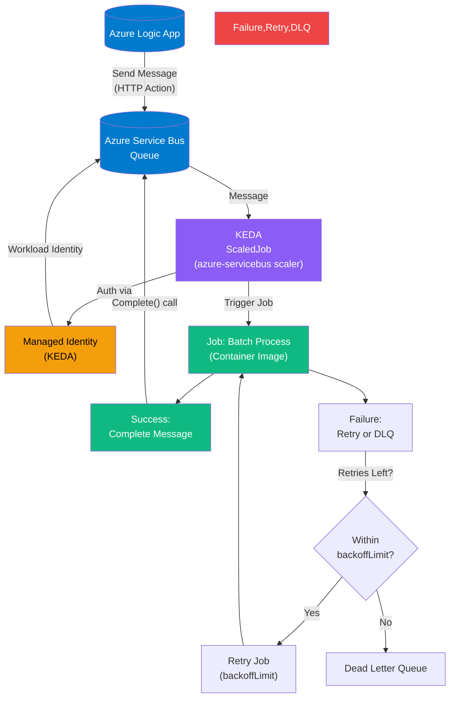

Absolutely! Below are **four clean, focused, per-path breakdowns** of your event-driven batch job architecture. Each diagram isolates **one specific integration path** for clarity — ideal for documentation, presentations, or onboarding.

Each uses **properly quoted labels** (so they render without errors in Mermaid) and includes **Managed Identity, filtering, retries, and completion flow**.

---

## 🔹 **1. Kafka → KEDA → Job (Recommended)**

**Use Case**: Trigger a batch job in AKS when a message of specific type arrives in Kafka.

```mermaid
flowchart TD
    Kafka[(Apache Kafka)]
    KEDA["KEDA\nScaledJob\n(Kafka Scaler)"]
    MI["Managed Identity\n(KEDA)"]
    Filter{"Filter:\n eventType == \"PROCESS_NOW\"?"}
    Job["Job: Batch Process\n(Container Image)"]
    Success["Success:\n Commit Offset"]
    Failure["Failure:\n Retry or DLQ"]
    Retry["Retry Job\n(backoffLimit)"]
    DLQ["Dead Letter Queue\n(Kafka Topic)"]

    Kafka -->|"Message"| KEDA
    KEDA -->|"Auth via"| MI
    MI -->|"Managed Identity\n(Azure AD)"| Kafka
    KEDA -->|"Apply"| Filter
    Filter -- Yes -->|"Create Job"| Job
    Filter -- No -->|"Ack & Skip"| Kafka
    Job -->|"Process"| Success
    Job -->|"Fail"| Failure
    Failure -->|"Retries Left?"| RetryDecision{"Within\nbackoffLimit?"}
    RetryDecision -- Yes --> Retry --> Job
    RetryDecision -- No --> DLQ
    Success --> Kafka

    style Kafka fill:#0D6E6E,color:white
    style KEDA fill:#8B5CF6,color:white
    style Job fill:#10B981,color:white
    style MI fill:#F59E0B,color:black
    style Success fill:#10B981,color:white
    style Failure,Retry,DLQ fill:#EF4444,color:white
```

✅ **Best for**: High-throughput, event-driven batch processing with auto-scaling.

---

## 🔹 **2. Azure Service Bus → KEDA → Job (Recommended)**

**Use Case**: Trigger a job when a message lands in an Azure Service Bus queue.

```mermaid
flowchart TD
    ServiceBus[(Azure Service Bus\nQueue)]
    KEDA["KEDA\nScaledJob\n(azure-servicebus scaler)"]
    MI["Managed Identity\n(KEDA)"]
    Filter{"Filter:\n eventType == \"PROCESS_NOW\"?"}
    Job["Job: Batch Process\n(Container Image)"]
    Success["Success:\n Complete Message"]
    Failure["Failure:\n Retry or DLQ"]
    Retry["Retry Job\n(backoffLimit)"]
    DLQ["Dead Letter Queue\n(Service Bus DLQ)"]
    Ops[(Alerts / Monitoring)]

    ServiceBus -->|"Message"| KEDA
    KEDA -->|"Auth via"| MI
    MI -->|"Workload Identity"| ServiceBus
    KEDA -->|"Apply Filter"| Filter
    Filter -- Yes -->|"Create Job"| Job
    Filter -- No -->|"Ack & Exit"
    Job --> Success
    Job --> Failure
    Failure -->|"Retries Left?"| RetryDecision{"Within\nbackoffLimit?"}
    RetryDecision -- Yes --> Retry --> Job
    RetryDecision -- No --> DLQ --> Ops
    Success -->|"Complete() call"| ServiceBus

    style ServiceBus fill:#007ACC,color:white
    style KEDA fill:#8B5CF6,color:white
    style Job fill:#10B981,color:white
    style MI fill:#F59E0B,color:black
    style Success fill:#10B981,color:white
    style Failure,Retry,DLQ fill:#EF4444,color:white
```

✅ **Best for**: Secure, Azure-native, decoupled event processing with DLQ support.

---

## 🔹 **3. Logic App → Service Bus → KEDA → Job (Recommended Pattern)**

**Use Case**: Use Azure Logic App to send a message → trigger job via KEDA.



✅ **Best for**: No-code/low-code triggers (e.g., email, HTTP, schedule) → secure job execution in AKS.

---

## 🔹 **4. Logic App → Argo Events (Webhook) → Job**

**Use Case**: Directly trigger Argo Events via webhook from Logic App.

```mermaid
flowchart TD
    LogicApp[(Azure Logic App)]
    ArgoEvents["Argo Events\nWebhook EventSource"]
    MI["Managed Identity\n(Argo Events)"]
    Filter{"Filter:\n eventType == \"PROCESS_NOW\"?"}
    Job["Job: Batch Process\n(Container Image)"]
    Success["Job Succeeded"]
    Failure["Job Failed"]
    Retry["Retry Job\n(backoffLimit)"]
    DLQ["Send to DLQ\n(e.g., SB Queue)"]
    Ingress["Ingress / LoadBalancer\n(exposes webhook endpoint)"]

    LogicApp -->|"HTTP POST /webhook"| ArgoEvents
    ArgoEvents -->|"Secure with"| MI
    MI -->|"Workload Identity\nor API Key"| ArgoEvents
    ArgoEvents -->|"Apply Filter"| Filter
    Filter -- Yes -->|"Trigger Job"| Job
    Filter -- No -->|"Acknowledge"
    Job --> Success
    Job --> Failure
    Failure -->|"Retries Left?"| RetryDecision{"Within\nbackoffLimit?"}
    RetryDecision -- Yes --> Retry --> Job
    RetryDecision -- No --> DLQ
    ArgoEvents -->|"Expose endpoint"| Ingress

    style LogicApp fill:#007ACC,color:white
    style ArgoEvents fill:#8B5CF6,color:white
    style Job fill:#10B981,color:white
    style MI fill:#F59E0B,color:black
    style Success fill:#10B981,color:white
    style Failure,Retry,DLQ fill:#EF4444,color:white
    style Ingress fill:#6B7280,color:white
```

⚠️ **Note**: Requires exposing Argo Events webhook via Ingress. Less secure than queue-based patterns unless protected (e.g., API key, mTLS).

✅ **Best for**: Real-time, direct integration when you’re already using Argo ecosystem.

---

## 📌 Summary: Which Path to Use?

| Path | When to Use | Recommendation |
|------|-------------|----------------|
| **Kafka → KEDA → Job** | Streaming data pipelines | ✅✅ Strongly Recommended |
| **Service Bus → KEDA → Job** | Reliable, secure messaging | ✅✅ Strongly Recommended |
| **Logic App → SB → KEDA → Job** | No-code triggers → batch job | ✅✅ **Best for Logic App integration** |
| **Logic App → Argo Events → Job** | Tight Argo integration, real-time | ⚠️ Use only if Argo is already in use |

---

### 📎 Export Tips

- Paste each into [https://mermaid.live](https://mermaid.live)
- Click **"Download Image"** to save as PNG/SVG
- Use in:
  - Architecture decision records (ADRs)
  - Runbooks
  - Security reviews
  - Onboarding docs

---

Let me know if you'd like:
- A **vertical version** of any diagram
- A **PlantUML** equivalent
- A **draw.io XML** import
- Or a **PDF bundle** of all four

Happy to generate!