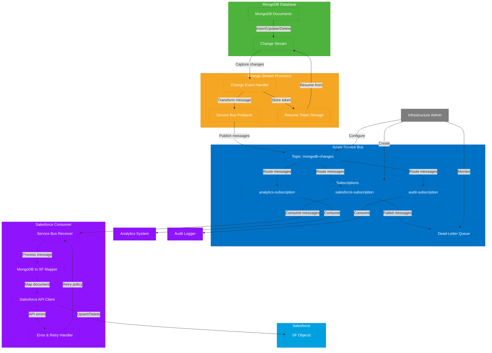

Using MongoDB Change Streams is an excellent approach for implementing CDC (Change Data Capture) with Salesforce. Here's how to implement this solution:

## MongoDB Change Streams Implementation

1. **Set up MongoDB in Replica Set mode**:
   Change Streams require MongoDB to be running as a replica set or sharded cluster, as they rely on the oplog.

2. **Create a Change Stream listener application**:
   ```javascript
   const { MongoClient } = require('mongodb');
   
   async function monitorChanges() {
     const client = await MongoClient.connect('mongodb://your-connection-string');
     const db = client.db('yourDatabase');
     const collection = db.collection('yourCollection');
     
     // Open a Change Stream on the collection
     const changeStream = collection.watch([], { fullDocument: 'updateLookup' });
     
     // Process change events
     changeStream.on('change', async (change) => {
       try {
         // Handle the change event based on operation type
         switch (change.operationType) {
           case 'insert':
           case 'update':
           case 'replace':
             await sendToSalesforce(change.fullDocument);
             break;
           case 'delete':
             await deleteFromSalesforce(change.documentKey._id);
             break;
         }
       } catch (error) {
         console.error('Error processing change:', error);
       }
     });
   }
   
   monitorChanges().catch(console.error);
   ```

3. **Implement Salesforce integration**:
   ```javascript
   const jsforce = require('jsforce');
   
   async function sendToSalesforce(document) {
     const conn = new jsforce.Connection({
       // Your Salesforce connection config
       loginUrl: 'https://login.salesforce.com',
       username: process.env.SF_USERNAME,
       password: process.env.SF_PASSWORD + process.env.SF_SECURITY_TOKEN
     });
     
     await conn.login();
     
     // Map MongoDB document to Salesforce object
     const sfObject = mapMongoToSalesforce(document);
     
     // Upsert to Salesforce
     const result = await conn.sobject('Your_Object__c').upsert(sfObject, 'External_Id__c');
     console.log('Salesforce upsert result:', result);
   }
   ```

4. **Handle document mapping and error recovery**:
   - Create a mapping function to transform MongoDB documents to Salesforce objects
   - Implement retry logic for Salesforce API failures
   - Consider using a message queue for resilience
   - Implement resumability using change stream resume tokens

## Key Considerations

1. **Resume Tokens**: Store the resume token periodically to allow your application to restart from where it left off:
   ```javascript
   let resumeToken;
   
   changeStream.on('change', (change) => {
     resumeToken = change._id;
     // Process change...
   });
   ```

2. **Filtering**: You can filter change events at the database level:
   ```javascript
   // Only watch for inserts and updates
   const pipeline = [
     { $match: { operationType: { $in: ['insert', 'update'] } } }
   ];
   const changeStream = collection.watch(pipeline);
   ```

3. **Error Handling**: Implement comprehensive error handling and retry mechanisms to ensure data consistency.

4. **Deployment**: Consider running this as a dedicated service with proper monitoring and alerting.

5. **Salesforce API Limits**: Be mindful of Salesforce API limits and implement rate limiting or batching if needed.


Mapping MongoDB documents to Salesforce objects is necessary because of fundamental differences in how these two systems store and structure data. Let me explain why this mapping is essential:

### Data Structure Differences

MongoDB is a document-oriented NoSQL database that stores flexible, schema-less JSON-like documents. Salesforce, on the other hand, is a relational database system with strict schema definitions for its objects. These different approaches to data storage create an inherent mismatch that requires translation.

When a MongoDB document looks like this:
```javascript
{
  "_id": ObjectId("60a2b7e9d4a2c63e8abcdef1"),
  "customer_name": "Acme Corp",
  "contacts": [
    { "name": "John Doe", "email": "john@acme.com" },
    { "name": "Jane Smith", "email": "jane@acme.com" }
  ],
  "subscription": {
    "plan": "Enterprise",
    "startDate": ISODate("2021-05-01T00:00:00Z"),
    "active": true
  },
  "tags": ["manufacturing", "large-enterprise"]
}
```

It needs to be transformed into Salesforce's more structured format where objects have predefined fields and relationships:
```javascript
// Salesforce Account object
{
  "Name": "Acme Corp",
  "External_Id__c": "60a2b7e9d4a2c63e8abcdef1",
  "Subscription_Plan__c": "Enterprise",
  "Subscription_Start_Date__c": "2021-05-01",
  "Subscription_Active__c": true,
  "Tags__c": "manufacturing;large-enterprise"
}
```

### Key Mapping Challenges

1. **Nested Data**: MongoDB easily stores nested objects and arrays, while Salesforce typically requires separate related objects or custom field types to represent complex structures. The contacts array in our example might need to become Contact objects in Salesforce.

2. **Data Types**: MongoDB supports a wider range of native data types than Salesforce fields. For example, MongoDB can store any valid JSON value including deeply nested structures, while Salesforce has specific field types with their own constraints.

3. **Identifiers**: MongoDB uses unique `_id` fields (often ObjectIds) that don't directly translate to Salesforce's ID system. You'll need to store MongoDB IDs in custom fields to maintain the relationship between systems.

4. **Field Names**: MongoDB field names can be dynamic and contain special characters, while Salesforce has naming conventions and restrictions for its fields.

### Business Logic During Mapping

Beyond simple field transformations, mapping often involves business logic decisions:

- Which MongoDB fields should become which Salesforce fields?
- How should nested data be flattened or distributed across related objects?
- What default values should be applied for required Salesforce fields with no MongoDB equivalent?
- How should data validation be handled when MongoDB data doesn't meet Salesforce field requirements?

### Practical Example

Consider mapping location data:
```javascript
// MongoDB document
{
  "store": "Downtown Branch",
  "location": {
    "type": "Point",
    "coordinates": [-122.4194, 37.7749]
  }
}

// Salesforce mapping
{
  "Store_Name__c": "Downtown Branch",
  "Geolocation__Latitude__s": 37.7749,
  "Geolocation__Longitude__s": -122.4194
}
```

The mapping process transforms MongoDB's GeoJSON format into Salesforce's separate latitude/longitude fields in a compound geolocation field type.

Without proper mapping, you'd either have data that Salesforce couldn't process or lose the rich structure and relationships present in your MongoDB data. Thoughtful mapping ensures both systems can work with the same information in their own native formats.


Yes, Azure Service Bus would be an excellent addition to your architecture for decoupling MongoDB Change Streams from Salesforce. This approach creates a more resilient and scalable integration pattern. Let me explain how this would work and the benefits it provides.

## Architecture with Azure Service Bus

When you introduce Azure Service Bus as a middleware component, your data flow becomes:

1. MongoDB Change Stream captures document changes
2. A producer service processes these changes and publishes messages to Azure Service Bus
3. A consumer service reads from Azure Service Bus and updates Salesforce

Here's how you could implement this:

### Producer Side (MongoDB to Azure Service Bus)

```javascript
const { MongoClient } = require('mongodb');
const { ServiceBusClient } = require('@azure/service-bus');

async function monitorAndPublishChanges() {
  // MongoDB connection
  const mongoClient = await MongoClient.connect('mongodb://your-connection-string');
  const db = mongoClient.db('yourDatabase');
  const collection = db.collection('yourCollection');
  
  // Azure Service Bus connection
  const serviceBusClient = new ServiceBusClient('your-connection-string');
  const sender = serviceBusClient.createSender('your-queue-or-topic');
  
  // Monitor MongoDB changes
  const changeStream = collection.watch([], { fullDocument: 'updateLookup' });
  
  // Process and publish changes
  changeStream.on('change', async (change) => {
    try {
      // Create a message based on operation type
      let message;
      switch (change.operationType) {
        case 'insert':
        case 'update':
        case 'replace':
          message = {
            operation: change.operationType,
            documentId: change.documentKey._id.toString(),
            document: change.fullDocument,
            timestamp: new Date().toISOString()
          };
          break;
        case 'delete':
          message = {
            operation: 'delete',
            documentId: change.documentKey._id.toString(),
            timestamp: new Date().toISOString()
          };
          break;
      }
      
      // Send to Azure Service Bus
      if (message) {
        await sender.sendMessages({ body: message });
        console.log(`Published ${change.operationType} event for document ${message.documentId}`);
      }
      
    } catch (error) {
      console.error('Error processing or publishing change:', error);
    }
  });
}

monitorAndPublishChanges().catch(console.error);
```

### Consumer Side (Azure Service Bus to Salesforce)

```javascript
const { ServiceBusClient } = require('@azure/service-bus');
const jsforce = require('jsforce');

async function processSalesforceMessages() {
  // Azure Service Bus connection
  const serviceBusClient = new ServiceBusClient('your-connection-string');
  const receiver = serviceBusClient.createReceiver('your-queue-or-topic');
  
  // Salesforce connection
  const sfConnection = new jsforce.Connection({
    loginUrl: 'https://login.salesforce.com',
    username: process.env.SF_USERNAME,
    password: process.env.SF_PASSWORD + process.env.SF_SECURITY_TOKEN
  });
  await sfConnection.login();
  
  // Process messages
  const messageHandler = async (message) => {
    try {
      console.log(`Processing message: ${message.body.documentId}`);
      
      // Handle different operations
      if (message.body.operation === 'delete') {
        // Handle delete in Salesforce
        await deleteFromSalesforce(sfConnection, message.body.documentId);
      } else {
        // Map and upsert document
        const sfObject = mapMongoToSalesforce(message.body.document);
        await upsertToSalesforce(sfConnection, sfObject);
      }
      
      // Complete the message (remove from queue)
      await receiver.completeMessage(message);
      
    } catch (error) {
      console.error('Error processing message:', error);
      
      // If this is a temporary error, abandon the message to retry later
      // If it's a permanent error, deadletter the message
      if (isTemporaryError(error)) {
        await receiver.abandonMessage(message);
      } else {
        await receiver.deadLetterMessage(message);
      }
    }
  };
  
  // Start receiving messages
  receiver.subscribe({
    processMessage: messageHandler,
    processError: async (err) => {
      console.error('Error in message processing:', err);
    }
  });
}

processSalesforceMessages().catch(console.error);
```

## Benefits of Using Azure Service Bus

This architecture provides several important benefits:

### 1. Improved Resilience

If Salesforce is temporarily unavailable, messages queue up in Azure Service Bus rather than being lost. When Salesforce comes back online, processing continues from where it left off. This handles scenarios like:

- Salesforce maintenance windows
- Network connectivity issues
- API rate limiting or throttling

### 2. Workload Decoupling

The MongoDB change stream processor can run independently from the Salesforce integration component. Each can scale, deploy, and operate on its own schedule. This means:

- MongoDB processors can capture changes at peak speed without waiting for Salesforce
- Salesforce updates can be throttled to respect API limits without slowing down MongoDB

### 3. Advanced Message Handling

Azure Service Bus provides powerful features that a direct integration would require you to build:

- **Message scheduling**: Delay message processing for certain periods
- **Dead-letter queue**: Capture messages that fail repeatedly for investigation
- **Sessions**: Ensure ordered processing for related messages
- **Message duplication detection**: Avoid processing the same change twice
- **Message batching**: Process multiple changes in a single Salesforce API call

### 4. Operational Advantages

This pattern also improves operational aspects:

- **Observability**: Monitor queue depths to understand backlog
- **Retry policies**: Configure automatic retries with exponential backoff
- **Message TTL**: Define how long messages should be retained
- **Priority queueing**: Process certain changes ahead of others if needed

## Implementation Considerations

When implementing this pattern, consider these aspects:

1. **Message Size Limits**: Azure Service Bus has a 1MB message size limit, so you may need to handle large documents differently
2. **Idempotency**: Design your Salesforce integration to handle possible duplicate messages
3. **Message Format**: Structure your messages for easy processing, including metadata about the change
4. **Topics vs. Queues**: Use topics with multiple subscriptions if different systems need the same change data
5. **Cost Model**: Azure Service Bus pricing is based on operations and messaging units

This architecture creates a more robust, scalable connection between MongoDB and Salesforce that can handle real-world challenges like temporary outages and uneven processing rates. The added complexity is justified by the significant improvements in resilience and operational capabilities.


# Azure Service Bus Messaging Models: Queues vs. Topics

Azure Service Bus provides two primary messaging models that serve different communication patterns. Let me explain how they work and how they apply to your MongoDB-to-Salesforce integration.

## Queues: Point-to-Point Communication

A queue represents a simple first-in, first-out (FIFO) messaging channel. When using a queue:

- One sender (your MongoDB change stream processor) sends messages to the queue
- One receiver (your Salesforce integration service) pulls messages from the queue
- Each message is delivered to exactly one receiver
- Messages remain in the queue until successfully processed

Think of a queue like a mailbox where your MongoDB change events wait until the Salesforce processor picks them up. The queue ensures that even if your Salesforce processor goes offline temporarily, the messages will be waiting when it comes back.

```
MongoDB Change Stream → Azure Service Bus Queue → Salesforce Processor
```

This model works well for simple integration scenarios where you have a single consumer of MongoDB changes.

## Topics and Subscriptions: Publish-Subscribe Communication

Topics extend the queue concept to support multiple receivers through a publish-subscribe pattern:

- One sender (MongoDB change stream processor) publishes messages to a topic
- The topic maintains multiple subscriptions, each acting like its own queue
- Each subscription can have one or more receivers consuming its messages
- When a message is published to a topic, a copy is delivered to each subscription

Think of a topic like a newspaper publisher and subscriptions like different newspaper delivery routes. The same news (MongoDB changes) gets delivered to everyone who has subscribed.

```
                              ┌→ Subscription A → Salesforce Processor
MongoDB Change Stream → Topic─┼→ Subscription B → Analytics System
                              └→ Subscription C → Audit Logger
```

## Using Topics and Subscriptions for Your Use Case

For your MongoDB-to-Salesforce integration, topics and subscriptions provide several advantages:

### 1. Supporting Multiple Consumers

Imagine you start by integrating MongoDB with Salesforce, but later want to:
- Send the same data to a data warehouse
- Trigger notifications based on certain changes
- Maintain an audit log of all changes

With a topic, you can add these additional consumers without modifying your original producer code:

```javascript
// Your producer code remains the same regardless of how many consumers you add
async function publishChangeToTopic(change) {
  const sender = serviceBusClient.createSender('mongodb-changes-topic');
  await sender.sendMessages({
    body: {
      operation: change.operationType,
      documentId: change.documentKey._id.toString(),
      document: change.fullDocument
    }
  });
}
```

Meanwhile, each consumer subscribes to the topic:

```javascript
// Salesforce consumer
const salesforceReceiver = serviceBusClient.createReceiver('mongodb-changes-topic', 'salesforce-subscription');

// Analytics consumer (added later)
const analyticsReceiver = serviceBusClient.createReceiver('mongodb-changes-topic', 'analytics-subscription');

// Audit logger consumer (added even later)
const auditReceiver = serviceBusClient.createReceiver('mongodb-changes-topic', 'audit-subscription');
```

### 2. Message Filtering with Rules and Actions

Subscriptions can include rules to filter which messages they receive:

```javascript
// Create a subscription that only receives customer document changes
await serviceBusAdministrationClient.createSubscription(
  'mongodb-changes-topic',
  'customer-changes-subscription',
  {
    defaultMessageTimeToLive: 'P14D',
    lockDuration: 'PT1M',
    rules: [
      {
        name: 'CustomerDocumentsOnly',
        filter: {
          sqlExpression: "document.type = 'customer'"
        }
      }
    ]
  }
);
```

This allows each downstream system to receive only the changes relevant to it, reducing processing overhead.

### 3. Different Processing Rates

Each subscription maintains its own queue of messages, allowing different consumers to process at their own pace:

- Your Salesforce integration might handle 10 messages per minute due to API limits
- Your analytics system might process 1,000 messages per minute
- Your audit logger might handle 100 messages per minute

With topics and subscriptions, the faster consumers aren't slowed down by the slower ones.

## Implementation Example for Your Use Case

Here's how you might implement a topic-based approach for your MongoDB-to-Salesforce integration:

```javascript
// Producer side: MongoDB Change Stream to Azure Service Bus Topic
const { MongoClient } = require('mongodb');
const { ServiceBusClient } = require('@azure/service-bus');

async function monitorAndPublishChanges() {
  // MongoDB connection
  const mongoClient = await MongoClient.connect('mongodb://your-connection-string');
  const db = mongoClient.db('yourDatabase');
  const collection = db.collection('yourCollection');
  
  // Azure Service Bus connection
  const serviceBusClient = new ServiceBusClient('your-connection-string');
  const sender = serviceBusClient.createSender('mongodb-changes-topic');
  
  // Monitor MongoDB changes
  const changeStream = collection.watch([], { fullDocument: 'updateLookup' });
  
  changeStream.on('change', async (change) => {
    try {
      // Create a message based on operation type
      let message = {
        operation: change.operationType,
        documentId: change.documentKey._id.toString(),
        collectionName: collection.collectionName,
        timestamp: new Date().toISOString()
      };
      
      if (['insert', 'update', 'replace'].includes(change.operationType)) {
        message.document = change.fullDocument;
      }
      
      // Send to Azure Service Bus Topic
      await sender.sendMessages({ body: message });
      console.log(`Published ${change.operationType} event for document ${message.documentId}`);
      
    } catch (error) {
      console.error('Error publishing change:', error);
    }
  });
}

// Consumer side: Azure Service Bus Subscription to Salesforce
async function processSalesforceMessages() {
  // Azure Service Bus connection
  const serviceBusClient = new ServiceBusClient('your-connection-string');
  const receiver = serviceBusClient.createReceiver(
    'mongodb-changes-topic',
    'salesforce-subscription'
  );
  
  // Salesforce connection
  const sfConnection = new jsforce.Connection({
    loginUrl: 'https://login.salesforce.com',
    username: process.env.SF_USERNAME,
    password: process.env.SF_PASSWORD + process.env.SF_SECURITY_TOKEN
  });
  await sfConnection.login();
  
  // Process messages
  receiver.subscribe({
    processMessage: async (message) => {
      try {
        // Process message and update Salesforce
        if (message.body.operation === 'delete') {
          await deleteFromSalesforce(sfConnection, message.body.documentId);
        } else {
          const sfObject = mapMongoToSalesforce(message.body.document);
          await upsertToSalesforce(sfConnection, sfObject);
        }
        
        // Complete the message
        await receiver.completeMessage(message);
        
      } catch (error) {
        // Handle error based on type
        if (isSalesforceTemporaryError(error)) {
          await receiver.abandonMessage(message);
        } else {
          await receiver.deadLetterMessage(message, {
            deadLetterReason: 'ProcessingFailure',
            deadLetterErrorDescription: error.message
          });
        }
      }
    },
    processError: async (err) => {
      console.error('Error in message processing:', err);
    }
  });
}
```

## Growing Your Integration

As your integration needs grow, you might expand to have multiple subscriptions:

1. **Salesforce Subscription**: Updates Salesforce with MongoDB changes
2. **Backup Subscription**: Archives all changes to long-term storage
3. **Analytics Subscription**: Streams changes to your data lake
4. **Security Subscription**: Monitors for suspicious changes
5. **Reporting Subscription**: Updates real-time dashboards

Each subscription would have its own set of receivers, processing logic, and possibly filtering rules.

## Best Practices for Topics and Subscriptions

1. **Use Message Properties for Filtering**: Set application properties on your messages to enable efficient filtering
2. **Plan Subscription Expiration**: Set appropriate TTLs for subscriptions based on how quickly messages should be processed
3. **Monitor Subscription Depths**: Watch for growing backlogs that might indicate processing issues
4. **Consider Session Handling**: For operations that must be processed in order (like updates to the same document), use sessions
5. **Implement Dead-Letter Handling**: Create processes to review and possibly reprocess dead-lettered messages

By using topics and subscriptions in your MongoDB-to-Salesforce integration, you're building a foundation that can easily expand to support additional integration scenarios in the future, all while maintaining a clean, decoupled architecture.

Yes, you should absolutely pre-create your subscriptions before attempting to receive or consume messages through them. Let me explain why this is important and how to approach it properly.

## Why Pre-Create Subscriptions

Pre-creating subscriptions is necessary for several important reasons:

In Azure Service Bus, a subscription must exist before any messages can be routed to it. If your consumer tries to receive from a non-existent subscription, it will fail with an error. Unlike some messaging systems that might auto-create destinations, Azure Service Bus requires explicit creation of topics and subscriptions.

Pre-creating subscriptions also allows you to configure them with the right settings from the start:
- Message time-to-live
- Lock duration for processing
- Auto-forwarding rules
- Filter rules
- Default actions

## Infrastructure as Code Approach

The best practice is to treat your Service Bus entities (topics and subscriptions) as infrastructure that should be defined, versioned, and deployed before your application code runs. This is often called "Infrastructure as Code" and brings several benefits:

```javascript
const { ServiceBusAdministrationClient } = require("@azure/service-bus");

async function setupServiceBusInfrastructure() {
  const adminClient = new ServiceBusAdministrationClient("your-connection-string");
  
  // Check if topic exists, create if not
  let topicExists = false;
  try {
    topicExists = await adminClient.topicExists("mongodb-changes-topic");
  } catch (error) {
    console.error("Error checking topic existence:", error);
  }
  
  if (!topicExists) {
    console.log("Creating topic: mongodb-changes-topic");
    await adminClient.createTopic("mongodb-changes-topic", {
      defaultMessageTimeToLive: "P14D",  // 14 days
      maxSizeInMegabytes: 5120
    });
  }
  
  // Define subscription configurations
  const subscriptions = [
    {
      name: "salesforce-subscription",
      options: {
        lockDuration: "PT1M",  // 1 minute lock
        defaultMessageTimeToLive: "P7D",  // 7 days
        deadLetteringOnMessageExpiration: true
      }
    },
    {
      name: "analytics-subscription",
      options: {
        lockDuration: "PT30S",  // 30 seconds lock
        defaultMessageTimeToLive: "P1D",  // 1 day
        rules: [
          {
            name: "FullDocumentsOnly",
            filter: {
              sqlExpression: "operation IN ('insert', 'update', 'replace')"
            }
          }
        ]
      }
    }
  ];
  
  // Create or update each subscription
  for (const sub of subscriptions) {
    let subscriptionExists = false;
    try {
      subscriptionExists = await adminClient.subscriptionExists(
        "mongodb-changes-topic", 
        sub.name
      );
    } catch (error) {
      console.error(`Error checking subscription existence for ${sub.name}:`, error);
    }
    
    if (!subscriptionExists) {
      console.log(`Creating subscription: ${sub.name}`);
      await adminClient.createSubscription(
        "mongodb-changes-topic", 
        sub.name, 
        sub.options
      );
    } else if (sub.options) {
      console.log(`Updating subscription: ${sub.name}`);
      await adminClient.updateSubscription(
        "mongodb-changes-topic", 
        sub.name, 
        sub.options
      );
    }
  }
  
  console.log("Service Bus infrastructure setup complete.");
}
```

## When to Run Setup Code

This infrastructure setup should run:

1. As part of your CI/CD pipeline deployment process
2. Before your producer or consumer applications start
3. Whenever you're adding new subscriptions

Many teams run this setup as part of their application's initialization, but check if the resources already exist to avoid errors:

```javascript
async function main() {
  // First, ensure all infrastructure exists
  await setupServiceBusInfrastructure();
  
  // Then start your application logic
  await monitorAndPublishChanges();
  // Or
  await processSalesforceMessages();
}
```

## Separation of Concerns

A best practice is to separate the concerns of:

1. **Infrastructure management**: Creating and configuring topics and subscriptions
2. **Message production**: Publishing changes from MongoDB
3. **Message consumption**: Processing messages to update Salesforce

This separation allows different team members to manage each aspect and reduces the risk of runtime errors. It also enables scenarios like:

- Operations team manages the Service Bus infrastructure
- Data team manages the MongoDB change stream integration
- Integration team manages the Salesforce connector

## Real-World Example with Terraform

For production environments, you might use infrastructure-as-code tools like Terraform to manage Service Bus resources:

```hcl
resource "azurerm_servicebus_namespace" "main" {
  name                = "mongodb-integration-servicebus"
  location            = azurerm_resource_group.main.location
  resource_group_name = azurerm_resource_group.main.name
  sku                 = "Standard"
}

resource "azurerm_servicebus_topic" "mongodb_changes" {
  name                = "mongodb-changes-topic"
  resource_group_name = azurerm_resource_group.main.name
  namespace_name      = azurerm_servicebus_namespace.main.name
  
  default_message_ttl = "P14D"
  max_size_in_megabytes = 5120
}

resource "azurerm_servicebus_subscription" "salesforce" {
  name                = "salesforce-subscription"
  resource_group_name = azurerm_resource_group.main.name
  namespace_name      = azurerm_servicebus_namespace.main.name
  topic_name          = azurerm_servicebus_topic.mongodb_changes.name
  
  max_delivery_count  = 10
  lock_duration       = "PT1M"
  default_message_ttl = "P7D"
  dead_lettering_on_message_expiration = true
}

resource "azurerm_servicebus_subscription" "analytics" {
  name                = "analytics-subscription"
  resource_group_name = azurerm_resource_group.main.name
  namespace_name      = azurerm_servicebus_namespace.main.name
  topic_name          = azurerm_servicebus_topic.mongodb_changes.name
  
  max_delivery_count  = 3
  lock_duration       = "PT30S"
  default_message_ttl = "P1D"
}

resource "azurerm_servicebus_subscription_rule" "analytics_full_docs" {
  name                = "FullDocumentsOnly"
  resource_group_name = azurerm_resource_group.main.name
  namespace_name      = azurerm_servicebus_namespace.main.name
  topic_name          = azurerm_servicebus_topic.mongodb_changes.name
  subscription_name   = azurerm_servicebus_subscription.analytics.name
  
  filter_type         = "SqlFilter"
  sql_filter          = "operation IN ('insert', 'update', 'replace')"
}
```

This approach ensures that your entire infrastructure is version-controlled, documented, and consistently deployed across environments.

## Handling Missing Subscriptions

Even with proper infrastructure management, it's wise to handle potential errors gracefully in your application code:

```javascript
async function setupConsumer() {
  try {
    const receiver = serviceBusClient.createReceiver(
      'mongodb-changes-topic',
      'salesforce-subscription'
    );
    
    // Process messages...
    
  } catch (error) {
    if (error.code === 'SubscriptionNotFound') {
      console.error('The subscription does not exist. Run infrastructure setup first.');
      process.exit(1);
    } else {
      throw error;
    }
  }
}
```

In summary, yes, you should absolutely pre-create your subscriptions through a dedicated infrastructure management process before your consumers attempt to use them. This approach ensures reliability and proper configuration of your messaging system, leading to a more robust integration between MongoDB and Salesforce.


I'll create a Mermaid diagram that visualizes the complete flow of data from MongoDB to Salesforce using Azure Service Bus as the middleware.



This diagram visualizes the complete architecture for your MongoDB to Salesforce integration using Azure Service Bus. Let me explain the key components and data flows:

### Data Flow Path
1. **MongoDB Side**:
   - Changes in MongoDB documents trigger the Change Stream
   - The Change Stream Processor captures these events
   - The processor stores resume tokens to allow recovery from failures
   - Changes are transformed into messages and published to Azure Service Bus

2. **Azure Service Bus (Middleware)**:
   - Messages are published to a central topic ("mongodb-changes")
   - The topic distributes messages to multiple subscriptions
   - Each subscription serves a different consumer system
   - Failed messages are sent to a Dead-Letter Queue (DLQ) for inspection

3. **Salesforce Consumer**:
   - The Service Bus Receiver pulls messages from the Salesforce subscription
   - The MongoDB to Salesforce Mapper translates document structure
   - The Salesforce API Client sends data to Salesforce
   - Error handling components manage retries and failures

4. **Additional Consumers**:
   - Analytics system receives relevant changes for data warehousing
   - Audit logger captures all changes for compliance purposes

### Key Benefits Visualized
- **Decoupling**: Each colored section operates independently
- **Scalability**: Multiple consumers can process at different rates
- **Resilience**: Resume tokens and DLQ provide failure recovery
- **Extensibility**: New subscriptions can be added without changing existing components

### Infrastructure Management
The Infrastructure Admin role shows the importance of pre-creating and configuring the topics and subscriptions before the applications run, as we discussed earlier.

This architecture provides a robust and scalable solution for CDC from MongoDB to Salesforce, with Azure Service Bus serving as the critical decoupling layer that enhances reliability and flexibility.


