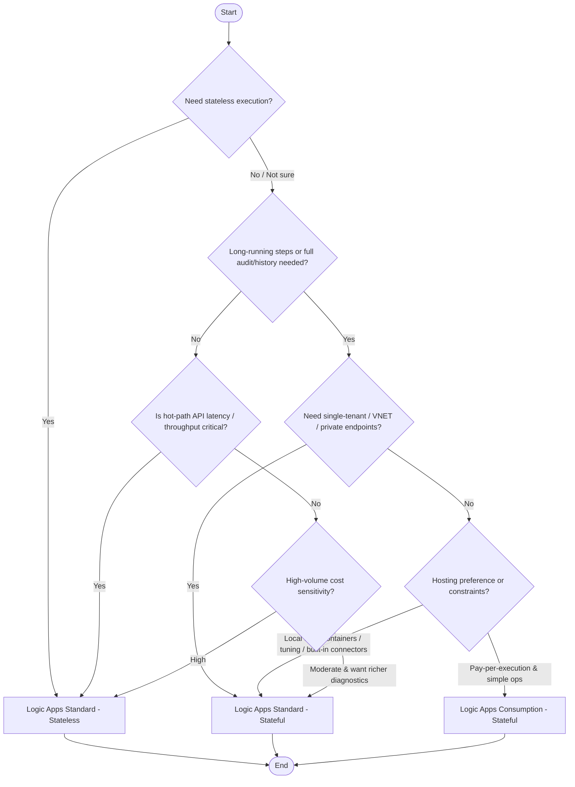

```mermaid
flowchart TD
  A([Start]) --> B{Need stateless execution?}

  B -- Yes --> S1[Logic Apps Standard - Stateless]
  B -- No / Not sure --> C{Long-running steps or full audit/history needed?}

  C -- Yes --> D{Need single-tenant / VNET / private endpoints?}
  D -- Yes --> S2[Logic Apps Standard - Stateful]
  D -- No --> E{Hosting preference or constraints?}
  E -- Pay-per-execution & simple ops --> C1[Logic Apps Consumption - Stateful]
  E -- Local dev / containers / tuning / built-in connectors --> S2

  C -- No --> F{Is hot-path API latency / throughput critical?}
  F -- Yes --> S1
  F -- No --> G{High-volume cost sensitivity?}
  G -- High --> S1
  G -- Moderate & want richer diagnostics --> S2

  S1 --> H([End])
  S2 --> H
  C1 --> H 
```
