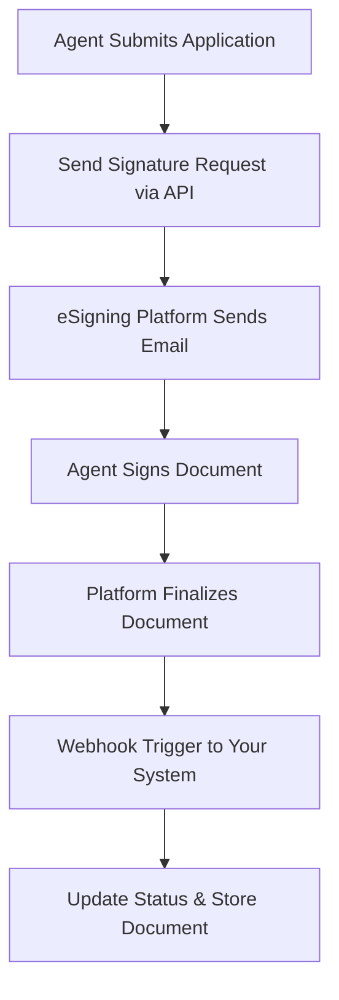

eSignature (electronic signature) is a key component in the **digital enrollment process** for health insurance, especially when individuals or brokers use online portals. Here's how it typically works:

---

### 🖊️ **How eSignature Is Used in Enrollment Applications**

#### **1. Trigger Point**
- After an individual or broker completes the enrollment form and selects a plan, the system prompts for a signature to **authorize the application**.

#### **2. Signature Capture Methods**
- **Typed Signature**: User types their name and agrees to terms.
- **Drawn Signature**: User draws their signature using a mouse or touchscreen.
- **Click-to-Sign**: User clicks a button to confirm agreement (common for brokers).
- **Biometric or OTP Verification**: Some systems use mobile OTP or biometric confirmation for added security.

#### **3. Legal Compliance**
- eSignatures are legally binding under laws like:
  - **ESIGN Act (U.S.)**
  - **eIDAS Regulation (EU)**
- Systems log:
  - Timestamp
  - IP address
  - User identity
  - Document version

#### **4. Document Generation**
- Once signed:
  - A **PDF copy** of the enrollment application is generated.
  - Signature is embedded in the document.
  - A copy is sent to the member and stored in the payer’s document management system.

#### **5. Broker-Specific Features**
- Brokers may sign on behalf of clients with proper authorization.
- Multi-party signature workflows are supported (e.g., employer + employee).

#### **6. Integration with Core Systems**
- eSignature status is tracked in the **enrollment system**.
- Triggers downstream processes like:
  - Coverage activation
  - ID card generation
  - Welcome kit dispatch

---

### 🔐 **Security & Audit Trail**
- Encrypted storage of signed documents.
- Audit logs for compliance and dispute resolution.
- Integration with third-party eSignature platforms (e.g., DocuSign, Adobe Sign).

---

To design a process where **agents are required to eSign applications** they create on behalf of individuals or groups, and to implement **automated follow-ups and status changes**, you can follow this structured workflow:

---

### 🧩 **Process Design: Agent eSignature Workflow**

#### **Step 1: Application Submission**
- Agent completes and submits an enrollment application on behalf of a client.
- System flags the application as **"Awaiting Agent Signature"**.

#### **Step 2: Signature Request Trigger**
- An eSignature request is sent to the agent via email or portal notification.
- A **timestamp** is recorded for tracking signature deadlines.

#### **Step 3: Signature Monitoring & Reminder Schedule**
- If the signature is not received, the system sends **automated reminders** at:
  - Day 1
  - Day 3
  - Day 5
  - Day 7
  - Day 15

Each reminder includes:
- A link to the eSignature portal
- A warning about the pending status if not signed

#### **Step 4: Status Transition**
- If no signature is received by **Day 15**, the application status is changed to **"PENDING – Signature Not Received"**.
- This status may:
  - Prevent further processing
  - Trigger alerts to internal teams
  - Be visible in broker dashboards

#### **Step 5: Signature Completion**
- Once the agent signs:
  - Status changes to **"Signed – Ready for Processing"**
  - Triggers downstream workflows (e.g., coverage activation)

---

### 🛠️ **System Components Involved**

| **Component**         | **Function** |
|-----------------------|--------------|
| **Enrollment System** | Tracks application and signature status |
| **eSignature Platform** | Captures and verifies agent signatures |
| **Notification Engine** | Sends scheduled reminders |
| **Workflow Engine**   | Manages status transitions and triggers |
| **Audit Log System**  | Records timestamps and actions for compliance |

---

To implement the agent eSignature workflow with reminders and status transitions, you can use a combination of **workflow automation**, **eSignature platforms**, and **notification systems**. Here's a breakdown of the tools commonly used:

---

### 🧰 **Tools to Implement the Agent eSignature Workflow**

#### **1. Workflow Automation Platforms**
These tools help define and manage the logic of the process (e.g., reminders, status changes).

- **Camunda** or **Flowable**: BPMN-based workflow engines for complex business logic.
- **Apache Airflow**: For scheduled tasks and workflows.
- **Microsoft Power Automate** or **Zapier**: For simpler, no-code automation.

#### **2. eSignature Platforms**
Used to capture legally binding signatures and integrate with your application.

- **DocuSign**
- **Adobe Sign**
- **HelloSign**
- **SignNow**

These platforms offer:
- API access
- Audit trails
- Multi-party signing workflows

#### **3. Notification Systems**
To send periodic emails or alerts to agents.

- **SendGrid**, **Mailgun**, or **Amazon SES**: For email delivery.
- **Twilio**: For SMS reminders.
- **Firebase Cloud Messaging (FCM)**: For push notifications.

#### **4. Application Backend**
To manage application states and integrate all components.

- **Node.js**, **Python (Django/Flask)**, or **Java (Spring Boot)**: For backend logic.
- **Database**: PostgreSQL, MySQL, or MongoDB to store application and signature status.

#### **5. Frontend Portal**
Where agents interact with the system.

- **React**, **Angular**, or **Vue.js**: For building responsive portals.
- Integration with eSignature widgets or redirect flows.

#### **6. Scheduler/Job Queue**
To manage timed reminders and status updates.

- **Celery** (Python) or **BullMQ** (Node.js): For background jobs.
- **Quartz Scheduler** (Java): For enterprise-grade scheduling.

---

### 🧠 **How It All Comes Together**

1. **Agent submits application** → stored in DB.
2. **eSignature request sent** via eSignature API.
3. **Workflow engine** tracks time and triggers reminders.
4. **Notification system** sends emails/SMS on schedule.
5. **If signed** → status updated to “Ready for Processing”.
6. **If not signed by Day 15** → status changes to “Pending”.

---
To implement the agent eSignature workflow with reminders and status transitions, you can use a combination of **workflow automation**, **eSignature platforms**, and **notification systems**. Here's a breakdown of the tools commonly used:

---

### 🧰 **Tools to Implement the Agent eSignature Workflow**

#### **1. Workflow Automation Platforms**
These tools help define and manage the logic of the process (e.g., reminders, status changes).

- **Camunda** or **Flowable**: BPMN-based workflow engines for complex business logic.
- **Apache Airflow**: For scheduled tasks and workflows.
- **Microsoft Power Automate** or **Zapier**: For simpler, no-code automation.

#### **2. eSignature Platforms**
Used to capture legally binding signatures and integrate with your application.

- **DocuSign**
- **Adobe Sign**
- **HelloSign**
- **SignNow**

These platforms offer:
- API access
- Audit trails
- Multi-party signing workflows

#### **3. Notification Systems**
To send periodic emails or alerts to agents.

- **SendGrid**, **Mailgun**, or **Amazon SES**: For email delivery.
- **Twilio**: For SMS reminders.
- **Firebase Cloud Messaging (FCM)**: For push notifications.

#### **4. Application Backend**
To manage application states and integrate all components.

- **Node.js**, **Python (Django/Flask)**, or **Java (Spring Boot)**: For backend logic.
- **Database**: PostgreSQL, MySQL, or MongoDB to store application and signature status.

#### **5. Frontend Portal**
Where agents interact with the system.

- **React**, **Angular**, or **Vue.js**: For building responsive portals.
- Integration with eSignature widgets or redirect flows.

#### **6. Scheduler/Job Queue**
To manage timed reminders and status updates.

- **Celery** (Python) or **BullMQ** (Node.js): For background jobs.
- **Quartz Scheduler** (Java): For enterprise-grade scheduling.

---

### 🧠 **How It All Comes Together**

1. **Agent submits application** → stored in DB.
2. **eSignature request sent** via eSignature API.
3. **Workflow engine** tracks time and triggers reminders.
4. **Notification system** sends emails/SMS on schedule.
5. **If signed** → status updated to “Ready for Processing”.
6. **If not signed by Day 15** → status changes to “Pending”.

---

Azure Logic Apps is a powerful tool for automating workflows and integrating services. In the context of your **agent eSignature workflow for health insurance enrollment**, Logic Apps can orchestrate the entire process—from triggering signature requests to sending reminders and updating application status.

---

### 🧠 **How Azure Logic Apps Can Be Used in This Scenario**

#### ✅ **1. Trigger Signature Request**
- **Trigger**: When an agent submits an application (e.g., a new record in Azure SQL or a message in a queue).
- **Action**: Call an external eSignature API (e.g., DocuSign or Adobe Sign) to initiate the signature request.
- **Store**: Save the signature request ID and timestamp in a database.

#### 🔁 **2. Schedule Reminder Emails**
- **Recurrence Triggers**: Use Logic Apps with scheduled triggers for Days 1, 3, 5, 7, and 15.
- **Condition Check**: Query the database to check if the signature has been received.
- **Action**: If not signed, send an email using:
  - **SendGrid**
  - **Azure Communication Services**
- **Logging**: Record each reminder sent for audit purposes.

#### 🔄 **3. Update Application Status**
- **Trigger**: On Day 15, check signature status.
- **Condition**: If still unsigned, update the application status to **"Pending – Signature Not Received"** in Azure SQL or Cosmos DB.
- **Optional**: Notify internal teams or brokers via email or dashboard alert.

#### 📄 **4. Post-Signature Actions**
- **Trigger**: When signature is received (via webhook or polling).
- **Action**:
  - Update status to **"Signed – Ready for Processing"**
  - Store signed document in **Azure Blob Storage**
  - Notify enrollment system to proceed

---

### 🧰 **Key Logic App Components Used**

| **Component** | **Purpose** |
|---------------|-------------|
| **Triggers** | Time-based (recurrence), HTTP, database change |
| **Actions** | API calls, database updates, email sends |
| **Connectors** | SQL, Blob Storage, SendGrid, DocuSign, HTTP |
| **Conditions** | Check signature status, control flow |
| **Loops** | Iterate through pending applications |
| **Logging** | Write to Azure Monitor or Log Analytics |

---

Here’s a step-by-step explanation of the **Azure Logic App workflow** for managing agent eSignature in health insurance enrollment:

---

### 🧩 **Workflow Steps Explained**

#### **1. Agent Submits Application**
- Triggered when an agent completes and submits an enrollment form.
- The application data is stored in **Azure SQL Database** or another backend system.

#### **2. Send eSignature Request**
- A **Logic App** is triggered to send a signature request to the agent using an external eSignature service (e.g., DocuSign or Adobe Sign).
- The request ID and timestamp are stored for tracking.

#### **3. Store Signature Request Info**
- The system logs the signature request details in **Azure SQL** for future reference and monitoring.

#### **4. Scheduled Reminders**
- A **recurrence-based Logic App** runs on Days 1, 3, 5, 7, and 15.
- It checks whether the agent has signed the application.
- If not, it sends reminder emails using **Azure Communication Services** or **SendGrid**.

#### **5. Condition Check**
- Each scheduled run includes a condition:
  - **If signed**: No action needed.
  - **If not signed**: Send reminder and log the attempt.

#### **6. Final Check on Day 15**
- On the 15th day, the Logic App performs a final check.
- If the signature is still missing, it updates the application status to **"Pending – Signature Not Received"** in the database.

#### **7. Signature Received**
- If the signature is received at any point (via webhook or polling):
  - The application status is updated to **"Signed – Ready for Processing"**.
  - The signed document is stored in **Azure Blob Storage**.

#### **8. Logging**
- All actions (signature sent, reminders, status updates) are logged using **Azure Monitor** and **Log Analytics** for audit and compliance.

---
Maintaining and updating the **state** of an agent eSignature workflow in Azure involves a combination of **persistent storage**, **event-driven logic**, and **scheduled checks**. Here's how it works step-by-step:

---

### 🧠 **State Management Strategy**

#### ✅ **1. Initial State: Awaiting Signature**
- When an agent submits an application:
  - A record is created in **Azure SQL Database** (or **Cosmos DB**) with:
    - `application_id`
    - `agent_id`
    - `signature_status = "Awaiting"`
    - `signature_request_timestamp`
    - `reminder_count = 0`

This record acts as the **source of truth** for the application's signature state.

---

#### 🔁 **2. Scheduled Reminders & State Checks**
- **Azure Logic Apps** or **Azure Functions** run on a schedule (Days 1, 3, 5, 7, 15).
- Each run:
  - Queries the database for applications with `signature_status = "Awaiting"`
  - Sends reminders if the signature is still pending
  - Increments `reminder_count`
  - Logs the reminder event

---

#### 🔄 **3. Signature Completion**
- When the agent signs the document:
  - The eSignature platform (e.g., DocuSign) sends a **webhook** or the system **polls** the API.
  - The webhook triggers an **Azure Function** or **Logic App** that:
    - Updates `signature_status = "Signed"`
    - Stores the signed document in **Azure Blob Storage**
    - Triggers downstream workflows (e.g., coverage activation)

---

#### ⏳ **4. Timeout Handling**
- On Day 15, if `signature_status = "Awaiting"`:
  - The system updates the record to:
    - `signature_status = "Pending – Signature Not Received"`
  - Optionally, flags the application for manual review or alerts internal teams.

---

### 🧰 **Tools Involved in State Management**

| **Component** | **Role** |
|---------------|----------|
| **Azure SQL / Cosmos DB** | Persistent state storage |
| **Azure Logic Apps** | Scheduled checks and reminders |
| **Azure Functions** | Event-driven updates (e.g., webhook handling) |
| **eSignature API/Webhook** | Signature status updates |
| **Azure Monitor / Log Analytics** | Audit and tracking |

---
To schedule **periodic reminders** using **Azure Logic Apps**, you can use the **Recurrence trigger** and build a workflow that checks conditions and sends notifications. Here's a step-by-step guide:

---

### 🧭 **Steps to Schedule Periodic Reminders in Azure Logic Apps**

#### **1. Create a Logic App**
- Go to the Azure Portal.
- Create a new Logic App (Consumption or Standard).
- Choose a **blank workflow**.

#### **2. Add a Recurrence Trigger**
- In the designer, search for **“Recurrence”**.
- Configure the schedule:
  - **Frequency**: Day
  - **Interval**: 1 (runs daily)
  - You can add **advanced options** to run at specific times.

#### **3. Add a Condition**
- Use a **SQL connector** or **HTTP request** to check if the agent has signed the application.
- Add a **Condition** block:
  - If `signature_status = "Awaiting"` → proceed to send reminder.
  - Else → terminate workflow.

#### **4. Send Reminder**
- Use **SendGrid**, **Azure Communication Services**, or **Outlook connector** to send an email.
- Customize the message with agent name, application ID, and signature link.

#### **5. Update Reminder Count**
- Use a **SQL Update** or **Cosmos DB action** to increment the `reminder_count`.

#### **6. Optional: Stop After Day 15**
- Add logic to check if `reminder_count >= 5` (i.e., after Day 15).
- If true, update application status to **"Pending – Signature Not Received"**.

---

### 🧠 **Best Practices**
- Use **Secure Inputs/Outputs** to protect sensitive data.
- Enable **Run History** and **Diagnostics** for monitoring.
- Use **Retry Policies** for email actions to handle transient failures.

---
Here’s a **sample Azure Logic App JSON template** that implements a basic version of the **agent eSignature reminder workflow**. This template:

- Runs daily
- Checks for applications with `signature_status = "Awaiting"`
- Sends a reminder email
- Updates the reminder count
- Flags the application as "Pending" after Day 15

---

### 🧾 **Sample Logic App JSON Template**

```json
{
  "definition": {
    "$schema": "https://schema.management.azure.com/providers/Microsoft.Logic/schemas/2016-06-01/workflowdefinition.json",
    "actions": {
      "Check_Signature_Status": {
        "inputs": {
          "host": {
            "connection": {
              "name": "@parameters('$connections')['sql']['connectionId']"
            }
          },
          "method": "get",
          "path": "/queries/applicationStatus",
          "queries": {
            "status": "Awaiting"
          }
        },
        "runAfter": {},
        "type": "ApiConnection"
      },
      "Condition": {
        "actions": {
          "Send_Reminder_Email": {
            "inputs": {
              "host": {
                "connection": {
                  "name": "@parameters('$connections')['sendgrid']['connectionId']"
                }
              },
              "method": "post",
              "path": "/v3/mail/send",
              "body": {
                "personalizations": [
                  {
                    "to": [
                      {
                        "email": "@{items('Check_Signature_Status')?['agent_email']}"
                      }
                    ],
                    "subject": "Reminder: Please eSign the Application"
                  }
                ],
                "from": {
                  "email": "noreply@yourdomain.com"
                },
                "content": [
                  {
                    "type": "text/plain",
                    "value": "Please sign the pending application using the link provided."
                  }
                ]
              }
            },
            "runAfter": {},
            "type": "ApiConnection"
          },
          "Update_Reminder_Count": {
            "inputs": {
              "host": {
                "connection": {
                  "name": "@parameters('$connections')['sql']['connectionId']"
                }
              },
              "method": "patch",
              "path": "/tables/applications",
              "body": {
                "application_id": "@{items('Check_Signature_Status')?['application_id']}",
                "reminder_count": "@{add(items('Check_Signature_Status')?['reminder_count'], 1)}"
              }
            },
            "runAfter": {
              "Send_Reminder_Email": ["Succeeded"]
            },
            "type": "ApiConnection"
          }
        },
        "expression": {
          "greater": [
            "@{items('Check_Signature_Status')?['reminder_count']}",
            4
          ]
        },
        "runAfter": {
          "Check_Signature_Status": ["Succeeded"]
        },
        "type": "If"
      },
      "Update_Status_to_Pending": {
        "inputs": {
          "host": {
            "connection": {
              "name": "@parameters('$connections')['sql']['connectionId']"
            }
          },
          "method": "patch",
          "path": "/tables/applications",
          "body": {
            "application_id": "@{items('Check_Signature_Status')?['application_id']}",
            "signature_status": "Pending – Signature Not Received"
          }
        },
        "runAfter": {
          "Condition": ["Succeeded"]
        },
        "type": "ApiConnection"
      }
    },
    "triggers": {
      "Recurrence": {
        "recurrence": {
          "frequency": "Day",
          "interval": 1
        },
        "type": "Recurrence"
      }
    }
  },
  "parameters": {
    "$connections": {
      "value": {
        "sql": {
          "connectionId": "/subscriptions/{subscription-id}/resourceGroups/{resource-group}/providers/Microsoft.Web/connections/sql",
          "connectionName": "sql",
          "id": "/subscriptions/{subscription-id}/providers/Microsoft.Web/locations/{location}/managedApis/sql"
        },
        "sendgrid": {
          "connectionId": "/subscriptions/{subscription-id}/resourceGroups/{resource-group}/providers/Microsoft.Web/connections/sendgrid",
          "connectionName": "sendgrid",
          "id": "/subscriptions/{subscription-id}/providers/Microsoft.Web/locations/{location}/managedApis/sendgrid"
        }
      }
    }
  }
}
```

---

### 🧠 Notes:
- Replace placeholders like `{subscription-id}`, `{resource-group}`, and `{location}` with your actual Azure values.
- You can extend this template to include webhook triggers, blob storage actions, or more complex logic.

Great question! **Azure Logic Apps** is designed to be **flexible and extensible**, so you can absolutely include **multiple actions within a single workflow**. You do **not** need to create separate Logic Apps for each action unless you want to modularize or isolate specific processes.

---

### ✅ **Including Multiple Actions in One Logic App**

You can build a **single Logic App** that includes:

- **Triggers** (e.g., Recurrence, HTTP request, webhook)
- **Conditions** (e.g., if/else logic)
- **Loops** (e.g., for each item in a list)
- **Multiple Actions** (e.g., database queries, API calls, email sends, status updates)

#### 🔄 Example Workflow:
1. Trigger: Daily recurrence
2. Action: Query database for pending applications
3. Loop: For each application
   - Check signature status
   - Send reminder email
   - Update reminder count
   - If overdue, update status to “Pending”

---

### 🧠 When to Use Separate Logic Apps

You might choose to split workflows into separate Logic Apps if:
- You want **clear separation of concerns** (e.g., one for reminders, one for webhook handling)
- You need **different triggers** (e.g., one is time-based, another is event-based)
- You want **independent scaling or monitoring**
- You’re working with **different teams or environments**

---
Great question! Here's a detailed explanation of how an **eSigning platform** (like DocuSign, Adobe Sign, or HelloSign) is used to capture an agent's eSignature, store it securely, and trigger downstream processes using **webhooks**.

---

### 🧾 **1. Initiating the eSignature Request**

When an agent submits an application:

- Your system (e.g., via Azure Logic Apps or backend API) sends a **signature request** to the eSigning platform.
- The request includes:
  - Agent’s email
  - Document to be signed (e.g., enrollment form PDF)
  - Signature fields and placement
  - Callback URL (webhook endpoint)

The eSigning platform sends an email to the agent with a secure link to sign the document.

---

### ✍️ **2. Capturing the Signature**

The agent opens the link and signs the document using:
- Typed signature
- Drawn signature
- Click-to-sign

Once signed:
- The platform **finalizes the document**
- Embeds the signature into the PDF
- Generates an **audit trail** (timestamp, IP, signer identity)

---

### ☁️ **3. Storing the Signed Document**

After signing:
- The signed document is stored in the eSigning platform’s cloud.
- Your system can:
  - **Download the signed document** via API
  - **Store it in Azure Blob Storage** or another secure repository
  - **Update application status** in your database

---

### 🔔 **4. Using Webhooks for Real-Time Updates**

Webhooks are crucial for automation. Here's how they work:

#### ✅ Setup:
- When sending the signature request, you include a **callback URL** (your webhook endpoint).

#### ✅ Trigger:
- Once the agent signs, the eSigning platform sends a **POST request** to your webhook with:
  - Document ID
  - Signature status
  - Timestamp
  - Download URL

#### ✅ Action:
- Your webhook handler (e.g., Azure Function or API endpoint):
  - Updates the application status to **“Signed – Ready for Processing”**
  - Downloads and stores the signed document
  - Logs the event for compliance

---

### 🧠 Summary of Integration Flow



---
Certainly! Here's a **sample webhook payload** that an eSigning platform like **DocuSign** or **Adobe Sign** might send to your system once an agent completes the eSignature process:

---

### 🧾 **Sample Webhook Payload (JSON)**

```json
{
  "event": "signature_completed",
  "timestamp": "2025-07-17T14:35:22Z",
  "document_id": "DOC-987654321",
  "application_id": "APP-123456789",
  "agent_id": "AGENT-001",
  "agent_email": "agent@example.com",
  "signature_status": "Signed",
  "signed_document_url": "https://esign.example.com/documents/DOC-987654321/download",
  "audit_trail": {
    "signed_at": "2025-07-17T14:34:59Z",
    "ip_address": "203.0.113.45",
    "user_agent": "Mozilla/5.0 (Windows NT 10.0; Win64; x64)",
    "signature_method": "click-to-sign"
  }
}
```

---

### 🧠 **How to Use This Payload**

1. **Validate the Payload**:
   - Ensure the `event` is `signature_completed`.
   - Confirm the `document_id` and `application_id` match your records.

2. **Update Application Status**:
   - Set `signature_status = "Signed"` in your database.

3. **Download and Store Document**:
   - Use the `signed_document_url` to fetch the signed PDF.
   - Store it in **Azure Blob Storage** or your document repository.

4. **Log Audit Trail**:
   - Save `signed_at`, `ip_address`, and `signature_method` for compliance.

---
Excellent question! In Azure Logic Apps, **waiting for a response from an external system like an eSignature platform** is typically handled using **webhooks or polling**, but **not by keeping the workflow actively waiting**. Here's why and how to design it properly:

---

### ❌ Why Not Keep Logic App Waiting?
- Logic Apps are **event-driven and stateless**.
- Keeping a workflow waiting (e.g., for hours or days) is **not cost-effective** and can lead to **timeouts or resource limits**.
- Instead, you should **split the workflow** into two parts:
  - One that **initiates the eSignature request**
  - Another that **responds to the webhook or polling result**

---

### ✅ Recommended Design Pattern

#### **Workflow 1: Initiate Signature Request**
- Triggered when an agent submits an application.
- Sends the document to the eSignature platform.
- Stores the request ID and timestamp.
- Ends execution.

#### **Workflow 2: Handle Signature Completion**
- Triggered by a **webhook** from the eSignature platform.
- Receives the signature status and document URL.
- Updates the application status to “Signed”.
- Downloads and stores the signed document.
- Triggers downstream processes (e.g., coverage activation).

---

### 🧠 Alternative: Polling Logic App
If webhooks are not available:
- Use a **recurrence trigger** (e.g., every hour).
- Query the eSignature API for status.
- If signed, perform the same actions as above.

---

### 🔄 Summary

| **Approach** | **Pros** | **Cons** |
|--------------|----------|----------|
| **Webhook-triggered Logic App** | Real-time, efficient | Requires webhook setup |
| **Polling Logic App** | Easier to implement | Less efficient, delayed response |
| **Long-running Logic App** | Not recommended | Costly, risk of timeout |

---

If the eSignature platform **does not support webhooks**, you can still manage the workflow using a **polling mechanism**. Here's how you can adapt your Azure Logic App architecture:

---

### 🔁 **Polling-Based Workflow Design**

#### ✅ **1. Initiate Signature Request**
- Same as before: send the document to the eSignature platform and store the request ID and timestamp.

#### ✅ **2. Schedule a Polling Logic App**
- Create a **recurrence-based Logic App** (e.g., every 1–2 hours).
- Use the **eSignature platform’s API** to check the status of the signature request using the stored request ID.

#### ✅ **3. Evaluate Signature Status**
- If the response indicates the document is signed:
  - Download the signed document.
  - Update the application status to **“Signed – Ready for Processing”**.
  - Store the document in **Azure Blob Storage**.
  - Trigger downstream workflows.

- If not signed:
  - Continue polling until a timeout threshold (e.g., 15 days).
  - Optionally send reminders during this period.

---

### 🧠 **Best Practices for Polling**

- **Use efficient intervals**: Avoid polling too frequently to reduce cost and API load.
- **Track polling attempts**: Store the number of polls and timestamps.
- **Timeout logic**: Stop polling after a defined period and mark the application as “Pending – Signature Not Received”.
- **Error handling**: Implement retries and logging for failed API calls.

---
