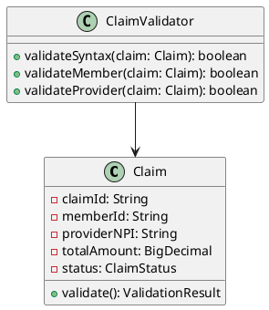

Absolutely! Below is a **complete C4 Model diagram set** (Levels 1–3) for a **Healthcare Payer Modernization Architecture**, using **PlantUML + C4-PlantUML syntax** — which you can copy-paste into any PlantUML renderer (like [PlantUML Web Server](https://www.plantuml.com/plantuml), VS Code with PlantUML plugin, or IntelliJ).

> 💡 I’ll also include rendered **ASCII visual approximations** for quick understanding, and explain each diagram’s purpose.

---

# ✅ C4 Diagrams for Healthcare Payer Modernization

## 🎯 Assumptions
We’re modernizing a legacy payer system by:
- Wrapping mainframe with APIs
- Building cloud-native microservices for Member, Claims, Benefits
- Adopting FHIR + EDI standards
- Using event-driven architecture (Kafka)
- Deploying on AWS/Azure

---

# 🖼️ LEVEL 1: SYSTEM CONTEXT DIAGRAM  
*(Audience: Executives, Business Stakeholders, Compliance Officers)*

```plantuml
@startuml
!include https://raw.githubusercontent.com/plantuml-stdlib/C4-PlantUML/master/C4_Context.puml

Person(member, "Member / Patient", "Submits claims, checks benefits, views EOB")
Person(provider, "Provider / Clinician", "Submits claims, checks eligibility, receives payments")
Person(admin, "Payer Admin", "Manages plans, rules, networks, compliance")

System_Boundary(payer_sys, "Modernized Payer Platform") {
    System_Ext(legacy_mainframe, "Legacy Mainframe", "COBOL/CICS Claims Engine (wrapped via APIs)")
    System(modern_core, "Modern Core Services", "Cloud-native services: Member, Claims, Benefits, Payments")
}

Rel(member, modern_core, "Uses Portal & APIs (FHIR/EDI)")
Rel(provider, modern_core, "Submits Claims & Eligibility (X12/FHIR)")
Rel(admin, modern_core, "Manages Rules, Plans, Reporting")

Rel(modern_core, legacy_mainframe, "Fallback / Hybrid Processing", "Async Events (Kafka)")

System_Ext(cms, "CMS / Regulators", "Receives HEDIS, Quality Reports")
System_Ext(partner_apps, "Partner Apps (Employers, Brokers)", "Integrates via APIs")

Rel(modern_core, cms, "Submits Compliance Reports")
Rel(modern_core, partner_apps, "Shares Member/Plan Data (FHIR APIs)")

@enduml
```

### 📐 ASCII Approximation (L1)

```
   +----------------+       +-------------------------+
   |   MEMBER       |------>|                         |
   +----------------+       |  MODERNIZED PAYER       |<------| PROVIDER
                            |       PLATFORM          |       +----------+
   +----------------+   ↗   |  +-------------------+  |  ↗
   |   ADMIN        |------> |  | Modern Core Svc   |<-------| PARTNER APPS
   +----------------+   ↘   |  +-------------------+  |  ↘
                            |            ↓            |
                            |  +-------------------+  |
                            |  | Legacy Mainframe  |  |
                            |  +-------------------+  |
                                      ↓
                               +-------------+
                               |    CMS      |
                               +-------------+
```

> 💡 Focus: Who interacts with the system? What external systems are involved?

---

# 🖼️ LEVEL 2: CONTAINER DIAGRAM  
*(Audience: Architects, DevOps, Engineering Leads)*

```plantuml
@startuml
!include https://raw.githubusercontent.com/plantuml-stdlib/C4-PlantUML/master/C4_Container.puml

Person(member, "Member", "Mobile/Web User")
Person(provider, "Provider", "Clinic/Hospital System")

System_Boundary(payer_platform, "Modernized Payer Platform") {

    Container(member_portal, "Member Portal", "React/Next.js", "Member self-service: claims, ID card, cost estimator")
    Container(provider_portal, "Provider Portal", "Angular", "Eligibility, claim status, remittance (ERA)")
    Container(api_gateway, "API Gateway", "Kong/Apigee", "Auth, routing, rate limiting for all APIs")

    Container(member_svc, "Member Service", "Node.js", "Manages member profiles, demographics, relationships")
    Container(benefits_svc, "Benefits Engine", "Java + Drools", "Evaluates coverage, copays, deductibles")
    Container(claims_svc, "Claims Service", "Go", "Ingests, validates, adjudicates claims (X12 837)")
    Container(payment_svc, "Payment Service", "Python", "Generates EFT/ERA (X12 835)")

    Container(fhir_gateway, "FHIR Gateway", "Java", "Converts internal data to FHIR R4 for external APIs")
    Container(edi_gateway, "EDI Gateway", "C#/.NET", "Handles X12 270/271/837/835 with partners")

    Container(event_bus, "Event Bus", "Kafka", "Decouples services; streams claims, member updates, payments")
    Container(fhir_db, "FHIR Data Store", "MongoDB", "Stores FHIR resources for APIs")
    Container(mainframe_adapter, "Mainframe Adapter", "Java/CICS Bridge", "Reads/writes to legacy via APIs")

    Container(cloud_data_lake, "Cloud Data Lake", "AWS S3 + Glue", "Stores claims, member, provider data for analytics & ML")
}

Rel(member, member_portal, "Views claims, benefits")
Rel(provider, provider_portal, "Checks eligibility, submits claims")

Rel(member_portal, api_gateway, "HTTPS")
Rel(provider_portal, api_gateway, "HTTPS")

Rel(api_gateway, member_svc, "Get member data")
Rel(api_gateway, benefits_svc, "Check benefits")
Rel(api_gateway, claims_svc, "Submit/view claims")
Rel(api_gateway, fhir_gateway, "FHIR APIs (R4)")

Rel(member_svc, event_bus, "Publishes member updates")
Rel(claims_svc, event_bus, "Publishes claim events")
Rel(benefits_svc, event_bus, "Publishes plan changes")

Rel(event_bus, payment_svc, "Triggers payment on approved claim")
Rel(event_bus, fhir_gateway, "Syncs data to FHIR store")
Rel(event_bus, cloud_data_lake, "Streams for analytics")

Rel(claims_svc, mainframe_adapter, "Fallback adjudication (sync/async)")
Rel(benefits_svc, mainframe_adapter, "Validate against legacy rules")

Rel(fhir_gateway, fhir_db, "Stores FHIR resources")
Rel(edi_gateway, claims_svc, "Ingests X12 837 claims")
Rel(edi_gateway, payment_svc, "Sends X12 835 remittance")

Rel(payer_platform, "CMS Regulators", "Submits HEDIS via CSV/API")
Rel(payer_platform, "Partner Apps", "Shares data via FHIR APIs")

@enduml
```

### 📐 ASCII Approximation (L2)

```
   [Member] → [Member Portal] ↘
                                → [API Gateway] → [Member Svc] → (Event Bus) → [FHIR Gateway] → [FHIR DB]
   [Provider] → [Provider Portal] ↗              → [Benefits Svc] ↗             ↘
                                → [EDI Gateway] → [Claims Svc] → [Mainframe Adapter] → [Legacy]
                                                    ↘ → [Payment Svc] → [EDI 835]
                                                         ↘ → [Cloud Data Lake]

   [Event Bus] = Kafka — connects all services async
```

> 💡 Focus: What are the containers (deployables)? How do they communicate? What tech stacks?

---

# 🖼️ LEVEL 3: COMPONENT DIAGRAM (Claims Service)  
*(Audience: Developers, QA, SREs)*

> Let’s zoom into the **Claims Service** — often the most complex.

```plantuml
@startuml
!include https://raw.githubusercontent.com/plantuml-stdlib/C4-PlantUML/master/C4_Component.puml

Container_Boundary(claims_container, "Claims Service (Go)") {

    Component(claims_controller, "ClaimsController", "HTTP handler for REST/FHIR APIs")
    Component(claims_ingestor, "X12Ingestor", "Parses X12 837 files from EDI Gateway")
    Component(claims_validator, "ClaimValidator", "Validates syntax, member ID, provider NPI")
    Component(benefits_checker, "BenefitsChecker", "Calls Benefits Svc to verify coverage")
    Component(rules_engine, "AdjudicationRules", "Drools-based rules for approval/denial")
    Component(fraud_detector, "FraudDetector", "ML model for anomaly detection (Python lib)")
    Component(claims_repo, "ClaimsRepository", "Persists to PostgreSQL")
    Component(event_publisher, "EventPublisher", "Publishes to Kafka (ClaimSubmitted, ClaimAdjudicated)")

}

Rel(claims_controller, claims_ingestor, "POST /claims (X12 or JSON)")
Rel(claims_ingestor, claims_validator, "Validate parsed claim")
Rel(claims_validator, benefits_checker, "Check eligibility & benefits")
Rel(benefits_checker, rules_engine, "Apply copay/deductible rules")
Rel(rules_engine, fraud_detector, "Flag for review if anomaly score > threshold")
Rel(fraud_detector, claims_repo, "Save claim status")
Rel(claims_repo, event_publisher, "Publish event after save")

Rel(claims_container, "Benefits Service", "gRPC", "Check member benefits")
Rel(claims_container, "Mainframe Adapter", "HTTP Fallback", "Adjudicate if rules engine fails")
Rel(claims_container, "Kafka", "Publish events")

@enduml
```

### 📐 ASCII Approximation (L3 — Claims Service)

```
+-------------------------------------------------+
|           Claims Service (Go)                   |
| +----------------+    +---------------------+   |
| | ClaimsController| → | X12Ingestor         |   |
| +----------------+    +----------+----------+   |
|                                  ↓              |
|                      +----------------------+   |
|                      | ClaimValidator       |   |
|                      +----------+-----------+   |
|                                 ↓              |
|                   +------------------------+   |
|                   | BenefitsChecker (gRPC) | → [Benefits Svc]
|                   +-----------+------------+   |
|                               ↓                |
|                 +--------------------------+   |
|                 | AdjudicationRules (Drools)|   |
|                 +------------+-------------+   |
|                              ↓                |
|               +--------------------------+     |
|               | FraudDetector (ML Model) |     |
|               +------------+-------------+     |
|                            ↓                   |
|              +------------------------+        |
|              | ClaimsRepository (PG)  |        |
|              +------------+-----------+        |
|                           ↓                    |
|             +--------------------------+       |
|             | EventPublisher (Kafka)   | → [Event Bus]
|             +--------------------------+       |
|                                                 |
|  Fallback → [Mainframe Adapter (HTTP)]          |
+-------------------------------------------------+
```

> 💡 Focus: How is the Claims Service internally structured? What are the components and their responsibilities?

---

# 📊 BONUS: Deployment & Tech Stack Summary

| Container           | Tech Stack                     | Cloud/Infra Target      |
|---------------------|--------------------------------|--------------------------|
| Member Portal       | React, Next.js                 | AWS Amplify / Azure Static Web Apps |
| API Gateway         | Kong, Apigee                   | Kubernetes / Managed SaaS |
| Member Service      | Node.js, TypeScript            | AWS ECS / Azure App Service |
| Benefits Engine     | Java 17, Drools, Spring Boot   | Kubernetes               |
| Claims Service      | Go, gRPC, PostgreSQL           | Kubernetes + RDS         |
| FHIR Gateway        | Java, HAPI FHIR                | Kubernetes               |
| EDI Gateway         | .NET, X12 Parser Libs          | Azure Functions / AWS Lambda |
| Event Bus           | Kafka (MSK / Confluent Cloud)  | Managed Kafka            |
| Cloud Data Lake     | AWS S3, Glue, Athena           | AWS                      |
| Mainframe Adapter   | Java, IBM CICS Client          | Hybrid (On-prem ↔ Cloud) |

---

# 🚀 How to Use These Diagrams

1. **Copy-Paste** into [PlantUML Web Editor](https://www.plantuml.com/plantuml) to render PNG/SVG.
2. **Save as .puml files** in your repo — version-controlled architecture!
3. **Embed in Confluence / Notion** using PlantUML plugins.
4. **Present L1 to execs**, L2 to architects, L3 to devs.
5. **Update as you build** — living documentation!

---

# 🧩 Optional: Add Level 4 (Code Diagram)

You can generate UML class diagrams for key components (e.g., `ClaimValidator.java`) using tools like:
- IntelliJ IDEA (Diagrams → Show Diagram)
- VS Code + PlantUML + Code2UML
- Source code → Mermaid Class Diagram

Example snippet:


---

# ✅ Summary

You now have:

✅ **C1: System Context** — Business view  
✅ **C2: Container Diagram** — Technical deployables & data flow  
✅ **C3: Component Diagram** — Internal structure of Claims Service  
✅ **Tech Stack & Deployment Mapping**  
✅ **Ready-to-Use PlantUML Code** — just paste and render!

---

Would you like me to generate:
- A **C4 diagram for Member Service or Benefits Engine**?
- A **Mermaid.js version** for embedding in Markdown/Notion?
- A **PDF/PNG export guide**?
- A **migration roadmap slide deck** based on these diagrams?

Let me know — I’ll tailor it further for your use case! 🚀
