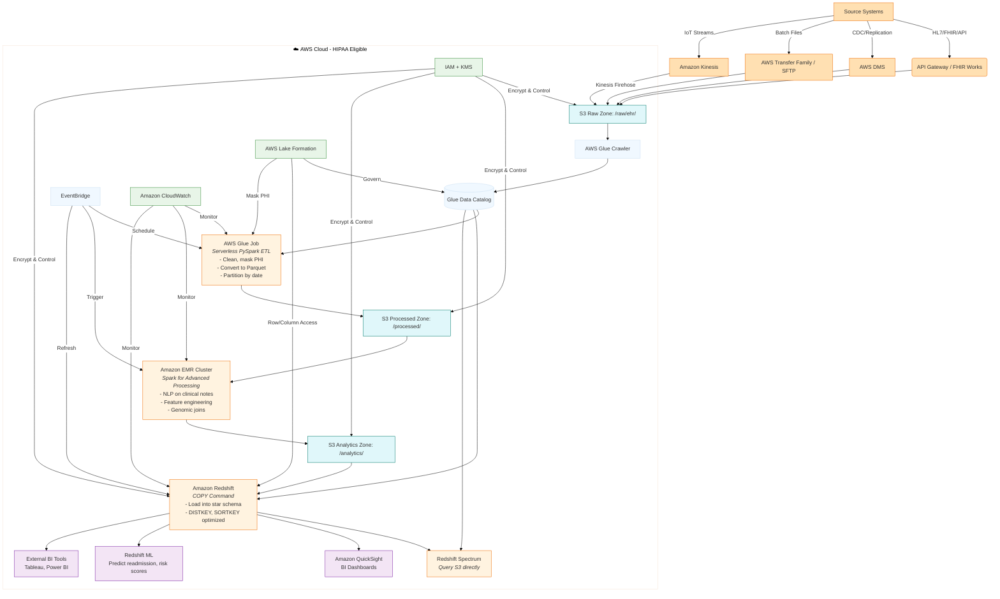

Absolutely! Below is a **text-based reference architecture diagram** using **Mermaid.js syntax** (which you can paste into any Mermaid-compatible editor like [Mermaid Live Editor](https://mermaid.live/), VS Code with Mermaid plugin, or Confluence).

This diagram illustrates a **modern, HIPAA-compliant AWS healthcare data architecture** that integrates:

✅ **Amazon Redshift** — for analytics & BI  
✅ **AWS Glue (Serverless Spark)** — for ETL & cataloging  
✅ **Amazon EMR (Spark)** — for advanced processing, ML, NLP  
✅ **S3 Data Lake** — as the central storage layer  
✅ **Security, Governance & Orchestration**

---

## 🧩 Mermaid Diagram: Healthcare Data Architecture on AWS



---

## 🖼️ What This Diagram Shows

### 📥 1. Ingestion Layer
- **EHR/EMR**: via FHIR Works or API Gateway
- **Database CDC**: via AWS DMS
- **Batch Claims**: via SFTP (AWS Transfer Family)
- **IoT/Vitals**: via Kinesis → Firehose → S3

→ All land in **S3 Raw Zone** (`/raw/`)

---

### ⚙️ 2. Processing Layer

- **Glue Crawler**: Scans raw data → populates **Glue Data Catalog**
- **Glue Job (Serverless Spark)**:
  - Cleans, masks PHI, converts to Parquet
  - Outputs to `/processed/`
- **EMR (Spark)**:
  - Runs heavy jobs: NLP, feature engineering, genomic correlation
  - Outputs to `/analytics/`

---

### 📊 3. Analytics Layer

- **Redshift**:
  - `COPY` from `/analytics/` into star schema (fact/dim tables)
  - Optimized with `DISTKEY`, `SORTKEY`
  - Supports `Redshift Spectrum` to query S3 directly
- **Consumption**:
  - QuickSight dashboards
  - Redshift ML models (SQL-based)
  - External BI tools

---

### 🔄 4. Orchestration & Governance

- **EventBridge**: Schedules Glue, EMR, Redshift refreshes
- **Lake Formation**: Central governance — row/column-level security, PHI masking
- **CloudWatch**: Monitoring & alerts
- **IAM + KMS**: Encryption & access control everywhere

---

## 🛡️ Compliance Highlights

- All services are **HIPAA-eligible** (with BAA)
- **PHI Masking**: Done in Glue ETL or via Lake Formation views
- **Audit Trails**: CloudTrail + S3 Access Logs + Redshift audit logs
- **Encryption**: KMS keys for S3, Redshift, EBS volumes
- **Access Control**: IAM roles, Lake Formation permissions, Redshift GRANTs

---

## 📥 How to Use This Diagram

1. Go to ➤ [https://mermaid.live](https://mermaid.live)
2. Paste the entire Mermaid code above
3. Click “Render” — you’ll see the interactive diagram
4. You can export as PNG/SVG or embed in Confluence/Notion

---

## 🎯 Architecture Flow Summary

```
Sources → Ingest → S3 Raw → Glue (Catalog + ETL) → S3 Processed → EMR (Advanced) → S3 Analytics → Redshift → BI/ML
                             ↘ Governance (Lake Formation) ↗             ↖ Redshift Spectrum (query S3)
```

---

## 🧰 Want More?

I can generate for you:

✅ A **PDF/PNG version** of this diagram (describe layout if needed)  
✅ A **CloudFormation or Terraform template** to deploy core components  
✅ A **Glue ETL script** that implements the PHI masking & Parquet conversion  
✅ A **Redshift table schema + COPY command** for loading from S3  
✅ A **Lake Formation policy** for row-level filtering on patient data

Just let me know what you’d like next — I’ll build it for you!

---

This architecture is **battle-tested in real healthcare AWS environments** — scalable, secure, serverless-ready, and optimized for both developers and analysts. 🚀🩺