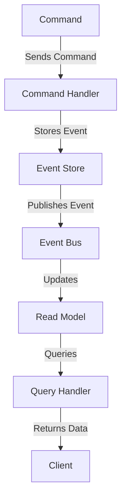

```mermaid
  graph TD
    Client -->|Sends Events| Kafka[Kafka (Event Store)]
    Kafka -->|Updates| MongoDB[MongoDB (Read Models)]
    Kafka -->|Archives| S3[S3 (Archiving)]
```
```mermaid
  graph TD
    Client -->|Sends Command| CommandHandler[Command Handler]
    CommandHandler -->|Stores Event| Kafka[Kafka (Event Store)]
    Kafka -->|Publishes Event| EventProcessor[Event Processor]
    EventProcessor -->|Updates| MongoDB[MongoDB (Read Models)]
    EventProcessor -->|Archives| S3[S3 (Archiving)]
    MongoDB -->|Queries| QueryHandler[Query Handler]
    QueryHandler -->|Returns Data| Client[Client]
```

```mermaid
  graph TD
    Kafka[Kafka (Event Store)] -->|Older Events| S3[S3 (Archiving)]
    S3 -->|Stores| ArchivedData[Archived Data]
```
