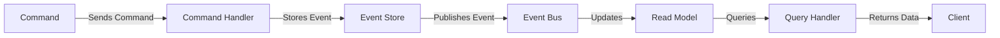

```mermaid
  graph TD;
      A-->B;
      A-->C;
      B-->D;
      C-->D;
```

```mermaid
graph LR
    Command[Command] -->|Sends Command| CommandHandler[Command Handler]
    CommandHandler -->|Stores Event| EventStore[Event Store]
    EventStore -->|Publishes Event| EventBus[Event Bus]
    EventBus -->|Updates| ReadModel[Read Model]
    ReadModel -->|Queries| QueryHandler[Query Handler]
    QueryHandler -->|Returns Data| Client[Client]
```
