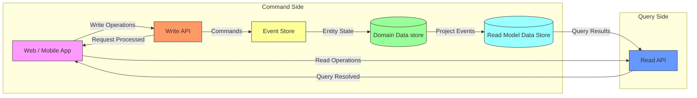

```mermaid
flowchart LR
    Client[Web / Mobile App]
    API[Write API]
    Kafka[Event Store]
    MongoDB[(Domain Data store)]
    ReadDB[(Read Model Data Store)]
    
    subgraph Command Side
        direction TB
        API --> |Commands| Kafka
        Kafka --> |Entity State| MongoDB
        MongoDB --> |Project Events| ReadDB
        API --> |Request Processed| Client
    end
    
    subgraph Query Side
        direction TB
        ReadAPI[Read API]
        ReadDB --> |Query Results| ReadAPI
        ReadAPI -->|Query Resolved| Client
    end
    
    Client --> |Write Operations| API
    Client --> |Read Operations| ReadAPI

    style Client fill:#f9f,stroke:#333
    style Kafka fill:#ff9,stroke:#333
    style MongoDB fill:#9f9,stroke:#333
    style ReadDB fill:#9ff,stroke:#333
    style API fill:#f96,stroke:#333
    style ReadAPI fill:#69f,stroke:#333
```
