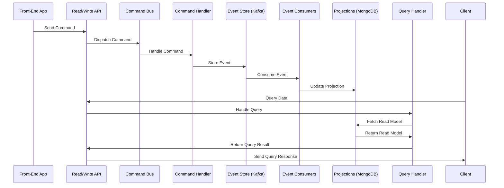

```mermaid
sequenceDiagram
    participant User as Front-End App
    participant API as Read/Write API
    participant CB as Command Bus
    participant CH as Command Handler
    participant ES as Event Store (Kafka)
    participant EC as Event Consumers
    participant P as Projections (MongoDB)
    participant Q as Query Handler
    participant Client as Client

    User->>API: Send Command
    API->>CB: Dispatch Command
    CB->>CH: Handle Command
    CH->>ES: Store Event
    ES->>EC: Consume Event
    EC->>P: Update Projection
    Client->>API: Query Data
    API->>Q: Handle Query
    Q->>P: Fetch Read Model
    P->>Q: Return Read Model
    Q->>API: Return Query Result
    API->>Client: Send Query Response
```