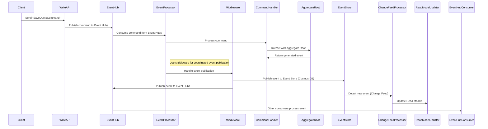

```mermaid
sequenceDiagram
    participant Client
    participant WriteAPI
    participant EventHub
    participant EventProcessor
    participant Middleware
    participant CommandHandler
    participant AggregateRoot
    participant EventStore
    participant ChangeFeedProcessor
    participant ReadModelUpdater
    participant EventHubConsumer

    Client ->> WriteAPI: Send "SaveQuoteCommand"
    WriteAPI ->> EventHub: Publish command to Event Hubs
    EventHub ->> EventProcessor: Consume command from Event Hubs
    EventProcessor ->> CommandHandler: Process command
    CommandHandler ->> AggregateRoot: Interact with Aggregate Root
    AggregateRoot ->> CommandHandler: Return generated event

    Note right of EventProcessor: Use Middleware for coordinated event publication
    EventProcessor ->> Middleware: Handle event publication
    Middleware ->> EventStore: Publish event to Event Store (Cosmos DB)
    Middleware ->> EventHub: Publish event to Event Hubs

    EventStore ->> ChangeFeedProcessor: Detect new event (Change Feed)
    ChangeFeedProcessor ->> ReadModelUpdater: Update Read Models
    EventHub ->> EventHubConsumer: Other consumers process event

```
