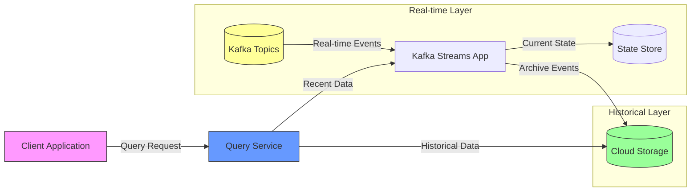

```mermaid
flowchart LR
    Client[Client Application]
    KS[Kafka Streams App]
    Kafka[(Kafka Topics)]
    SS[(State Store)]
    CS[(Cloud Storage)]
    QA[Query Service]
    
    Kafka -->|Real-time Events| KS
    KS -->|Current State| SS
    KS -->|Archive Events| CS
    Client -->|Query Request| QA
    QA -->|Recent Data| KS
    QA -->|Historical Data| CS
    
    subgraph Real-time Layer
        Kafka
        KS
        SS
    end

    subgraph Historical Layer
        CS
    end
    
    style Client fill:#f9f,stroke:#333
    style Kafka fill:#ff9,stroke:#333
    style CS fill:#9f9,stroke:#333
    style QA fill:#69f,stroke:#333
```
