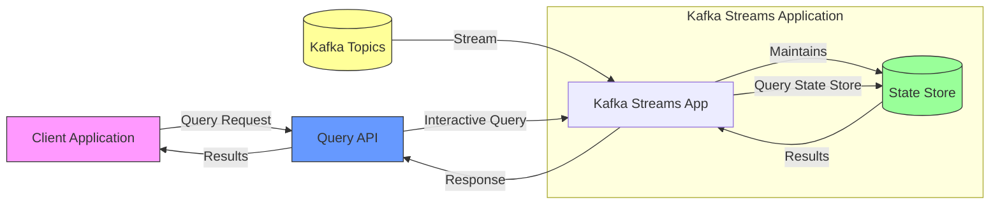

```mermaid
flowchart LR
    Client[Client Application]
    KS[Kafka Streams App]
    Kafka[(Kafka Topics)]
    SS[(State Store)]
    QA[Query API]
    
    Kafka -->|Stream| KS
    KS -->|Maintains| SS
    Client -->|Query Request| QA
    QA -->|Interactive Query| KS
    KS -->|Query State Store| SS
    SS -->|Results| KS
    KS -->|Response| QA
    QA -->|Results| Client
    
    subgraph Kafka Streams Application
        KS
        SS
    end
    
    style Client fill:#f9f,stroke:#333
    style Kafka fill:#ff9,stroke:#333
    style SS fill:#9f9,stroke:#333
    style QA fill:#69f,stroke:#333
```
