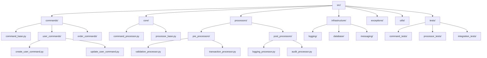

```mermaid
graph TD
    src[src/]
    commands[commands/]
    core[core/]
    processors[processors/]
    infrastructure[infrastructure/]
    exceptions[exceptions/]
    utils[utils/]
    tests[tests/]

    src --> commands
    src --> core
    src --> processors
    src --> infrastructure
    src --> exceptions
    src --> utils
    src --> tests

    commands --> command_base[command_base.py]
    commands --> user_commands[user_commands/]
    commands --> order_commands[order_commands/]

    core --> command_processor[command_processor.py]
    core --> processor_base[processor_base.py]

    processors --> pre_processors[pre_processors/]
    processors --> post_processors[post_processors/]

    infrastructure --> logging[logging/]
    infrastructure --> database[database/]
    infrastructure --> messaging[messaging/]

    tests --> command_tests[command_tests/]
    tests --> processor_tests[processor_tests/]
    tests --> integration_tests[integration_tests/]

    user_commands --> create_user[create_user_command.py]
    user_commands --> update_user[update_user_command.py]

    pre_processors --> validation[validation_processor.py]
    pre_processors --> transaction[transaction_processor.py]

    post_processors --> logging_processor[logging_processor.py]
    post_processors --> audit[audit_processor.py]
```
