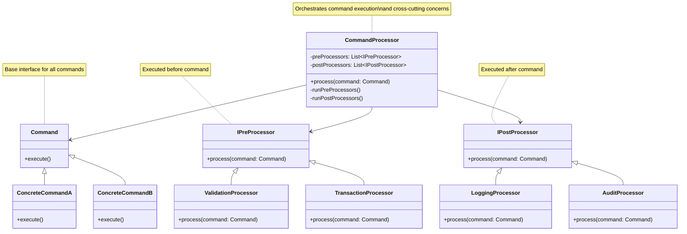

```mermaid
classDiagram
    class Command {
        +execute()
    }
    class ConcreteCommandA {
        +execute()
    }
    class ConcreteCommandB {
        +execute()
    }
    class CommandProcessor {
        -preProcessors: List~IPreProcessor~
        -postProcessors: List~IPostProcessor~
        +process(command: Command)
        -runPreProcessors()
        -runPostProcessors()
    }
    class IPreProcessor {
        +process(command: Command)
    }
    class IPostProcessor {
        +process(command: Command)
    }
    class ValidationProcessor {
        +process(command: Command)
    }
    class LoggingProcessor {
        +process(command: Command)
    }
    class TransactionProcessor {
        +process(command: Command)
    }
    class AuditProcessor {
        +process(command: Command)
    }

    Command <|-- ConcreteCommandA
    Command <|-- ConcreteCommandB
    CommandProcessor --> Command
    CommandProcessor --> IPreProcessor
    CommandProcessor --> IPostProcessor
    IPreProcessor <|-- ValidationProcessor
    IPreProcessor <|-- TransactionProcessor
    IPostProcessor <|-- LoggingProcessor
    IPostProcessor <|-- AuditProcessor

    note for Command "Base interface for all commands"
    note for CommandProcessor "Orchestrates command execution\nand cross-cutting concerns"
    note for IPreProcessor "Executed before command"
    note for IPostProcessor "Executed after command"
```
