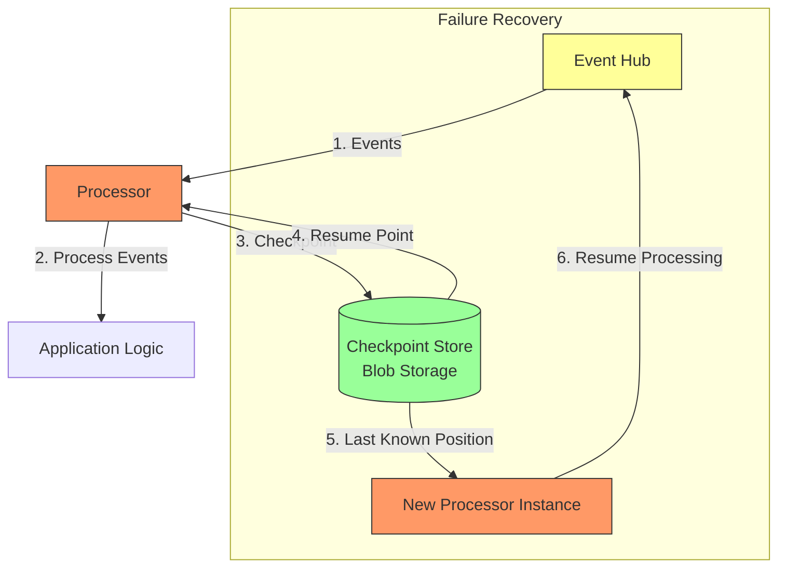

```mermaid
flowchart TD
    EH[Event Hub] -->|1. Events| Processor
    Processor -->|2. Process Events| App[Application Logic]
    Processor -->|3. Checkpoint| CS[(Checkpoint Store\nBlob Storage)]
    CS -->|4. Resume Point| Processor
    
    subgraph "Failure Recovery"
        CS -->|5. Last Known Position| NewProcessor[New Processor Instance]
        NewProcessor -->|6. Resume Processing| EH
    end
    
    style EH fill:#ff9,stroke:#333
    style CS fill:#9f9,stroke:#333
    style Processor fill:#f96,stroke:#333
    style NewProcessor fill:#f96,stroke:#333
```
