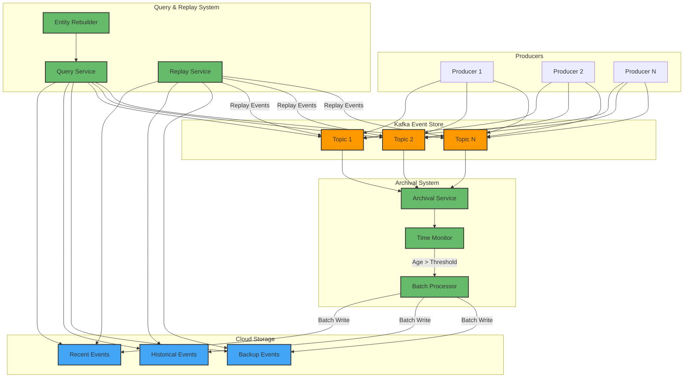

I'll create a Mermaid diagram to visualize the flow of events and data in the system.

Let me explain the key components and flows in the diagram:

1. Event Production Flow:
   - Multiple producers write events to different Kafka topics
   - Events are stored in Kafka with their original ordering and timestamps

2. Archival Flow:
   - Archival Service continuously monitors Kafka topics
   - Time Monitor checks event age against configured threshold
   - Batch Processor aggregates events and writes to Cloud Storage
   - Events are organized in Cloud Storage by recency and type

3. Query & Replay Flow:
   - Query Service can access both Kafka and Cloud Storage
   - Replay Service can restore events back to Kafka when needed
   - Entity Rebuilder uses both systems to reconstruct entity states

Color Coding:
- Orange: Kafka components (Event Store)
- Blue: Cloud Storage components
- Green: Processing services

The system maintains data accessibility while efficiently managing storage across both hot (Kafka) and cold (Cloud Storage) tiers. Would you like me to:
1. Add more detail about any specific component?
2. Show the data flow for a specific scenario (like entity rebuild)?
3. Include additional components for monitoring or scaling?