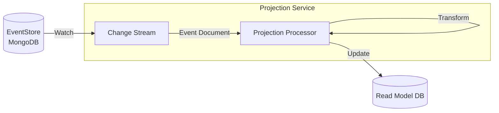

```mermaid
flowchart LR
    MongoDB[(EventStore\nMongoDB)]
    CS[Change Stream]
    PP[Projection Processor]
    RM[(Read Model DB)]
    
    MongoDB -->|Watch| CS
    CS -->|Event Document| PP
    PP -->|Transform| PP
    PP -->|Update| RM
    
    subgraph Projection Service
        CS
        PP
    end
```
