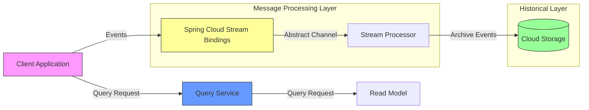

```mermaid
flowchart LR
    Client[Client Application]
    Binding[Spring Cloud Stream Bindings]
    Processor[Stream Processor]
    CS[(Cloud Storage)]
    QA[Query Service]
    RDS[Read Model]

    
    Client -->|Events| Binding
    Binding -->|Abstract Channel| Processor
    Processor -->|Archive Events| CS
    Client -->|Query Request| QA
    QA -->|Query Request| RDS

    
    subgraph Message Processing Layer
        Binding
        Processor
    end
    
    subgraph Historical Layer
        CS
    end
    
    style Client fill:#f9f,stroke:#333
    style Binding fill:#ff9,stroke:#333
    style CS fill:#9f9,stroke:#333
    style QA fill:#69f,stroke:#333
```
