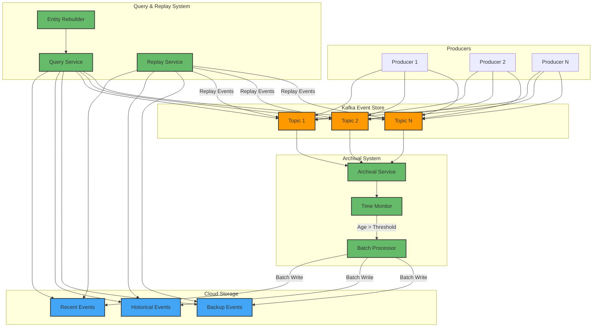

```mermaid
flowchart TD
    subgraph Producers
        P1[Producer 1]
        P2[Producer 2]
        P3[Producer N]
    end

    subgraph "Kafka Event Store"
        K1[Topic 1]
        K2[Topic 2]
        K3[Topic N]
    end

    subgraph "Archival System"
        AS[Archival Service]
        TM[Time Monitor]
        BP[Batch Processor]
    end

    subgraph "Cloud Storage"
        B1[Recent Events]
        B2[Historical Events]
        B3[Backup Events]
    end

    subgraph "Query & Replay System"
        QS[Query Service]
        RS[Replay Service]
        ER[Entity Rebuilder]
    end

    P1 & P2 & P3 --> K1 & K2 & K3
    K1 & K2 & K3 --> AS
    AS --> TM
    TM --> |"Age > Threshold"| BP
    BP --> |"Batch Write"| B1 & B2 & B3
    
    QS --> B1 & B2 & B3
    QS --> K1 & K2 & K3
    RS --> B1 & B2 & B3
    RS --> |"Replay Events"| K1 & K2 & K3
    ER --> QS
    
    classDef kafka fill:#ff9900,stroke:#333,stroke-width:2px
    classDef storage fill:#42a5f5,stroke:#333,stroke-width:2px
    classDef service fill:#66bb6a,stroke:#333,stroke-width:2px
    
    class K1,K2,K3 kafka
    class B1,B2,B3 storage
    class AS,TM,BP,QS,RS,ER service
```
