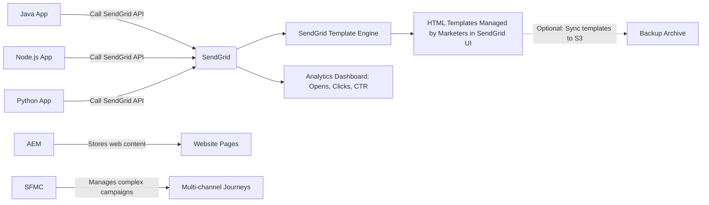

Great question — leveraging **Adobe Experience Manager (AEM)** or **Salesforce Marketing Cloud (SFMC)** for email template management is a natural consideration, especially since you mentioned both are already in use in your environment.

Let’s evaluate **AEM** and **SFMC** specifically as **email template management platforms** — not as full email senders — in the context of your core requirements:

---

## ✅ Your Core Requirements Recap (Relevant to Template Management)

| Requirement | Priority |
|-----------|----------|
| **Business users can manage email templates without dev help** | ⭐⭐⭐⭐⭐ |
| **Unified approach across Java/Node.js/Python apps** | ⭐⭐⭐⭐⭐ |
| **Support for Security & Compliance** | ⭐⭐⭐⭐⭐ |
| **Analytics (Open rate, CTR, time-to-open)** | ⭐⭐⭐⭐⭐ |
| **Bulk email sending at scale** | ⭐⭐⭐⭐⭐ |
| **Cost-efficient** | ⭐⭐⭐⭐ |

> 💡 **Important**: You’re *not* asking “Should we replace all email sending with AEM/SFMC?”  
> You’re asking:  
> > _“Can we use AEM or SFMC just for **template management**, while keeping our own send infrastructure (e.g., SES + SendGrid) for delivery?”_

That’s a smart, pragmatic architecture. Let’s analyze it.

---

## 🧩 Option 1: Use **Salesforce Marketing Cloud (SFMC)** for Template Management Only

### ✅ Strengths for Template Management

| Feature | How SFMC Delivers |
|--------|-------------------|
| **No-code template editor** | ✅ **Industry-leading drag-and-drop Content Builder** — WYSIWYG, responsive design, dynamic content blocks, personalization strings (`%%FirstName%%`), AMPscript logic. |
| **Versioning & Approval Workflows** | ✅ Full lifecycle management: draft → review → approve → publish. Audit trails included. |
| **Reusable Components** | ✅ Templates can include modular components (headers, footers, CTAs) — great for brand consistency. |
| **Multilingual Support** | ✅ Built-in translation workflows. |
| **Security & Compliance** | ✅ SOC 2, GDPR, HIPAA compliant. Enterprise-grade access controls, data residency options. |
| **Integration with External Systems** | ✅ REST APIs available to **fetch template HTML** from external apps (Java/Node.js/Python). |

### ❌ Critical Limitations for Your Use Case

| Issue | Why It’s Problematic |
|------|----------------------|
| **Not designed as a "template store"** | SFMC is an **end-to-end marketing platform**. Fetching templates via API is possible, but **you're forced into SFMC’s ecosystem** — even if you don’t send emails through it. |
| **API complexity** | To retrieve a template via REST API, you must: <br> - Authenticate with OAuth2 <br> - Navigate complex object models (ContentBuilder, Asset, Definition) <br> - Handle versioning manually <br> - Parse HTML with embedded AMPscript — which may break if rendered outside SFMC |
| **Template portability risk** | SFMC templates often contain **AMPscript**, **SSJS**, or **personalization strings** that **only work inside SFMC**. If you render them externally (e.g., via SendGrid or SES), they’ll fail unless rewritten. |
| **Cost inefficiency** | Even if you only use SFMC for templates, you need a **full SFMC license** — which starts at **$5K–$10K/month**. You’re paying for 90% of features you don’t use. |
| **No analytics from external sends** | If you send emails via SendGrid or SES, **SFMC cannot track opens/clicks** unless you inject tracking pixels and link wrapping — which requires heavy engineering effort and breaks deliverability if done poorly. |

> 💡 **Bottom Line**:  
> SFMC is **overkill and expensive** if used only for template storage. It’s brilliant for end-to-end campaigns — but a **poor fit as a lightweight template registry**.

---

## 🧩 Option 2: Use **Adobe Experience Manager (AEM)** for Template Management Only

### ✅ Strengths for Template Management

| Feature | How AEM Delivers |
|--------|------------------|
| **Visual, no-code template editor** | ✅ Drag-and-drop interface with **responsive design tools**, component libraries, and preview modes. Marketers can edit text, images, CTAs visually. |
| **Component-based architecture** | ✅ Reusable components (header, footer, promo banner) promote brand consistency. |
| **Workflow & approvals** | ✅ Built-in publishing workflows, version history, user roles, and audit logs. |
| **Content reuse & multilingual** | ✅ Excellent for global brands — translations, DAM integration, cloud services. |
| **Security & Compliance** | ✅ GDPR, CCPA, SOC 2, ISO 27001 certified. Granular permissions. |
| **REST APIs available** | ✅ Yes — you can fetch template HTML via `/bin/wcm/content.json` or `/content/dam/.../jcr:content` endpoints. |

### ❌ Critical Limitations for Your Use Case

| Issue | Why It’s Problematic |
|------|----------------------|
| **Templates are not email-optimized** | AEM was built for **web pages**, not **HTML emails**. Email clients (Outlook, Gmail) have terrible CSS support. AEM templates often use modern CSS/JS that **breaks in email clients**. |
| **No native email rendering engine** | Unlike SFMC or SendGrid, AEM doesn’t auto-convert web templates to email-safe HTML. You’d need to manually ensure: <br> - Inline CSS <br> - Table-based layouts <br> - No media queries <br> - Avoid modern fonts |
| **Complex API for template retrieval** | Fetching a clean, usable email HTML blob requires: <br> - Custom servlets <br> - Post-processing to inline CSS <br> - Stripping out AEM-specific JS/CSS <br> - Handling dynamic variables (`{name}` → `{{name}}`) |
| **No built-in email analytics** | AEM has **zero native open/click tracking** for external emails. You’d need to inject tracking pixels + log events → complex and unreliable. |
| **Cost & overhead** | AEM is an enterprise CMS — **license cost starts at $100K+/year**. Requires dedicated DevOps, hosting, and admins. |
| **Over-engineered for simple use case** | You’re using AEM to store HTML snippets — but it’s designed for managing entire websites, digital assets, and personalized experiences. |

> 💡 **Bottom Line**:  
> AEM is a **powerful CMS** — but **not an email template manager**. Using it for this purpose is like using a Ferrari to deliver groceries. Possible? Yes. Efficient? No.

---

## 🔍 Comparison Summary: AEM & SFMC for Template Management Only

| Feature | **Salesforce Marketing Cloud** | **Adobe AEM** | **SendGrid** | **Custom (S3 + GitHub)** |
|--------|-------------------------------|---------------|--------------|--------------------------|
| **No-code template editor** | ✅ Best-in-class | ✅ Very good | ✅ Good | ❌ None |
| **Email-safe HTML output** | ✅ Auto-generated | ❌ Manual conversion needed | ✅ Auto-generated | ✅ Manual control |
| **Dynamic variables supported** | ✅ AMPscript/Personalization Strings | ✅ Sling Model bindings | ✅ Handlebars | ✅ Any (custom) |
| **API to fetch templates** | ✅ Yes (complex) | ✅ Yes (complex) | ✅ Yes (simple) | ✅ Yes (simple) |
| **Analytics (open/click)** | ✅ Only if sending via SFMC | ❌ No | ✅ Yes | ✅ Manual (UTM + pixel) |
| **Cost (annual estimate)** | **$60K–$120K+** | **$100K+** | **$1.8K–$18K** | **$0–$5K** |
| **Dev effort to integrate** | High | High | Low | Low |
| **Marketer self-service** | ✅ Excellent | ✅ Good | ✅ Excellent | ❌ No |
| **Future-proof / vendor stability** | ✅ Strong | ✅ Strong | ✅ Strong | ✅ Strong |

> 🚫 **AEM & SFMC are NOT cost-effective or efficient choices for template management alone.**

---

## ✅ Recommended Architecture: **Use SendGrid for Everything**

Here’s why **SendGrid is still the best answer**, even after considering AEM/SFMC:

| Benefit | Why It Wins |
|--------|-------------|
| ✅ **Single platform** for templates + sending + analytics | One UI, one API, one billing — no integration hell. |
| ✅ **Marketing team self-service** | Edit subject lines, body copy, CTAs — instantly. No tickets. |
| ✅ **Real-time analytics** | Open rates, click maps, device trends — out-of-the-box. |
| ✅ **Easy API integration** | Simple POST to SendGrid API from Java/Node.js/Python. |
| ✅ **Cost-efficient** | ~$150/month for 1M emails — less than 1% of SFMC/AEM cost. |
| ✅ **Migration-friendly** | Export Pinpoint templates → convert placeholders → import into SendGrid. |
| ✅ **Future-proof** | Independent company (Twilio), active roadmap, strong market position. |

> 💡 **You can still keep AEM and SFMC for what they do best:**  
> - **AEM**: Manage website content, landing pages, digital assets.  
> - **SFMC**: Run complex multi-channel marketing journeys (email + SMS + mobile push + advertising).  

But **for transactional and bulk email templating**, **SendGrid is the lean, focused, cost-efficient, marketer-friendly solution**.

---

## 🛠 Practical Hybrid Architecture (Recommended)



> ✅ **Best Practice**:  
> - Let **SendGrid** handle **all email templates and sends**.  
> - Let **AEM** handle **website content**.  
> - Let **SFMC** handle **enterprise marketing automation** (if you have budget).  
> - **Do NOT cross-wire** — avoid forcing AEM/SFMC to be “template stores” for non-native email systems.

---

## ✅ Final Recommendation

> **Do NOT use AEM or SFMC for email template management** — even though they’re powerful platforms, they are **too heavy, too expensive, and too misaligned** with your goal of **lightweight, self-service, cost-efficient email templating**.

> ✅ **Use SendGrid** — it’s the only platform that:
> - Replaces Amazon Pinpoint’s **template + analytics + sending** capabilities,
> - Empowers **non-technical marketers**,
> - Integrates cleanly with **Java/Node.js/Python**,
> - Is **cost-efficient at scale**,
> - And is **future-proof**.

If you want to **keep AEM/SFMC in your stack**, keep them for their **core strengths** — **don’t repurpose them as email template repositories**.

---

## 💡 Bonus: How to Migrate Pinpoint Templates to SendGrid (Quick Start)

1. **Export** your Pinpoint templates via `aws pinpoint get-email-template --template-name MyTemplate`
2. **Replace placeholders**:  
   ```handlebars
   {{User.UserAttributes.Name}} → {{name}}
   {{AppId}} → {{app_id}}
   ```
3. **Upload** to SendGrid via API or UI:  
   ```bash
   curl -X POST https://api.sendgrid.com/v3/templates \
     -H "Authorization: Bearer YOUR_API_KEY" \
     -d '{"name":"MyTemplate","html_content":"<p>Hello {{name}}!</p>"}'
   ```
4. **Train marketers** — they’ll love the visual editor.
5. **Start sending** from your apps using SendGrid’s API.

✅ Done in under 2 days. Zero license cost beyond usage.

---

Let me know if you'd like a script to auto-convert all your existing Pinpoint templates to SendGrid format — I’ll generate it for you.