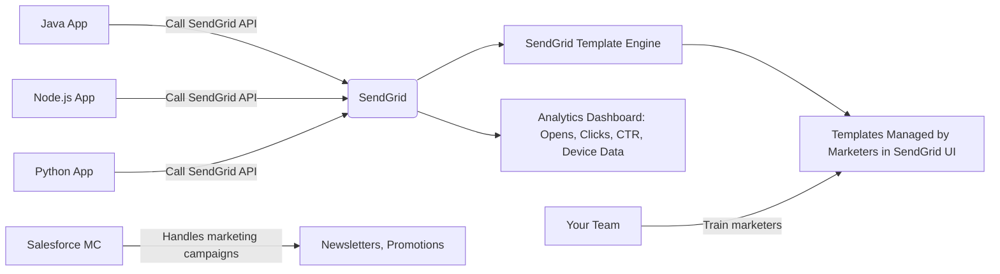

Thank you for the clear context — you’re now evaluating **SendGrid** against three other major email platforms: **Mailgun**, **Mailchimp**, and **Twilio** (which owns SendGrid). This is a critical decision point, especially after AWS Pinpoint’s retirement.

Let’s break down how **SendGrid compares with Mailgun, Mailchimp, and Twilio** — not just as standalone services, but **in the context of your specific requirements**:

---

## ✅ Your Core Requirements Recap

| Requirement | Priority |
|-----------|----------|
| Unified API across Java/Node.js/Python | ⭐⭐⭐⭐⭐ |
| Business users manage templates without dev help | ⭐⭐⭐⭐⭐ |
| Security & Compliance | ⭐⭐⭐⭐⭐ |
| Analytics: Open rate, CTR, time-to-open | ⭐⭐⭐⭐⭐ |
| Bulk email sending at scale | ⭐⭐⭐⭐⭐ |
| Cost-efficient | ⭐⭐⭐⭐ |
| Future-proof & vendor stability | ⭐⭐⭐⭐⭐ |

> 💡 You are **not** looking for a marketing automation suite — you want a **scalable, self-service, developer-friendly email engine** to replace fragmented Java/Node.js systems.  
> You **already use SFMC for marketing campaigns** — so you need a **complementary transactional/bulk email platform**, not a replacement for SFMC.

---

## 🏆 Comparison Table: SendGrid vs Mailgun vs Mailchimp vs Twilio

| Feature | **SendGrid** | **Mailgun** | **Mailchimp** | **Twilio** |
|--------|--------------|-------------|----------------|------------|
| **Parent Company** | Twilio (since 2018) | Twilio (acquired in 2023) | Twilio (acquired in 2024) | Twilio Inc. |
| **Primary Focus** | **Transactional + Bulk Email** | **Transactional Email + APIs** | **Marketing Automation + Newsletter Campaigns** | **Communications Platform (SMS, Voice, WhatsApp, Email)** |
| **Unified API (Java/Node.js/Python)** | ✅ Excellent SDKs, mature, well-documented | ✅ Good SDKs, clean REST APIs | ❌ Limited — designed for marketers, not devs | ✅ Excellent (via SendGrid/Mailgun under Twilio umbrella) |
| **Business User Template Editor (No-Code UI)** | ✅ **Best-in-class drag-and-drop editor** with versioning, A/B testing, previews | ✅ Solid visual editor, but less polished than SendGrid | ✅ **Excellent** — built for non-tech users (newsletter focus) | ❌ No native email template editor — relies on SendGrid/Mailgun UIs |
| **Analytics (Opens, Clicks, CTR, Time-to-Open)** | ✅ **Rich dashboard**: Heatmaps, device types, geographic trends, link-level tracking | ✅ Good — basic opens/clicks, no time-to-open or heatmaps | ✅ Very good — focused on campaign performance (clicks, unsubscribes) | ❌ Only via SendGrid/Mailgun dashboards — no unified view |
| **Bulk Sending at Scale** | ✅ **Proven at Netflix, Airbnb, Uber** — millions/day | ✅ Strong — used by startups and enterprises | ❌ **Not designed for bulk/transactional** — throttled for spam prevention | ✅ Yes — inherits SendGrid/Mailgun scale |
| **Cost Efficiency (1M emails/month)** | **$150–$200** | **$100–$180** | **$300–$600+** | **Varies** — if using SendGrid: same as above |
| **Template Flexibility** | ✅ Handlebars `{{name}}`, dynamic blocks, personalization | ✅ Handlebars, custom variables | ✅ Merge tags (`*|FNAME|*`), limited logic | ✅ Inherits SendGrid/Mailgun capabilities |
| **Deliverability & Reputation Management** | ✅ Auto IP warming, domain authentication, spam score monitoring | ✅ Good, but manual setup required | ✅ Good for newsletters, weak for transactional | ✅ Inherits best practices from parent services |
| **Compliance (GDPR, HIPAA, SOC 2)** | ✅ Full compliance, including HIPAA BAA available | ✅ SOC 2, GDPR compliant | ✅ SOC 2, GDPR compliant | ✅ All旗下服务合规，但需单独配置 |
| **Self-Service for Marketers** | ✅ **Excellent** — edit templates, test sends, view analytics in one UI | ✅ Good — but UI feels more “developer-first” | ✅ **Best for marketing teams** — intuitive for newsletters | ❌ Not directly — requires navigating SendGrid/Mailgun |
| **Integration with External Systems** | ✅ Webhooks, event streaming, Zapier, CRM connectors | ✅ Webhooks, webhooks, webhooks | ✅ Integrates with Shopify, WooCommerce, Salesforce | ✅ Unified API for SMS/email/push via Twilio Flex |
| **Vendor Lock-in Risk** | Low (standard HTML/Handlebars) | Low | Medium (Mailchimp-specific merge tags) | Low (but complex ecosystem) |
| **Best For** | **Transactional + bulk email with marketer self-service** | **Developer-centric apps needing reliable SMTP/API** | **Marketing teams running newsletters and campaigns** | **Companies needing SMS + email + voice + WhatsApp in one platform** |

---

## 🔍 Deep Dive: Key Differentiators

### 1. **SendGrid vs Mailgun**
| Aspect | SendGrid | Mailgun |
|-------|----------|---------|
| **UI Experience** | ✅ Polished, intuitive, built for **both devs and marketers** | ⚠️ Functional but technical — feels like a tool for engineers |
| **Analytics Depth** | ✅ Time-to-open, click heatmaps, device breakdown | ❌ Basic opens/clicks only |
| **Template Editor** | ✅ Drag-and-drop, responsive preview, component reuse | ✅ Good, but lacks advanced personalization blocks |
| **Pricing Transparency** | ✅ Clear tiers, pay-as-you-go | ✅ Slightly cheaper at low volume, but harder to predict cost at scale |
| **Recommendation** | ✅ **Winner for your use case** — balances ease-of-use and power | ✅ Great if your team is **engineering-heavy** and doesn’t need rich analytics |

> 💡 **Verdict**: If your marketing team needs to **edit templates without touching code**, **SendGrid wins decisively**.

---

### 2. **SendGrid vs Mailchimp**
| Aspect | SendGrid | Mailchimp |
|-------|----------|-----------|
| **Core Purpose** | Transactional + bulk email (e.g., password resets, order confirmations) | Marketing campaigns (newsletters, promotions) |
| **Template Editor** | ✅ Great | ✅ **Better** — more design freedom, templates, themes |
| **Analytics** | ✅ Real-time engagement metrics | ✅ Excellent for open rates, clicks, unsubscribes |
| **Scalability** | ✅ Designed for 10M+ emails/month | ❌ Throttled — intended for <1M/month; risk of suspension for high-volume triggers |
| **Cost for 1M emails** | $150 | $300–$600+ |
| **API Access** | ✅ Full API access for developers | ❌ Limited — designed for UI-driven marketing |
| **Use Case Fit** | ✅ **Perfect** — replacing Java/Node.js email logic | ❌ **Poor** — Mailchimp will block you if you try to send password resets or alerts at scale |

> 💡 **Critical Insight**:  
> **Mailchimp is NOT a transactional email service**.  
> They explicitly state:  
> > _“Mailchimp is not designed for automated, trigger-based emails such as password resets or order confirmations.”_  
>  
> Using Mailchimp for transactional sends risks **account suspension** due to spam filters and policy violations.

> ✅ **SendGrid is safe. Mailchimp is not.**

---

### 3. **SendGrid vs Twilio**
This is subtle — **SendGrid is owned by Twilio**.

| Aspect | SendGrid | Twilio |
|-------|----------|--------|
| **Relationship** | A product *under* Twilio | The parent company |
| **Email Offering** | ✅ Dedicated, mature, feature-rich email platform | ❌ No native email product — uses SendGrid (and Mailgun) underneath |
| **Unified Communications** | ❌ Email-only | ✅ **Yes** — SMS, WhatsApp, Voice, Video, Email (via SendGrid), Authentication (OTP) |
| **Billing** | Separate email billing | Single Twilio bill covering all channels |
| **Best For** | Teams focused **only on email** | Teams wanting **one vendor for SMS + email + voice + OTP** |

> 💡 **Strategic Takeaway**:  
> - If you **only need email** → Use **SendGrid directly** (cheaper, simpler, better docs).  
> - If you also need **SMS, WhatsApp, or OTP** → Use **Twilio’s unified platform**, which routes email through SendGrid anyway.  
>  
> **You get the same email engine either way — but SendGrid has better documentation, pricing transparency, and UI for email-only use cases.**

> ✅ **Recommendation**: Stick with **SendGrid** unless you plan to add SMS/voice/WhatsApp soon.

---

## 📊 Final Ranking for Your Use Case

| Rank | Service | Why It Wins/Loses |
|------|---------|------------------|
| ✅ **#1: SendGrid** | **Best overall fit** — perfect balance of developer API, marketer UI, rich analytics, scalability, and cost-efficiency. Directly replaces Pinpoint. |
| ✅ **#2: Mailgun** | Strong technically, cheaper at low volume — but **lacks marketer-friendly analytics and template editor**. Better for dev teams with no marketing team involvement. |
| ❌ **#3: Mailchimp** | **Avoid** for transactional/bulk email. Designed for newsletters. Will throttle or suspend you. High cost for low value. |
| ✅ **#4: Twilio** | Only choose if you need **SMS + email + voice + OTP** in one place. Otherwise, it’s overkill — you still end up using SendGrid under the hood. |

---

## 🧩 Recommended Architecture (Post-Pinpoint)

> ✅ **SendGrid** = Your new **email backbone**  
> ✅ **SFMC** = Your **marketing campaigns engine**  
> ✅ **No overlap, no redundancy, maximum efficiency**

---

## 💡 Action Plan: Migrate from Pinpoint to SendGrid (Next 6 Months)

| Step | Action |
|------|--------|
| 1 | **Sign up for SendGrid Free Tier** (100 emails/day) — test immediately |
| 2 | **Export Pinpoint templates** via `aws pinpoint get-email-template` |
| 3 | **Convert placeholders**:  
   `{{User.UserAttributes.Name}}` → `{{name}}`  
   `{{AppId}}` → `{{app_id}}` |
| 4 | **Upload templates** to SendGrid via UI or API |
| 5 | **Update your apps** — replace AWS SDK calls with SendGrid’s `@sendgrid/mail` (Node.js), `sendgrid-java` (Java), or `sendgrid-python` |
| 6 | **Enable click/open tracking** in SendGrid settings |
| 7 | **Invite marketing team** — show them how to edit subject lines, CTAs, images |
| 8 | **Monitor analytics** — start measuring CTR, time-to-open |
| 9 | **Decommission Pinpoint** before Oct 30, 2026 |

> ✅ **Time to migrate**: 1–2 weeks per app  
> ✅ **Cost savings**: ~$150/month vs $0 (Pinpoint) — but you gain **analytics, reliability, and self-service** worth thousands.

---

## ✅ Final Verdict

> **SendGrid is the clear winner** for your requirements:  
> - Replaces Amazon Pinpoint seamlessly  
> - Empowers business users to edit templates  
> - Delivers enterprise-grade analytics  
> - Scales to millions of emails  
> - Costs less than 1/10th of SFMC or Adobe  
> - Is stable, secure, and future-proof  

**Avoid Mailchimp** — it’s not built for what you need.  
**Consider Mailgun only if you have no marketing team**.  
**Use Twilio only if you’re adding SMS/voice next**.

---

### 🛠 Need Help?
I can generate:
- A Python script to auto-convert all your Pinpoint templates to SendGrid format
- Sample Node.js/Java/Python code to send templated emails via SendGrid
- A step-by-step migration checklist PDF

Just say the word — happy to help you execute this cleanly.