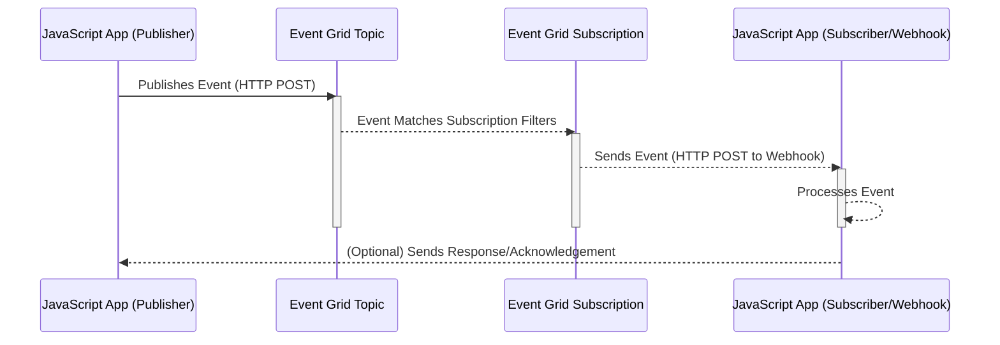

Let's illustrate the sequence flow of Azure Event Grid working with JavaScript apps:

Step-by-step breakdown:
 * JavaScript App (Publisher) Publishes Event: A JavaScript application (acting as a publisher) wants to notify about something that happened. It creates an event (typically a JSON object) describing the event.  It then sends this event to an Event Grid Topic using an HTTP POST request.  This request includes the event data, the topic's endpoint, and authentication information (e.g., a key or SAS token).
 * Event Grid Topic Receives Event: The Event Grid Topic receives the event.  The Topic acts as a central point for receiving events.
 * Event Grid Topic Matches Event to Subscriptions: The Event Grid Topic checks if the received event matches any of the subscriptions associated with it.  Subscriptions are essentially filters that define which events subscribers are interested in.
 * Event Grid Subscription Filters and Forwards: If the event matches a subscription's filters, the Event Grid Subscription takes the event data.
 * Event Grid Subscription Sends Event to Webhook: The Event Grid Subscription then makes an HTTP POST request to the subscriber's webhook URL. This URL was specified when the subscription was created. The body of the POST request contains the event data (usually in JSON format).
 * JavaScript App (Subscriber/Webhook) Receives Event:  The JavaScript application (acting as a subscriber), which is configured as a webhook, has a publicly accessible endpoint (URL).  It receives the HTTP POST request from the Event Grid Subscription.
 * JavaScript App (Subscriber/Webhook) Processes Event: The JavaScript code at the webhook URL parses the JSON payload of the event. It can then perform the necessary actions based on the event data. This could involve updating a database, sending a notification, triggering another process, etc.
 * (Optional) Response/Acknowledgement:  The JavaScript app (subscriber) can optionally send a response back to Event Grid to acknowledge that it received and processed the event.  This helps with ensuring reliable delivery.
Key Points:
 * Push-based: The crucial part is that Event Grid pushes the event to the JavaScript app (subscriber).  The JavaScript app doesn't have to poll or continuously check for new events.
 * Webhook: The JavaScript app acts as a webhook, providing a URL that Event Grid can send events to.
 * Decoupling: Event Grid decouples the publisher and subscriber. The publisher doesn't need to know anything about the subscriber.  Event Grid handles the routing and delivery of events.
This sequence diagram and explanation should provide a clear picture of how Event Grid works with JavaScript applications in a push-based, event-driven architecture.
