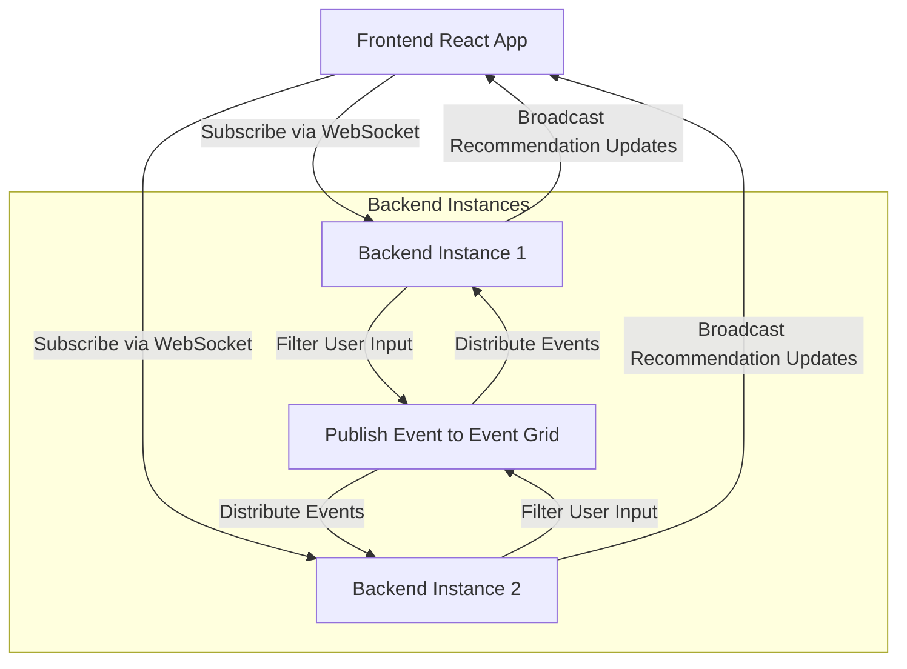

# Using Azure Event Grid 
* To leverage Azure Event Grid for this use case, we can use it as a **PubSub mechanism** to propagate events (like `recommendationUpdates`) in a distributed system. 
* Event Grid provides serverless event-driven communication, ensuring that updates are delivered to all interested services or components in real time.

Here's how we can structure it for the use case:

---

### **How Azure Event Grid Fits Into the Architecture**

1. **Event Grid as a Message Broker**:
   - Azure Event Grid acts as the central hub that routes events (e.g., user responses or recommendation updates) to all backend instances or subscribers.
   - Event Grid topics and subscriptions allow multiple backend services to consume events and broadcast them to WebSocket-connected clients.

2. **Event Types**:
   - **User Input Event**: When a user answers a question, this event is sent to the Event Grid.
   - **Recommendation Update Event**: Backend services process the user input and publish updated recommendations to Event Grid.

3. **Distribution of Events**:
   - Event Grid ensures that all backend instances in the distributed system are notified of the events, regardless of which instance published them.

---

### **Steps to Implement Azure Event Grid in the Use Case**

#### **1. Set Up Event Grid Infrastructure**
- **Create an Event Grid Topic**:
   - In the Azure portal, create a custom Event Grid topic (e.g., `recommendation-events-topic`) to handle custom events for the application.

- **Set Up Event Subscriptions**:
   - Configure backend instances to subscribe to this topic. Event subscriptions define how each service (or backend instance) will consume the events.
   - For backend instances using NestJS, use Azure SDKs or REST APIs to subscribe dynamically during service initialization.

#### **2. Publish Events to Event Grid**
Backend services publish events whenever user actions require updates. For example:
- When a user answers a question, a **User Input Event** is published.
- After filtering or enriching recommendations, a **Recommendation Update Event** is published.

**Example Code to Publish an Event**:
Install the Azure SDK:
```bash
npm install @azure/eventgrid
```

Publish an event in the backend:
```typescript
import { EventGridPublisherClient, AzureKeyCredential } from "@azure/eventgrid";

const topicEndpoint = "<The Event Grid Topic Endpoint>";
const topicKey = "<The Topic Key>";
const client = new EventGridPublisherClient(topicEndpoint, new AzureKeyCredential(topicKey));

async function publishRecommendationUpdate(updatedPlans: any) {
  const events = [
    {
      eventType: "RecommendationUpdate",
      subject: "Recommendation.Update",
      dataVersion: "1.0",
      data: { recommendationUpdates: updatedPlans },
    },
  ];

  await client.send(events);
  console.log("Event published to Event Grid.");
}
```

#### **3. Consume Events in Backend Instances**
Each backend instance subscribes to the Event Grid topic and listens for published events. When an event is received, the instance can broadcast updates to its WebSocket-connected clients.

We can use Azure Event Grid Subscriptions with a webhook, or integrate with Azure Functions or Logic Apps as event handlers.

**Example Using NestJS**:
```typescript
import { Controller, Post, Body } from '@nestjs/common';

@Controller('eventgrid')
export class EventGridController {
  @Post()
  async handleEvent(@Body() eventPayload: any) {
    const events = eventPayload; // Events from Event Grid
    for (const event of events) {
      if (event.eventType === "RecommendationUpdate") {
        const updatedPlans = event.data.recommendationUpdates;
        // Broadcast to WebSocket clients here
        await this.broadcastToClients(updatedPlans);
      }
    }
  }

  private async broadcastToClients(updatedPlans: any) {
    // Use WebSocket logic to send updates to connected clients
  }
}
```

#### **4. Broadcast Updates to WebSocket Clients**
Once the backend instance receives the propagated event from Event Grid, it identifies the WebSocket-connected clients subscribed to the `recommendationUpdates` event and sends the updates directly to them.

**Broadcast Implementation**:
```typescript
@WebSocketServer()
server: Server;

async broadcastToClients(updatedPlans: any) {
  this.server.emit("recommendationUpdates", updatedPlans);
}
```

---

### **Updated Workflow with Azure Event Grid**



---

### **Key Advantages of Using Azure Event Grid**

1. **Serverless and Managed**:
   - We don't have to manage Redis or Kafka clusters; Event Grid handles the event infrastructure for us.

2. **Real-Time and Scalable**:
   - Event Grid can process millions of events per second with low latency, making it highly scalable.

3. **Built-In Integrations**:
   - Event Grid integrates seamlessly with other Azure services, such as Functions, Logic Apps, and even non-Azure endpoints (via webhook subscriptions).

4. **Fault Tolerance**:
   - Event Grid ensures delivery of events with built-in retry mechanisms and dead-lettering for failed deliveries.

---

### **Potential Trade-Offs**
1. **Cost**:
   - Event Grid charges based on the number of events published and delivered, so costs may scale with event volume.
2. **Complexity**:
   - While Event Grid reduces infrastructure overhead, integrating with it adds some initial setup complexity (e.g., managing event subscriptions, configuring authentication, etc.).
3. **Dependency**:
   - If the architecture needs to remain cloud-agnostic, relying on Azure Event Grid might limit flexibility.

---

This approach is ideal if we're looking for a highly scalable, serverless, and reliable event propagation system.
