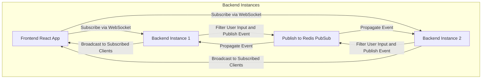

# In a distributed environment with multiple instances of service running for scalability ,does the pubsub feature of GraphQL subscription has any dependency on using REDIS/kafka/Event Grid .


Yes, in a distributed environment with multiple instances of the service running for scalability, the **PubSub** mechanism used in GraphQL Subscriptions does require additional support, such as **Redis**, **Kafka**, or **Azure Event Grid**, to work properly. Here's why:

---

### **Why PubSub Alone Isn't Enough in Distributed Environments**
The default `PubSub` implementation provided by libraries like `graphql-subscriptions` is **in-memory**. This means:
1. It works well in single-instance environments.
2. In a distributed system with multiple backend instances, each instance would have its own in-memory PubSub storage. This creates issues:
   - **Event Isolation**: A client connected to one instance will only receive updates from events that are published to that same instance.
   - **Cross-Instance Communication**: Events published on one instance won't be propagated to other instances, causing some clients to miss updates.

To solve this, we need a shared message broker or PubSub mechanism across all instances.

---

### **Options for Distributed PubSub in GraphQL Subscriptions**
Here are some commonly used solutions:

#### **1. Redis PubSub**
- **How It Works**:
   - Redis acts as a centralized message broker.
   - When an event is published in one instance, it is pushed to Redis.
   - Redis propagates the event to other instances subscribed to the same event channel.
- **Advantages**:
   - Simple and lightweight solution.
   - Easy to set up with existing Redis instances.
- **When to Use**:
   - Suitable for applications with moderate traffic and real-time needs.
   - Works well for small to medium-scale distributed systems.

#### **2. Kafka**
- **How It Works**:
   - Kafka is a distributed message broker that ensures reliable delivery of events.
   - When an event is published to Kafka by one instance, it is consumed by all instances subscribed to the same topic.
- **Advantages**:
   - Ideal for large-scale systems with high traffic and complex event-driven workflows.
   - Supports message persistence and replay.
- **When to Use**:
   - If the system already uses Kafka for other microservices.
   - For applications with high throughput or complex event streams.

#### **3. Azure Event Grid**
- **How It Works**:
   - Azure Event Grid provides a serverless event-routing service.
   - Events are published to a topic and delivered to subscribed services or instances.
- **Advantages**:
   - Fully managed and serverless, so no need to maintain infrastructure.
   - Scales automatically with demand.
- **When to Use**:
   - For applications hosted on Azure or when looking for a fully managed solution.
   - Useful for integrating with other Azure services.

#### **4. Other Alternatives**
- **RabbitMQ**: Another popular message broker, similar to Kafka but simpler to set up.
- **Google Pub/Sub** or **Amazon SNS**: Cloud-native message-passing services provided by Google Cloud and AWS.

---

### **How It Fits into GraphQL Subscriptions**
With a distributed PubSub mechanism, the architecture would look like this:
1. A client subscribes to a GraphQL subscription (e.g., `recommendationUpdates`) via one of the service instances.
2. When an event is published (e.g., filtering recommendations), it is sent to Redis/Kafka/Event Grid.
3. All service instances subscribed to that event receive the update and push it to their connected clients.

---

### **Code Example: Using Redis with GraphQL Subscriptions**
#### **Setup**
1. Install the `graphql-redis-subscriptions` package:
   ```bash
   npm install graphql-redis-subscriptions ioredis
   ```

2. Update the GraphQL module to use Redis:
   ```typescript
   import { RedisPubSub } from 'graphql-redis-subscriptions';
   import Redis from 'ioredis';

   const pubSub = new RedisPubSub({
     publisher: new Redis({ host: 'localhost', port: 6379 }),
     subscriber: new Redis({ host: 'localhost', port: 6379 }),
   });

   export const pubSubInstance = pubSub; // Export for use in resolvers
   ```

3. Use the Redis-powered `PubSub` in the Subscription Resolver:
   ```typescript
   @Resolver()
   export class PlanResolver {
     @Subscription(() => [Plan])
     recommendationUpdates() {
       return pubSubInstance.asyncIterator('recommendationUpdates');
     }

     async triggerRecommendationUpdates(updatedPlans: Plan[]) {
       await pubSubInstance.publish('recommendationUpdates', { recommendationUpdates: updatedPlans });
     }
   }
   ```

---

### **Key Considerations**
- **Scalability**:
   - Redis and Kafka can both handle distributed environments, but Kafka scales better for high-throughput scenarios.
- **Latency**:
   - Redis PubSub offers low latency for real-time updates, but Kafka may introduce slightly higher latency due to its durability guarantees.
- **Ease of Integration**:
   - Redis is simpler to set up, while Kafka is more robust and better suited for complex workflows.

---

### **Conclusion**
* In a distributed environment, using a shared PubSub mechanism like Redis, Kafka, or Azure Event Grid is essential to ensure consistent delivery of events to all clients.
* The choice of solution depends on the system’s scale, real-time needs, and existing infrastructure.


Let’s break this down step-by-step to explain how GraphQL Subscriptions with Redis (or another distributed PubSub system) work in a distributed environment. I'll also outline the changes needed in your React app and how the updates are triggered from the backend.

---

### **How GraphQL Subscriptions Work in a Distributed Environment**
1. **WebSocket Connection**:
   - When the frontend (React app) subscribes to a GraphQL subscription (like `recommendationUpdates`), a WebSocket connection is established with the backend GraphQL server.
   - In a distributed setup with multiple backend instances, the WebSocket connection is routed to one of the running instances via a load balancer.

2. **Redis PubSub for Cross-Instance Communication**:
   - When an event (e.g., `recommendationUpdates`) is published in one instance, it is sent to a shared Redis server.
   - Redis propagates this event to all backend instances subscribed to the same event channel.

3. **Broadcasting Updates to Clients**:
   - Every instance of the GraphQL server that receives the Redis event checks its WebSocket connections to see which clients are subscribed to that event.
   - The appropriate updates are sent to those clients over the WebSocket connection.

---

### **Changes in the React Frontend**
To enable subscription and real-time updates in your React app, you'll need to set up the client for GraphQL Subscriptions. Here are the steps:

#### 1. **Install Required Dependencies**
You’ll need `@apollo/client` for GraphQL integration and `graphql-ws` for WebSocket support:
```bash
npm install @apollo/client graphql-ws
```

#### 2. **Configure Apollo Client with WebSocket Support**
Modify your Apollo Client setup to include a WebSocket link for subscriptions:
```javascript
import { ApolloClient, InMemoryCache, split } from '@apollo/client';
import { GraphQLWsLink } from '@apollo/client/link/subscriptions';
import { createClient } from 'graphql-ws';
import { getMainDefinition } from '@apollo/client/utilities';

// Create WebSocket link for subscriptions
const wsLink = new GraphQLWsLink(createClient({
  url: 'ws://localhost:3000/graphql', // Adjust to your backend's URL
}));

// Split links to use WebSocket for subscriptions and HTTP for queries/mutations
const httpLink = new HttpLink({ uri: 'http://localhost:3000/graphql' });

const splitLink = split(
  ({ query }) => {
    const definition = getMainDefinition(query);
    return (
      definition.kind === 'OperationDefinition' &&
      definition.operation === 'subscription'
    );
  },
  wsLink,  // Use WebSocket for subscriptions
  httpLink // Use HTTP for queries/mutations
);

const client = new ApolloClient({
  link: splitLink,
  cache: new InMemoryCache(),
});
```

#### 3. **Subscribe to Updates in React**
Use the `useSubscription` hook from Apollo Client to listen for updates:
```javascript
import { gql, useSubscription } from '@apollo/client';

const RECOMMENDATION_UPDATES = gql`
  subscription RecommendationUpdates {
    recommendationUpdates {
      id
      name
      description
    }
  }
`;

const PlanList = () => {
  const { data, loading, error } = useSubscription(RECOMMENDATION_UPDATES);

  if (loading) return <p>Loading...</p>;
  if (error) return <p>Error: {error.message}</p>;

  return (
    <ul>
      {data.recommendationUpdates.map((plan) => (
        <li key={plan.id}>{plan.name}</li>
      ))}
    </ul>
  );
};
```

With this setup, the React app is now ready to register and subscribe to real-time updates from the backend.

---

### **How Updates Are Triggered in the Backend**
On the backend, updates are triggered using the `RedisPubSub` mechanism. Here’s a step-by-step explanation:

#### 1. **User Interaction**
- A user answers a question on the frontend, which is sent to the backend using a GraphQL mutation or an HTTP request.

#### 2. **Processing the Response**
- The backend processes the response (e.g., filtering or enriching plans) and publishes an event to Redis with the updated data.
- Example:
   ```typescript
   import { RedisPubSub } from 'graphql-redis-subscriptions';
   const pubSub = new RedisPubSub({ ...redisConfig });

   async function handleUserResponse(userResponse: UserResponseDto) {
     const filteredPlans = await filterPlans(userResponse); // Lightweight filtering
     await pubSub.publish('recommendationUpdates', { recommendationUpdates: filteredPlans });
   }
   ```

#### 3. **Redis Propagation**
- Redis propagates the `recommendationUpdates` event to all backend instances subscribed to the `recommendationUpdates` channel.

#### 4. **GraphQL Subscription Resolver**
- Each instance of the GraphQL server receives the event from Redis and passes it to the active WebSocket connections of subscribed clients.
- Example:
   ```typescript
   import { Resolver, Subscription } from '@nestjs/graphql';

   @Resolver()
   export class PlanResolver {
     constructor(private readonly pubSub: RedisPubSub) {}

     @Subscription(() => [Plan])
     recommendationUpdates() {
       return this.pubSub.asyncIterator('recommendationUpdates');
     }
   }
   ```

---

### **Workflow Summary**
1. **Frontend**:
   - The React app subscribes to the `recommendationUpdates` subscription.
   - When a new event is pushed by the backend, the data is automatically updated in the React app without additional HTTP requests.

2. **Backend**:
   - User interactions trigger event processing.
   - Redis ensures cross-instance propagation of events.
   - The GraphQL server broadcasts updates to the subscribed WebSocket clients.

---

### **Benefits of This Approach**
- Real-time updates with minimal latency.
- Simplified frontend logic with consistent subscription mechanisms.
- Seamless scalability for a distributed backend with Redis PubSub.

Visual Flow using a unified representation of backend instances:



---

### **Explanation of the Changes**
1. **Unified Roles**:
   - The backend instance (e.g., `B[Backend Instance 1]`) both **publishes** events to Redis and **listens** for propagated events via Redis. This shows clearly that the same instance handles both roles.

2. **Redis as the Hub**:
   - Redis is explicitly depicted as the propagation layer that distributes events to all backend instances.

3. **Broadcasting Updates**:
   - After receiving the propagated event from Redis, the backend instance broadcasts the update to its connected WebSocket clients.

---

### **Benefits of This Approach**
- Simplifies the diagram by reducing redundancy.
- Clearly communicates that a single backend instance performs both the "produce" and "consume" roles.
- Matches the real-world implementation where backend instances act as both publishers and subscribers.
