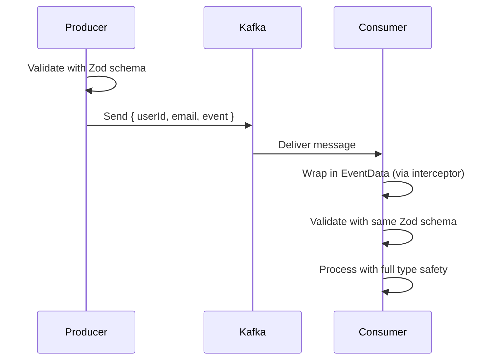

Excellent question — **schema validation is the missing “safety net”** in your otherwise flexible, schemaless `EventData` library.

Let’s explore **why you need it**, **how it helps**, and **how to integrate it cleanly** without breaking your generic design.

---

## 🚨 The Problem: Flexibility ≠ Safety

Your `EventData` library is intentionally **schema-agnostic**:

```ts
const userId = eventData.get<string>('userId');
const amount = eventData.get<number>('amount');
```

✅ Pros:
- No need to define DTOs per event
- Easy to evolve events
- Great for polyglot/legacy systems

❌ Cons:
- ❗ No compile-time or runtime guarantee that `'userId'` exists or is a `string`
- ❗ Typos, type mismatches, or missing fields cause **runtime errors or silent bugs**
- ❗ Hard to document or enforce contract between services

> 💥 Example: If someone publishes `{ user_id: "123" }` instead of `{ userId: "123" }`, your handler silently gets `undefined` — and fails later.

---

## ✅ Schema Validation to the Rescue

Schema validation **adds runtime safety** by checking that incoming data conforms to expected shape/type — **without forcing you to define rigid classes or interfaces per event**.

You keep your generic `EventDataMap` interface — but **validate before you use it**.

---

## 🧰 Best Tool for the Job: `zod`

[Zod](https://zod.dev/) is a TypeScript-first schema validation library — perfect for this use case.

```bash
npm install zod
npm install --save-dev @types/zod  # if needed
```

---

## 🎯 How Schema Validation Helps

| Problem | Without Validation | With Validation |
|--------|--------------------|-----------------|
| Missing field | `eventData.get('userId') → undefined` → runtime crash later | ✅ Throws clear error immediately: “Required field ‘userId’ missing” |
| Wrong type | `eventData.get<number>('amount')` but value is `"100"` | ✅ Throws: “Expected number, received string” |
| Typos | `eventData.get('useerId')` → undefined | ✅ Schema defines `userId` — typo caught at validation time |
| Documentation | Unclear what fields are expected | ✅ Schema acts as living documentation |
| Evolution | Can’t track what changed | ✅ Schema changes are explicit and versionable |

---

## 🔌 Integration Strategy: Validate on Consumption

Keep your interceptors **lightweight** — they just wrap raw data into `EventData`.

Add validation **in your event/command handlers** — where you know what shape you expect.

---

## 🛠️ Step-by-Step: Add Zod Validation to Your Kafka Consumer

### 1. Define Reusable Schemas

```ts
// schemas/user-event.schema.ts

import { z } from 'zod';

export const UserCreatedEventSchema = z.object({
  userId: z.string().uuid(),
  email: z.string().email(),
  name: z.string().optional(),
  event: z.literal('user.created'),
  timestamp: z.number().optional(),
});

export type UserCreatedEvent = z.infer<typeof UserCreatedEventSchema>;
```

---

### 2. Enhance `EventData` Class with Validation

Add a method to validate and return typed 

```ts
// libs/event-data/src/event-data.class.ts

import { z, ZodSchema } from 'zod';

export class EventData implements EventDataMap {
  // ... existing code ...

  // ✅ New method: Validate against schema and return typed object
  validate<T>(schema: ZodSchema<T>): T {
    const data = this.getAll();
    const result = schema.safeParse(data);

    if (!result.success) {
      // You can throw, log, or return default — your choice
      throw new Error(`EventData validation failed: ${result.error.message}`);
    }

    return result.data;
  }

  // ✅ Optional: Validate and return new EventData (with only validated fields)
  validateAsEventData<T>(schema: ZodSchema<T>): EventData {
    const validated = this.validate(schema);
    return new EventData(validated, this.getMetadata());
  }
}
```

> 💡 This keeps `EventData` generic but adds optional, on-demand validation.

---

### 3. Use in Kafka Event Handler

```ts
// kafka.controller.ts

import { UserCreatedEventSchema } from './schemas/user-event.schema';

@EventPattern('user-events')
async handleUserEvent(@Payload() eventData: EventDataMap) {
  // ✅ Validate early — fail fast if shape is wrong
  const validatedEvent = eventData.validate(UserCreatedEventSchema);
  // → Type: UserCreatedEvent (fully typed!)

  console.log(`Handling user.created for ${validatedEvent.userId}`);

  // Safe to use — TypeScript knows exact shape
  await this.sendWelcomeEmail(validatedEvent.email);
}

private async sendWelcomeEmail(email: string) {
  // ...
}
```

✅ Now you get:
- Runtime validation
- Full TypeScript autocomplete and type safety after `.validate()`
- Clear error messages if payload is malformed

---

## 🔄 Alternative: Validate in Interceptor (Global Safety)

If you want **all Kafka messages validated before they reach handlers**, enhance your `KafkaEventDataInterceptor`:

```ts
// microservices/kafka-event-data.interceptor.ts

import { Injectable, NestInterceptor, ExecutionContext, CallHandler } from '@nestjs/common';
import { Observable } from 'rxjs';
import { EventDataFactory } from '../event-data.factory';
import { v4 as uuidv4 } from 'uuid';

// Import schemas — or inject a SchemaRegistry
import { UserCreatedEventSchema } from '../../schemas/user-event.schema';

@Injectable()
export class KafkaEventDataInterceptor implements NestInterceptor {
  constructor(private readonly eventDataFactory: EventDataFactory) {}

  intercept(context: ExecutionContext, next: CallHandler): Observable<any> {
    const args = context.getArgs();
    const kafkaMessage = args[0];

    const payload = kafkaMessage.value;
    const topic = kafkaMessage.topic;

    // ✅ Auto-validate based on topic (or header, etc.)
    let schema;
    if (topic === 'user-events') {
      schema = UserCreatedEventSchema;
    }
    // Add more topics...

    // Validate if schema exists
    if (schema) {
      const result = schema.safeParse(payload);
      if (!result.success) {
        console.error(`❌ Validation failed for topic ${topic}:`, result.error);
        // Optionally throw or return early
        throw new Error(`Invalid event for topic ${topic}`);
      }
    }

    const metadata = {
      timestamp: Date.now(),
      correlationId: kafkaMessage.headers?.['correlationId'] || uuidv4(),
      source: 'kafka',
      topic,
    };

    const eventDataMap = this.eventDataFactory.create(payload, metadata);

    // ✅ Optional: Attach validated data for convenience
    if (schema) {
      (eventDataMap as any).validated = schema.parse(payload);
    }

    args[0] = eventDataMap;

    return next.handle();
  }
}
```

Then in handler:

```ts
@EventPattern('user-events')
async handleUserEvent(@Payload() eventData: EventDataMap & { validated?: UserCreatedEvent }) {
  const event = eventData.validated!; // if you attached it
  // or re-validate: eventData.validate(UserCreatedEventSchema)
}
```

> ⚠️ Trade-off: Interceptor becomes aware of schemas → less generic. Use only if you want global enforcement.

---

## 📦 Pro Approach: Schema Registry

For large systems, create a `SchemaRegistry` service:

```ts
// schema-registry.service.ts

import { Injectable } from '@nestjs/common';
import { z, ZodSchema } from 'zod';

@Injectable()
export class SchemaRegistry {
  private schemas = new Map<string, ZodSchema<any>>();

  register(topic: string, schema: ZodSchema<any>) {
    this.schemas.set(topic, schema);
  }

  get(topic: string): ZodSchema<any> | undefined {
    return this.schemas.get(topic);
  }

  validate(topic: string, data: any): any {
    const schema = this.get(topic);
    if (!schema) return data; // or throw
    return schema.parse(data);
  }
}
```

Then inject into interceptor or handler.

---

## 🔄 Validation on Producer Side (Optional)

You can also validate before publishing:

```ts
// kafka.service.ts

async emitUserCreatedEvent(input: { userId: string; email: string }) {
  // Validate before sending
  const validated = UserCreatedEventSchema.parse({
    ...input,
    event: 'user.created',
  });

  this.kafkaClient.emit('user-events', validated);
}
```

→ Ensures only valid events enter Kafka.

---

## 🧩 Example: Full Flow with Validation



---

## ✅ Benefits Recap

| Benefit | Description |
|---------|-------------|
| 🛡️ Runtime Safety | Catches malformed events early |
| 🧩 Keeps Generic Design | Still use `EventDataMap` — validation is optional |
| 📚 Self-Documenting | Schemas define expected structure |
| 🔄 Evolvable | Add optional fields, deprecate old ones safely |
| 🧪 Testable | Easy to mock or generate test data with `zod` |
| 🚫 Prevents Silent Bugs | No more `undefined` due to typos or type mismatches |

---

## 💡 Pro Tips

- Use `zod.discriminatedUnion` if you have multiple event types in one topic.
- Use `zod.coerce` to auto-convert strings to numbers/dates where safe.
- Log validation failures to monitoring (Sentry, Datadog) — don’t just crash.
- Version your schemas if events evolve — e.g., `UserCreatedEventV2Schema`.

---

## 🚀 What’s Next?

Want me to show you how to:
- ➕ Auto-generate OpenAPI/Swagger docs from Zod schemas?
- ➕ Integrate with Kafka Schema Registry (Confluent)?
- ➕ Add fallback/defaults for optional fields?
- ➕ Serialize/deserialize `EventData` with metadata across services?

Just say the word — I’ll extend this further!