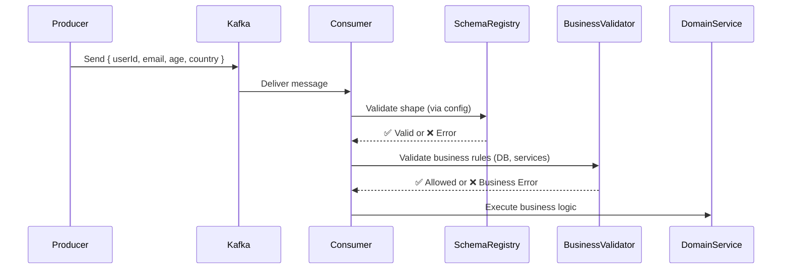

This is a **critical architectural question** — and the answer is:

> ✅ **Do ONLY basic structural/schema validation in this layer.**  
> 🚫 **DO NOT do business logic validation here.**

Let me explain why, how to separate concerns cleanly, and where business validation *should* live.

---

## 🧭 Layered Validation Strategy

Think of validation as happening in **layers** — like an onion:

```
[Incoming Raw Payload]
         ↓
✅ Layer 1: Schema Validation (Structural) ← Config-based (JSON/YAML/Zod)
         ↓
✅ Layer 2: Semantic / Business Validation ← Code-based, in Domain/Service Layer
         ↓
✅ Layer 3: Stateful / Cross-Aggregate Validation ← Often requires DB, external services
         ↓
[Business Logic Execution]
```

---

## ✅ Layer 1: Schema Validation — “Is it well-formed?”

This is what your config-based validation should do.

### ✔️ Examples:
- ✅ Required fields present? (`userId`, `email`)
- ✅ Correct types? (`amount` is number, not string)
- ✅ Format valid? (`email` matches RFC, `uuid` is v4)
- ✅ Enum values? (`status` is `"active" | "inactive"`)
- ✅ String length, number ranges, array minItems

### ❌ NOT This Layer:
- ❌ Is user allowed to perform this action?
- ❌ Does this product exist in catalog?
- ❌ Is wallet balance sufficient?
- ❌ Is this email already registered?

> 💡 This layer answers: **“Is this data shaped correctly?”** — not **“Is this data meaningful or allowed?”**

---

## 🚫 Why You Should NOT Put Business Validation in Schema Layer

### 1. ❌ **Schema Config ≠ Business Logic**
- Config files (YAML/JSON) are not meant for complex conditional logic.
- You can’t easily express: “if country === ‘US’, then zipCode is required and must be 5 digits”.

### 2. ❌ **Tight Coupling**
- Business rules change frequently — schemas should be relatively stable.
- You don’t want to redeploy or reload schemas for every pricing rule change.

### 3. ❌ **No Access to State or Services**
- Schema validation runs in isolation — no DB, no auth service, no inventory system.
- Can’t check “is user active?” or “is promo code valid?”.

### 4. ❌ **Poor Observability & Debugging**
- Business validation failures need rich context, user-facing messages, metrics, etc.
- Schema validation errors are generic: “Invalid type” — not “Sorry, your cart exceeds max items for this promo”.

### 5. ❌ **Testing Complexity**
- Business logic needs unit/integration tests with mocks, fixtures, edge cases.
- Config-based schemas are harder to test dynamically.

---

## ✅ Where to Put Business Validation

### ➤ Option 1: Dedicated Validation Service / Use Case Layer

```ts
// services/user-event.validator.ts

import { Injectable } from '@nestjs/common';
import { UserRepository } from './user.repository';

@Injectable()
export class UserEventValidator {
  constructor(private userRepo: UserRepository) {}

  async validateUserCreatedEvent(event: UserCreatedEvent) {
    // ✅ Business rule: Email must not be already registered
    const existingUser = await this.userRepo.findByEmail(event.email);
    if (existingUser) {
      throw new BadRequestException(`Email ${event.email} is already registered`);
    }

    // ✅ Business rule: User must be over 13 if country is US
    if (event.country === 'US' && event.age < 13) {
      throw new ForbiddenException('Users under 13 not allowed in US');
    }

    // ✅ Business rule: Referral code must be active
    if (event.referralCode) {
      const promo = await this.promoService.get(event.referralCode);
      if (!promo?.isActive) {
        throw new BadRequestException('Invalid or expired referral code');
      }
    }
  }
}
```

Used in handler:

```ts
@EventPattern('user-created-event')
async handleUserEvent(@Payload() eventData: EventDataMap & { validated?: UserCreatedEvent }) {
  const event = eventData.validated!;

  // ✅ Schema already validated — now validate business rules
  await this.userEventValidator.validateUserCreatedEvent(event);

  // ✅ Now safe to create user
  await this.userService.createUser(event);
}
```

---

### ➤ Option 2: Validation Inside Domain Entity / Aggregate

If you’re using DDD:

```ts
// domain/user.ts

export class User {
  static create(props: UserProps): Result<User> {
    // ✅ Business validation
    if (!Email.isValid(props.email)) {
      return Result.fail('Invalid email format');
    }

    if (props.age < 0) {
      return Result.fail('Age cannot be negative');
    }

    if (props.country === 'US' && props.age < 13) {
      return Result.fail('COPPA violation: under 13 in US');
    }

    return Result.ok(new User(props));
  }
}
```

Handler:

```ts
const result = User.create(event);
if (result.isFailure()) {
  throw new BadRequestException(result.error);
}
```

---

### ➤ Option 3: Decorators or Pipes (for HTTP)

For REST APIs, you can use NestJS `Pipes`:

```ts
@Post()
async createUser(
  @Body() dto: CreateUserDto,
  @UsePipes(new BusinessValidationPipe()),
) {
  // ...
}
```

But for Kafka/event-driven — prefer explicit service validation.

---

## 🧩 Example: Full Validation Flow



---

## 📊 Comparison Table

| Concern | Schema Validation (Config) | Business Validation (Code) |
|---------|----------------------------|----------------------------|
| **Purpose** | Is it well-formed? | Is it allowed/meaningful? |
| **Location** | Interceptor / Schema Registry | Service / Domain / Use Case |
| **Access to DB?** | ❌ No | ✅ Yes |
| **Access to Config?** | ✅ Yes | ✅ Yes |
| **Changes Frequently?** | ❌ Rarely | ✅ Often |
| **Who Maintains?** | Platform/DevOps | Product/Domain Teams |
| **Error Type** | 400 Bad Request / Schema Violation | 400/403/409 Business Rule Violation |
| **Tooling** | JSON Schema, Zod, AJV | TypeScript, Services, Repositories |

---

## ✅ Best Practices

1. **✅ Schema validation FIRST** — fail fast on malformed data.
2. **✅ Business validation SECOND** — in service/domain layer.
3. **✅ Keep schemas SIMPLE** — only structural constraints.
4. **✅ Generate TypeScript types** from schemas for dev experience.
5. **✅ Log schema failures** — they indicate integration/contract issues.
6. **✅ Return user-friendly messages** for business validation failures.

---

## 💡 Pro Tip: Use “Validation Levels” in Error Handling

```ts
class ValidationError extends Error {
  constructor(
    public level: 'schema' | 'business' | 'system',
    message: string,
    public details?: any,
  ) {
    super(message);
  }
}

// In handler:
try {
  const event = schemaRegistry.validate(topic, eventData);
  await businessValidator.validate(event);
} catch (err) {
  if (err instanceof ValidationError) {
    if (err.level === 'schema') {
      // Alert dev team — contract broken
      this.alertService.notifyDevs(`Schema violation: ${err.message}`);
    } else if (err.level === 'business') {
      // Log for product team — business rule triggered
      this.analytics.track('business_validation_failed', { reason: err.message });
    }
  }
  throw err;
}
```

---

## ✅ Final Answer

> Use **config-based schema validation ONLY for structural correctness** (types, required fields, formats).  
> Put **business validation in your service or domain layer**, where you have access to state, services, and business context.

This separation keeps your system:
- ✅ Maintainable
- ✅ Testable
- ✅ Observable
- ✅ Scalable

---

Want me to show you how to:
- ➕ Add **validation error categorization**?
- ➕ Build a **central validation error handler**?
- ➕ Integrate with **OpenTelemetry for validation tracing**?
- ➕ Generate **user-friendly messages from schema errors**?

Just say the word — I’ll extend this further!