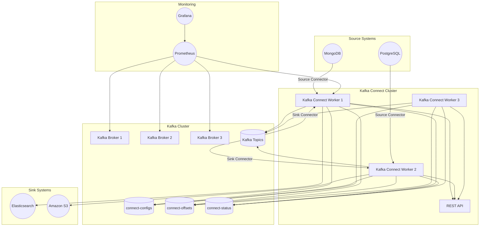
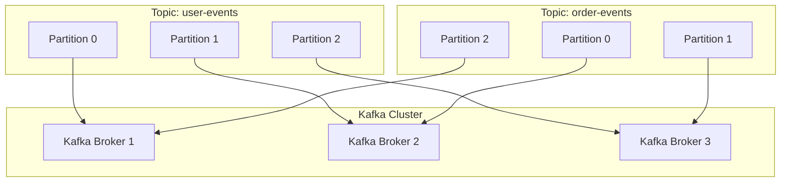

```mermaid
graph TD
  subgraph Source Systems
    MongoDB((MongoDB))
    PostgreSQL((PostgreSQL))
  end

  subgraph Kafka Connect Cluster
    Connect1[Kafka Connect Worker 1]
    Connect2[Kafka Connect Worker 2]
    Connect3[Kafka Connect Worker 3]
    REST[REST API]
  end

  subgraph Kafka Cluster
    Broker1[Kafka Broker 1]
    Broker2[Kafka Broker 2]
    Broker3[Kafka Broker 3]
    Topics[(Kafka Topics)]
    Configs[(connect-configs)]
    Offsets[(connect-offsets)]
    Status[(connect-status)]
  end

  subgraph Sink Systems
    Elasticsearch((Elasticsearch))
    S3((Amazon S3))
  end

  subgraph Monitoring
    Prometheus((Prometheus))
    Grafana((Grafana))
  end

  MongoDB -->|Source Connector| Connect1
  PostgreSQL -->|Source Connector| Connect2

  Connect1 --> Topics
  Connect2 --> Topics
  Connect3 --> Topics

  Topics -->|Sink Connector| Connect1
  Topics -->|Sink Connector| Connect2

  Connect1 --> Elasticsearch
  Connect2 --> S3

  Connect1 --> REST
  Connect2 --> REST
  Connect3 --> REST

  Connect1 --> Configs
  Connect1 --> Offsets
  Connect1 --> Status

  Connect2 --> Configs
  Connect2 --> Offsets
  Connect2 --> Status

  Connect3 --> Configs
  Connect3 --> Offsets
  Connect3 --> Status

  Prometheus --> Connect1
  Prometheus --> Broker1
  Prometheus --> Broker2
  Prometheus --> Broker3

  Grafana --> Prometheus
```

```mermaid
graph TD
  subgraph Kafka Cluster
    Broker1[Kafka Broker 1]
    Broker2[Kafka Broker 2]
    Broker3[Kafka Broker 3]
  end

  subgraph Topic: user-events
    P0[Partition 0]
    P1[Partition 1]
    P2[Partition 2]
  end

  P0 --> Broker1
  P1 --> Broker2
  P2 --> Broker3

  subgraph Topic: order-events
    P3[Partition 0]
    P4[Partition 1]
    P5[Partition 2]
  end

  P3 --> Broker2
  P4 --> Broker3
  P5 --> Broker1
```

