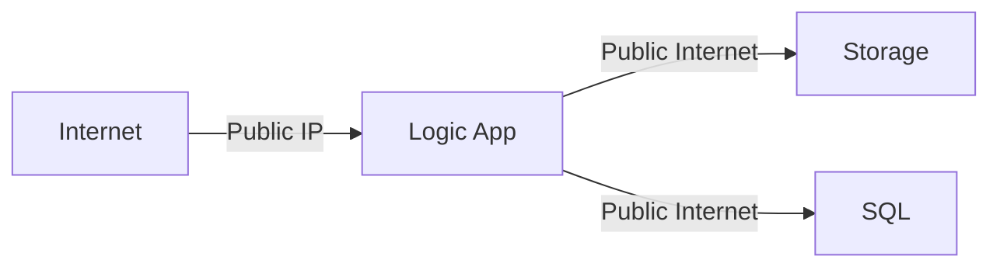
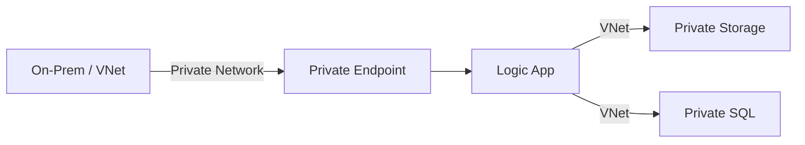

Great question! 🔍

Using **Private Endpoints with Azure Logic Apps Standard** is **not mandatory**, but it's a **critical security and networking best practice** in enterprise or regulated environments. Let’s explore **why** you’d want to use private endpoints and when they make sense.

---

## 🔐 What Are Private Endpoints?

**Azure Private Endpoints** enable you to connect to Azure services (like Logic Apps, Storage, SQL, etc.) over a **private network (VNet)** instead of over the public internet.

They assign a **private IP address** from your VNet to the service endpoint, so traffic stays within the Microsoft backbone network — **no exposure to the public internet**.

---

## 🧩 Why Use Private Endpoints with Logic Apps Standard?

Here are the **key reasons**:

### 1. ✅ **Enhanced Security & Zero Public Exposure**
- By default, Logic Apps Standard has a public HTTPS endpoint (e.g., `https://yourapp.azurewebsites.net`)
- Without private endpoints, **anyone with the URL can attempt to reach it** (even if secured with SAS or AAD)
- With **private endpoints**, the workflow trigger endpoint is accessible **only from within your VNet**

> 🔒 Use Case: Prevent public internet access to internal workflows (e.g., HR, finance, healthcare)

---

### 2. ✅ **Compliance & Regulatory Requirements**
Many industries (finance, healthcare, government) require:
- Data to stay within private networks
- No data egress to public internet
- Auditability of network paths

Using private endpoints helps meet:
- **HIPAA**, **GDPR**, **PCI-DSS**, **FedRAMP**, **ISO 27001**, etc.

---

### 3. ✅ **Secure Integration with Private Backends**
Your Logic App often connects to systems like:
- Azure SQL DB (with private access)
- Storage Accounts (private endpoints)
- APIs in on-premises networks (via ExpressRoute/VPN)
- Internal microservices (in AKS or App Service)

👉 If **those backends are private**, you want your Logic App to **call them from a private network** — not from the public internet.

With private endpoints + **VNet Integration**, your Logic App appears as if it's **inside your VNet**, enabling secure, low-latency communication.

---

### 4. ✅ **Avoid NAT/Gateways for Outbound Calls**
Without VNet integration, outbound calls from Logic Apps go via **public Azure IPs**.

With **private endpoints + regional VNet integration**, you can:
- Route outbound traffic through your **on-premises firewall** (via ExpressRoute/VPN)
- Apply **NSGs, Firewall, WAF** rules
- Audit traffic using **Azure Firewall** or **Network Watcher**

---

### 5. ✅ **Defense-in-Depth Architecture**
Even if you use authentication (SAS, AAD, API keys), **network-level security** adds another layer:
- **Authentication** = "Who are you?"
- **Network isolation** = "Are you even allowed to connect?"

👉 Combine both for **zero-trust security**.

---

## 🏗️ How Private Endpoints Work with Logic Apps Standard

```mermaid
graph TD
    A[Client in VNet] -->|Private IP| B[Private Endpoint for Logic App]
    B --> C[Logic App (Standard)]
    C --> D[Private Storage Account]
    C --> E[Azure SQL (Private)]
    C --> F[On-Premises via ExpressRoute]
    style B fill:#33f,color:white
```

### Key Components:
| Component | Purpose |
|--------|--------|
| **Private Endpoint** | Assigns a private IP (e.g., 10.0.1.10) to the Logic App |
| **DNS Zone (Private DNS Zone)** | Maps `yourapp.azurewebsites.net` to private IP |
| **VNet Integration (Preview)** | Allows outbound calls from Logic App to go via VNet (requires regional VNet integration) |

> ⚠️ Note: Logic Apps Standard uses **App Service infrastructure**, so it supports:
> - **Inbound** private access via Private Endpoint
> - **Outbound** private access via **Regional VNet Integration** (separate feature)

---

## 🚫 Without Private Endpoints



- All traffic goes over public internet (even if encrypted)
- Harder to audit or filter
- Risk of accidental exposure

---

## ✅ With Private Endpoints



- Inbound: Only allowed from VNet
- Outbound: Can route via VNet (with regional integration)
- Fully private, secure, compliant

---

## 🛠️ How to Enable Private Endpoints (High-Level)

### Step 1: Enable App Service Environment (ASE) or use **Private Endpoint for App Service**
> Logic Apps Standard runs on App Service, so same networking applies.

### Step 2: Create a Private Endpoint
- Go to your Logic App → Networking → Private Endpoint Connections
- Create a private endpoint in your VNet (e.g., subnet `logicapp-pe`)
- Assign a private IP (e.g., `10.0.1.10`)

### Step 3: Configure Private DNS Zone
- Link to your VNet
- Maps `yourlogicapp.azurewebsites.net` → `10.0.1.10`

### Step 4: (Optional) Enable Regional VNet Integration
- Allows **outbound** calls from Logic App to go via VNet
- Requires a delegated subnet (e.g., `gateway/subnet`)

### Step 5: Update NSGs & Firewalls
- Allow traffic only from trusted subnets
- Block public access via **"HTTPS Only"** and **Access Restrictions**

---

## 📌 Best Practices

| Practice | Why |
|--------|-----|
| ✅ Disable public access | Use "Access Restrictions" to deny public traffic |
| ✅ Use Private DNS Zones | Ensures name resolution works internally |
| ✅ Combine with Managed Identity | No secrets, private network = gold standard |
| ✅ Use NSGs and Azure Firewall | Filter inbound/outbound traffic |
| ✅ Monitor with Network Watcher | Detect anomalies |

---

## ✅ When Should You Use Private Endpoints?

| Scenario | Use Private Endpoint? |
|--------|------------------------|
| Internal HR workflow | ✅ Yes |
| Public-facing API integration | ❌ Maybe not |
| Healthcare data processing | ✅ Yes (compliance) |
| Dev/test environment | ❌ Optional |
| Connecting to private SQL/Storage | ✅ Yes |
| Using on-premises systems via ExpressRoute | ✅ Yes |

---

## ✅ Summary

| Benefit | Description |
|-------|-------------|
| 🔒 **Security** | Prevent public internet access to your workflows |
| 📏 **Compliance** | Meet regulatory requirements |
| 🔄 **Private Integrations** | Securely connect to private backends |
| 🌐 **Network Control** | Route traffic through your VNet and firewalls |
| 🛡️ **Defense-in-Depth** | Combine network + authentication security |

---

> ✅ **Bottom Line**:  
> Use **Private Endpoints** with Logic Apps Standard when:
> - You're handling **sensitive data**
> - You need **compliance**
> - Your integrations are **private-only**
> - You follow **zero-trust networking**

It’s a **must-have** for enterprise-grade deployments.

---

Let me know if you'd like:
- A **Terraform example** to deploy Logic App Standard with Private Endpoint
- How to set up **regional VNet integration**
- A full secure architecture diagram

Happy securing! 🔐🚀