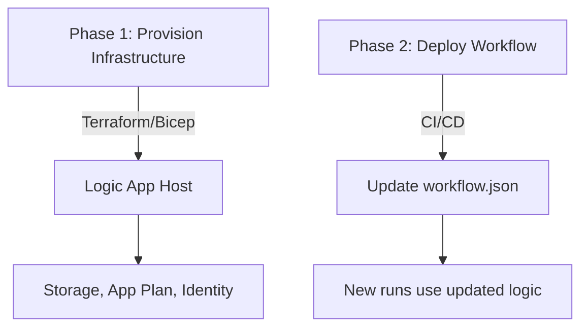

# query
Do we have to provision logic app standard resource, storage account and app service plan together along with workflow definition OR can we have them provisioned separately and then only deploy specific workflow flow definition later as a separate step.

# response 
Great question! ✅

**Short Answer:**  
👉 **You do NOT need to provision everything together.**  
You can **provision the Logic App Standard, Storage Account, and App Service Plan separately**, and then **deploy the workflow definition later as a separate step**.

This is actually a **best practice** for DevOps, CI/CD, and environment management (dev → staging → prod).

---

## ✅ Why This Separation Works

Azure Logic Apps (Standard) is built on **Azure Functions runtime**, so it supports:
- **Decoupling infrastructure from code/content**
- **Updating just the workflow definition** without touching infrastructure
- Using **infrastructure-as-code (IaC)** for resources, and **deployment pipelines** for workflows

---

## 🔧 Breakdown: Two-Phase Approach

### 🟦 Phase 1: Provision Infrastructure (Once, Infrequently)
Deploy these **once**, and reuse across multiple workflows or updates.

| Resource | Purpose |
|--------|--------|
| **Resource Group** | Container for all resources |
| **Storage Account** | Required for Logic App state and logs |
| **App Service Plan** | Defines compute (Y1 for Consumption, or Premium/Standard) |
| **Logic App (Standard) Resource** | The host/container for your workflow(s) |

> ✅ Done via **Terraform, Bicep, ARM, or Azure Portal**  
> ✅ Typically done during environment setup (e.g., "create dev environment")

### 🟨 Phase 2: Deploy Workflow Definition (Frequently)
Update just the **workflow logic** without changing infrastructure.

| Action | How |
|------|-----|
| Update workflow | Modify `workflow.json` |
| Deploy | Use VS Code, ZIP deploy, CI/CD, or Terraform |
| Result | New logic runs; infrastructure unchanged |

> ✅ Done via **VS Code, Azure CLI, GitHub Actions, etc.**  
> ✅ Done every time you change business logic

---

## ✅ Example: Deploy Infrastructure Once

Using **Terraform** or **Bicep**, you create the **empty Logic App host**:

```hcl
resource "azurerm_logic_app_workflow" "example" {
  name                = "my-logic-app"
  location            = "East US"
  resource_group_name = azurerm_resource_group.example.name
  app_service_plan_id = azurerm_service_plan.example.id
  storage_account_id  = azurerm_storage_account.example.id

  # Empty or minimal definition (can be updated later)
  definition = jsonencode({
    definition = {
      "$schema" = "https://schema.management.azure.com/providers/Microsoft.Logic/schemas/2019-05-01/workflowdefinition.json#"
      contentVersion = "1.0.0.0"
      parameters = {}
      triggers = {}
      actions = {}
      outputs = {}
    }
  })
}
```

> This creates the **host**, but with no real logic.

---

## ✅ Then: Deploy Workflow Later (Separately)

You can deploy the **real workflow** using:

### Option 1: **VS Code (Right-click → Deploy)**
- Connects to existing Logic App
- Overwrites only the workflow definition
- No infrastructure change

### Option 2: **Azure CLI (ZIP Deploy)**
```bash
az webapp deployment source config-zip \
  --resource-group my-rg \
  --name my-logic-app \
  --src logicapp.zip
```
> The ZIP contains `workflows/*.json`, `host.json`, etc.

### Option 3: **Terraform (Update Only `definition`)**
```hcl
resource "azurerm_logic_app_workflow" "example" {
  # ... same as before ...

  # Now point to real workflow
  definition = file("${path.module}/workflows/MyActualWorkflow.json")
}
```
Run `terraform apply` — only the **workflow content** changes.

### Option 4: **CI/CD Pipeline (GitHub Actions, Azure DevOps)**
- Build: package workflow
- Deploy: update only the app content
- No Terraform needed for every code change

---

## ✅ Real-World DevOps Workflow



- **Team A (Infra/Platform)**: Sets up environments (dev/stage/prod)
- **Team B (App Dev)**: Deploys and updates workflows independently

---

## ⚠️ Important Notes

| Consideration | Guidance |
|-------------|---------|
| **Storage Account** | Must be **general-purpose v2** and in same region |
| **App Service Plan** | Required (can be Consumption `Y1` or dedicated) |
| **Connections** | If using API connections, ensure they exist or use managed identity |
| **Stateful Workflows** | Logic Apps Standard supports stateful workflows (like Consumption) |
| **Multiple Workflows** | One Logic App (Standard) can host **multiple workflows** |

---

## ✅ Summary

| Question | Answer |
|--------|--------|
| Can I provision infra and workflow separately? | ✅ **Yes** |
| Should I? | ✅ **Yes — it's a best practice** |
| Can I update just the workflow later? | ✅ **Yes — via VS Code, CLI, or Terraform** |
| Do I need to redeploy storage/App Service Plan every time? | ❌ **No — only once** |

---

## 💡 Pro Tip: Use Staging Slots

You can even use **deployment slots** (like `staging`, `production`) for zero-downtime deployments:
```bash
az webapp deployment slot create --name my-logic-app --slot staging --resource-group my-rg
az webapp deployment slot swap --name my-logic-app --slot staging --resource-group my-rg
```

