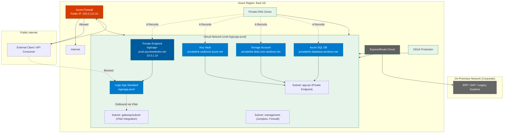

Absolutely! Below is a **comprehensive, enterprise-grade secure architecture diagram** for **Azure Logic Apps Standard** using:

- ✅ Private Endpoints  
- ✅ Managed Identity  
- ✅ VNet Integration  
- ✅ Secure Backends (Storage, SQL, Key Vault)  
- ✅ On-Premises Connectivity  
- ✅ Zero Public Exposure (defense-in-depth)

---

## 🏗️ 🔐 **Secure Logic Apps Standard Architecture (Enterprise)**



---

## 🔐 Security & Networking Features (Explained)

| Component | Purpose | Security Benefit |
|--------|--------|------------------|
| **Private Endpoint (PE)** | Gives Logic App a private IP (`10.0.1.10`) | ❌ No public inbound access |
| **Private DNS Zone** | Resolves `*.azurewebsites.net` → private IP | ✅ Internal name resolution |
| **Regional VNet Integration** | Outbound calls from Logic App go via VNet | ✅ Route through firewall, inspect traffic |
| **Managed Identity** | Logic App authenticates to Azure services without secrets | ✅ No keys in config or code |
| **Azure Firewall** | Filters inbound/outbound traffic | ✅ Whitelist allowed IPs/ports |
| **ExpressRoute** | Private connection to on-premises | ✅ No public internet for hybrid |
| **DDoS Protection** | Mitigates volumetric attacks | ✅ High availability |
| **NSGs & Firewalls** | On subnets and services | ✅ Micro-segmentation |
| **Key Vault** | Stores connection strings, passwords | ✅ Secrets never in code |
| **Private Links for Storage/SQL** | Backends also private | ✅ End-to-end private path |

---

## 🔒 Access Flow (Secure Path)

### ✅ Inbound (Trigger)
```text
On-Prem System → ExpressRoute → VNet → Private Endpoint → Logic App
```
- No public internet
- Only allowed from corporate network

### ✅ Outbound (Actions)
```text
Logic App → VNet Integration → Azure SQL (Private Endpoint) → DB
Logic App → Managed Identity → Storage (Private Link)
Logic App → Key Vault (Private Link) → Get Secret
```

---

## 🛡️ Defense-in-Depth Layers

| Layer | Control |
|------|--------|
| 1. Network | Private Endpoints + VNet |
| 2. Identity | Managed Identity + RBAC |
| 3. Secrets | Key Vault (not in code) |
| 4. Traffic | Azure Firewall + NSGs |
| 5. Compliance | Audit Logs, Private Access Only |
| 6. Hybrid | ExpressRoute (not public internet) |

---

## 🧩 Example Use Cases

| Scenario | Why This Architecture Works |
|--------|-----------------------------|
| Healthcare workflow (HIPAA) | All data stays private, encrypted, audited |
| Finance reconciliation | No public exposure, secure ERP integration |
| Government system | Meets FedRAMP, zero-trust requirements |
| Enterprise SAP integration | Hybrid via ExpressRoute, secure |

---

## 📦 Terraform / IaC Ready

This architecture can be fully defined using:
- **Terraform** (with `azurerm_private_endpoint`, `azurerm_subnet`, etc.)
- **Bicep** or **ARM templates**
- **Azure CAF (Cloud Adoption Framework)**

Let me know if you'd like the **Terraform code** to deploy this entire setup!

---

## 📥 Download or Customize

You can:
- Copy the Mermaid code into [Mermaid Live Editor](https://mermaid.live/edit)
- Export as PNG/SVG
- Integrate into your architecture docs (Confluence, Visio, etc.)

---

## ✅ Summary

This **secure architecture** ensures:
- ✅ **No public exposure** of Logic App endpoints
- ✅ **End-to-end private networking**
- ✅ **Zero secrets in code**
- ✅ **Compliance-ready**
- ✅ **Hybrid connectivity**
- ✅ **Full observability and control**

It’s ideal for **enterprise, regulated, or high-security** environments.

---

## 🚀 Next Steps

Let me know if you'd like:
- ✅ **Terraform modules** to deploy this architecture
- ✅ **Bicep version**
- ✅ **Step-by-step deployment guide**
- ✅ **How to monitor with Azure Monitor & Sentinel**

Happy architecting! 🏗️🔐🚀