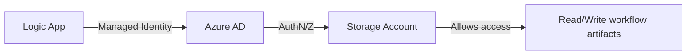

Absolutely! Here's the **updated version** of the previous example that uses **Managed Identity** instead of storage account keys — enhancing security by eliminating the need to handle or store access keys.

---

## ✅ Key Changes: Use Managed Identity

| Before | After |
|------|-------|
| Used `storage_account_access_key` in Terraform | Removed — not needed |
| Logic App used key-based auth | Uses **System-Assigned Managed Identity** |
| Less secure | ✅ More secure, zero secrets in config |

---

## 🧩 Full Example: Logic App Standard with **Managed Identity**

> Same two-phase approach:
> 1. Provision infrastructure (with managed identity)
> 2. Deploy workflow (no keys needed)

---

### 📁 Project Structure (Same as before)
```
logicapp-terraform-managed-identity/
│
├── phase1-infrastructure/
│   ├── main.tf
│   └── variables.tf
│
├── phase2-workflow/
│   ├── main.tf
│   └── workflows/HelloWorkflow.json
│
└── README.md
```

---

## 🧱 PHASE 1: Provision Infrastructure with Managed Identity

📁 `phase1-infrastructure/main.tf`

```hcl
provider "azurerm" {
  features {}
}

locals {
  env        = "dev"
  name_base  = "logicappmi"
}

resource "azurerm_resource_group" "main" {
  name     = "${local.name_base}-rg-${local.env}"
  location = "East US"
}

resource "azurerm_storage_account" "main" {
  name                     = "${local.name_base}storage${local.env}"
  resource_group_name      = azurerm_resource_group.main.name
  location                 = azurerm_resource_group.main.location
  account_tier             = "Standard"
  account_replication_type = "LRS"
  allow_blob_public_access = false

  # Enable hierarchical namespace (optional, not required for Logic Apps)
  is_hns_enabled           = false
}

resource "azurerm_service_plan" "main" {
  name                = "${local.name_base}-sp-${local.env}"
  resource_group_name = azurerm_resource_group.main.name
  location            = azurerm_resource_group.main.location
  os_type             = "Windows"
  sku_name            = "Y1"  # Consumption plan
}

# Logic App with System-Assigned Managed Identity
resource "azurerm_logic_app_workflow" "main" {
  name                = "${local.name_base}-app-${local.env}"
  location            = azurerm_resource_group.main.location
  resource_group_name = azurerm_resource_group.main.name

  app_service_plan_id = azurerm_service_plan.main.id
  storage_account_id  = azurerm_storage_account.main.id

  # 👉 Enable System-Assigned Managed Identity
  identity {
    type = "SystemAssigned"
  }

  # Empty definition (to be updated later)
  definition = jsonencode({
    definition = {
      "$schema" = "https://schema.management.azure.com/providers/Microsoft.Logic/schemas/2019-05-01/workflowdefinition.json#"
      contentVersion = "1.0.0.0"
      parameters = {}
      triggers = {}
      actions = {}
      outputs = {}
    }
  })
}

# 👉 Grant Managed Identity access to Storage Account
resource "azurerm_role_assignment" "logicapp_storage" {
  scope                = azurerm_storage_account.main.id
  role_definition_name = "Storage Blob Data Contributor"
  principal_id         = azurerm_logic_app_workflow.main.identity[0].principal_id
}

# Output Logic App name for reference
output "logic_app_name" {
  value = azurerm_logic_app_workflow.main.name
}

output "resource_group_name" {
  value = azurerm_resource_group.main.name
}

# Optional: Output the identity principal ID
output "logic_app_principal_id" {
  value = azurerm_logic_app_workflow.main.identity[0].principal_id
}
```

📁 `phase1-infrastructure/variables.tf` (unchanged)

```hcl
variable "location" {
  default = "East US"
}
```

### 🔧 Deploy Phase 1

```bash
cd phase1-infrastructure
terraform init
terraform apply -auto-approve
```

✅ This creates:
- Logic App with **System-Assigned Managed Identity**
- Role assignment: Identity has **Storage Blob Data Contributor** on the storage account
- No secrets used!

---

## 🧪 PHASE 2: Deploy Workflow (No Keys Needed!)

Now deploy the workflow — **no storage key required**, because the Logic App uses its managed identity to access storage.

📁 `phase2-workflow/workflows/HelloWorkflow.json` (same as before)

```json
{
  "definition": {
    "$schema": "https://schema.management.azure.com/providers/Microsoft.Logic/schemas/2019-05-01/workflowdefinition.json#",
    "contentVersion": "1.0.0.0",
    "parameters": {},
    "triggers": {
      "manual": {
        "type": "Request",
        "kind": "Http",
        "inputs": {
          "schema": {}
        }
      }
    },
    "actions": {
      "Compose": {
        "type": "Compose",
        "inputs": "Hello from Managed Identity Logic App!"
      }
    },
    "outputs": {}
  },
  "parameters": {}
}
```

---

### 📄 Phase 2: Terraform (Using Managed Identity – No Keys!)

📁 `phase2-workflow/main.tf`

```hcl
provider "azurerm" {
  features {}
}

# Reference existing resources
data "azurerm_resource_group" "existing" {
  name = "logicappmi-rg-dev"
}

data "azurerm_storage_account" "existing" {
  name                = "logicappmistoragedev"
  resource_group_name = data.azurerm_resource_group.existing.name
}

data "azurerm_service_plan" "existing" {
  name                = "logicappmi-sp-dev"
  resource_group_name = data.azurerm_resource_group.existing.name
}

data "azurerm_logic_app_workflow" "existing" {
  name                = "logicappmi-app-dev"
  resource_group_name = data.azurerm_resource_group.existing.name
}

# Update only the workflow definition
resource "azurerm_logic_app_workflow" "workflow" {
  name                = data.azurerm_logic_app_workflow.existing.name
  location            = data.azurerm_resource_group.existing.location
  resource_group_name = data.azurerm_resource_group.existing.name

  app_service_plan_id = data.azurerm_service_plan.existing.id
  storage_account_id  = data.azurerm_storage_account.existing.id
  storage_account_name = data.azurerm_storage_account.existing.name

  # 🔐 NO storage_account_access_key needed!
  # Managed Identity handles access via RBAC

  definition = file("${path.module}/workflows/HelloWorkflow.json")

  # Still need identity block to preserve identity
  identity {
    type = "SystemAssigned"
  }

  parameters = {}
}
```

> 🔹 **Important**: Even though we're not creating identity here, we include the `identity { type = "SystemAssigned" }` block to **prevent Terraform from removing it** during apply.

---

### 🔧 Deploy Phase 2

```bash
cd phase2-workflow
terraform init
terraform apply -auto-approve
```

✅ The workflow is deployed securely — **no credentials passed**.

---

## ✅ How It Works (Security Flow)



- Logic App authenticates to Azure AD using its identity
- Azure AD checks `Role Assignment`: "Is this identity a `Storage Blob Data Contributor`?"
- If yes → access granted → Logic App reads/writes workflow files

---

## ✅ Test the Workflow

Same as before:
1. Go to Azure Portal → `logicappmi-app-dev`
2. Open **Logic App Designer**
3. Trigger via HTTP POST
4. See success in run history

---

## ✅ Benefits of This Approach

| Benefit | Description |
|-------|-------------|
| 🔐 **No Secrets in Terraform** | No storage keys in `.tf` files or state |
| 🛡️ **Better Security** | Least privilege via RBAC |
| 🔄 **CI/CD Friendly** | Safe to run in pipelines |
| 🧑‍💼 **Auditable** | Identity usage logged in Azure AD and Activity Log |

---

## 🚀 Optional: Use User-Assigned Identity (Advanced)

If you prefer **User-Assigned Managed Identity** (reusable across apps):

```hcl
resource "azurerm_user_assigned_identity" "logicapp" {
  name                = "uai-logicapp"
  resource_group_name = azurerm_resource_group.main.name
  location            = azurerm_resource_group.main.location
}

# In Logic App:
identity {
  type = "UserAssigned"
  identity_ids = [azurerm_user_assigned_identity.logicapp.id]
}
```

Then assign the role to `azurerm_user_assigned_identity.logicapp.principal_id`.

---

## 📦 Download or Automate

You can now:
- Add this to GitHub
- Connect to **GitHub Actions** or **Azure DevOps**
- Deploy workflows in **dev/stage/prod** with same pattern

---

## ✅ Summary

| Feature | Implemented? |
|--------|--------------|
| Managed Identity (System-Assigned) | ✅ |
| No storage account keys in Terraform | ✅ |
| Secure RBAC access to storage | ✅ |
| Two-phase deployment (infra + logic) | ✅ |
| CI/CD ready | ✅ |

---

Let me know if you'd like:
- A **Bicep version** of this
- Integration with **Azure Key Vault** (e.g., for connection strings)
- How to use **private endpoints** with Logic App Standard
- Example with **API Connections** using managed identity

Happy secure coding! 🔐🚀