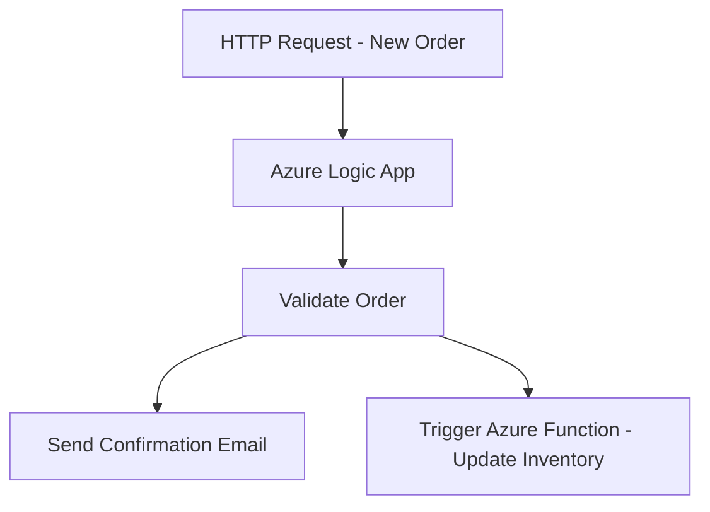
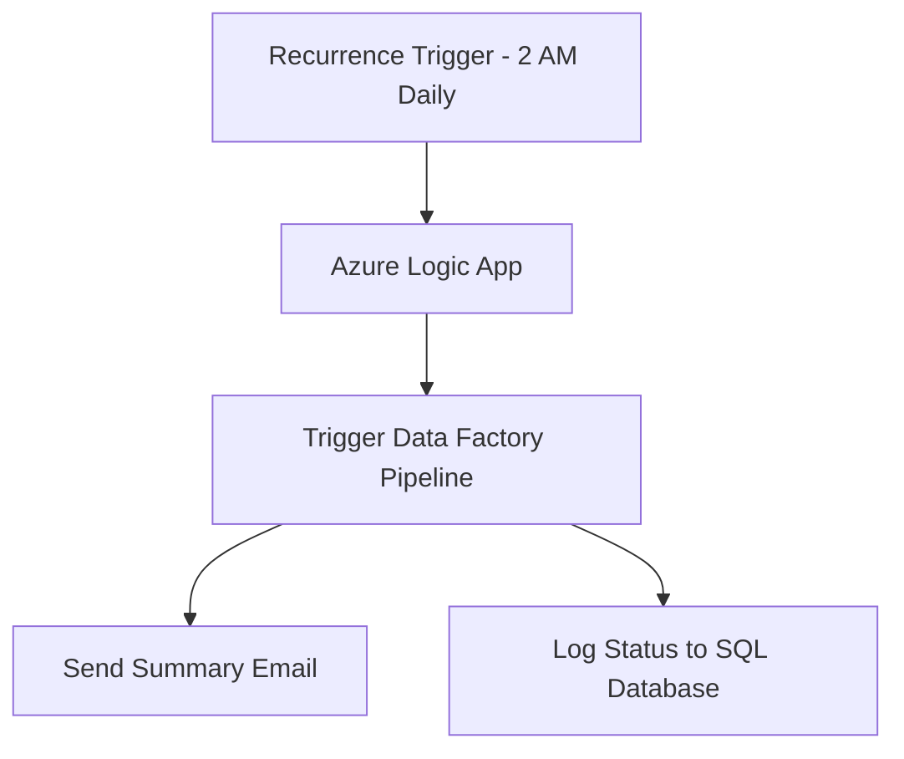

Here’s a **sample Azure Logic App workflow** that triggers both **real-time** and **batch jobs**. I'll describe each and then show a visual representation.

---

### 🔄 **Real-Time Job Triggering Workflow**
**Scenario**: A new customer order is received via an HTTP request, and the Logic App:
1. Validates the order.
2. Sends a confirmation email.
3. Triggers an Azure Function to update inventory.

---

### 🕒 **Batch Job Triggering Workflow**
**Scenario**: Every night at 2 AM, the Logic App:
1. Triggers a Data Factory pipeline to aggregate sales data.
2. Sends a summary report via email.
3. Logs the job status to a database.

---

