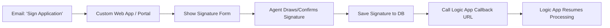

Excellent question — you're thinking like a seasoned solution architect! 🎯

Let’s clarify the **flow when the agent clicks the link**:

> ❓ *"Do we show a form to capture the signature? And does the workflow only complete after the signature is captured?"*

✅ **Yes — ideally, you should show a form to collect the signature**, and  
✅ **No — the Logic App workflow should *not* complete until after the signature is captured and confirmed.**

But here's the key: **The callback URL should *not* be the final destination** — it should be **triggered *after* the signature is collected**, not when the agent just opens the page.

---

## 🔄 Let’s Break Down the Correct Flow

### ✅ Goal:
1. Agent clicks a link
2. Sees a **signature form** (web page)
3. Signs (draws signature, clicks "Accept", etc.)
4. System **captures signature**
5. Then, **Logic App is notified** to resume

---

### 🚫 Anti-Pattern: Direct Callback Link in Email
```text
Email link: https://prod-xx.logic.azure.com/.../callbacks/sign?sig=...
```
➡️ If agent clicks this:
- Logic App **immediately resumes** (even before they sign!)
- No chance to show a form
- Signature data is missing
- Workflow proceeds incorrectly

❌ **This is not what you want.**

---

### ✅ Correct Pattern: Use a **Web Portal or API** as an Intermediary



---

## ✅ Step-by-Step: How It Should Work

### 1. **Send Email with a Custom Link**
Not the Logic App callback — instead:
```
https://your-portal.com/sign?app=APP-123&token=xyz789
```
- This points to **your web application** (e.g., Azure Static Web Apps, App Service, Blazor, React app)

---

### 2. **Your Web App Shows a Signature Form**
- Render a form with:
  - Application details
  - Signature canvas (using HTML5 `<canvas>` or a library like [Signature Pad](https://github.com/szimek/signature_pad))
  - "I agree" checkbox
  - Submit button

---

### 3. **On Submit: Capture & Store Signature**
When agent clicks "Submit":

```javascript
// Example: Capture signature as base64 image
const signatureImage = signaturePad.toDataURL(); // data:image/png;base64,...

// Send to your backend API
fetch('/api/sign', {
  method: 'POST',
  body: JSON.stringify({
    applicationId: 'APP-123',
    signatureImage,
    signedAt: new Date().toISOString()
  })
})
```

---

### 4. **Your Backend Saves Signature & Calls Logic App Callback**

In your API (e.g., Azure Function, ASP.NET Core, Node.js):

```csharp
// Save to database (MongoDB, SQL, etc.)
await signatureRepo.SaveAsync(signatureData);

// THEN: Call Logic App callback URL to resume workflow
var callbackUrl = "https://prod-xx.logic.azure.com/.../callbacks/sign?sig=...";
var client = new HttpClient();
var response = await client.PostAsJsonAsync(callbackUrl, new {
    signed = true,
    signatureImage = signatureData.Image,
    signedAt = signatureData.SignedAt
});
```

> 🔐 Tip: Store the callback URL securely (e.g., in Key Vault or config) — don’t expose it to the browser.

---

### 5. **Logic App Resumes with Signature Data**
Now the `triggerBody()` in Logic App includes:
```json
{
  "signed": true,
  "signatureImage": "image/png;base64,...",
  "signedAt": "2025-04-05T10:00:00Z"
}
```

You can:
- Save to MongoDB
- Validate
- Proceed with enrollment processing

---

## 🛠️ Why This Design Is Better

| Benefit | Explanation |
|-------|-------------|
| ✅ **Better UX** | Agent sees a nice form, not a blank page |
| ✅ **Secure** | Callback URL never exposed to browser/user |
| ✅ **Controlled flow** | Workflow only resumes *after* valid signature |
| ✅ **Audit trail** | You log when/where/how the signature was captured |
| ✅ **Flexible** | Add ID verification, 2FA, etc. before allowing sign |

---

## 🔐 Security Considerations

- ✅ **Never expose the Logic App callback URL to the client/browser**
- ✅ Use a **short-lived token** (e.g., JWT) in your `?token=...` link to authenticate the agent
- ✅ Validate `applicationId` and agent role before allowing signature
- ✅ Rate-limit or disable the link after one use

---

## 🧩 Alternative: Host the Form in Logic Apps? (Not Recommended)

You *could* use Logic App to serve HTML (via response), but:
- ❌ No dynamic interactivity
- ❌ Hard to handle canvas/signature
- ❌ Poor UX
- ❌ Not scalable

➡️ **Stick with a real web app** for forms.

---

## ✅ Summary: Answers to Your Questions

| Question | Answer |
|--------|--------|
| **Should we show a form when the agent clicks the link?** | ✅ Yes — but via a **custom web app**, not directly in Logic Apps |
| **Does the flow complete when the link is clicked?** | ❌ No — clicking the link should **open a form**, not complete the flow |
| **When does the Logic App resume?** | ✅ Only **after your backend confirms the signature is captured** and calls the callback URL |
| **Who calls the callback URL?** | ✅ Your **backend API**, not the browser |

---

## 📦 Want a Starter Template?

I can provide:
- A simple **HTML + JavaScript** signature form
- An **Azure Function** to save signature and call Logic App
- A **Logic App workflow** that waits and resumes
- **Azure Static Web Apps** deployment guide

Just say the word! 🚀