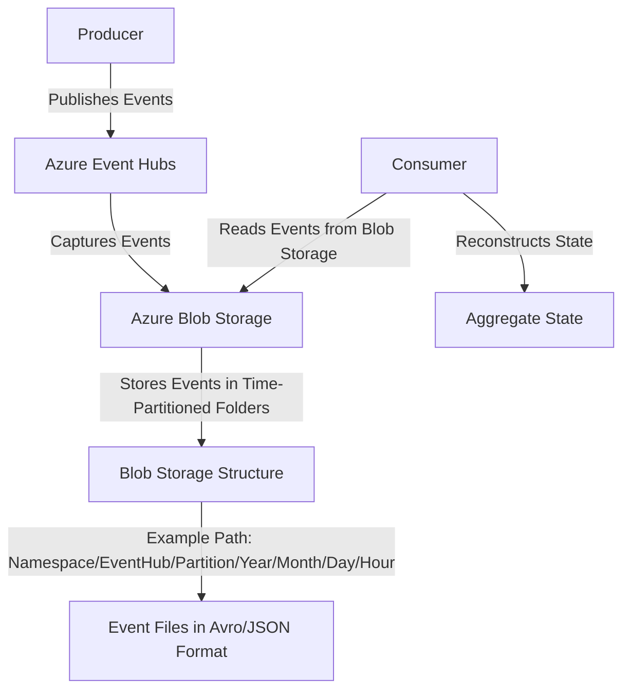
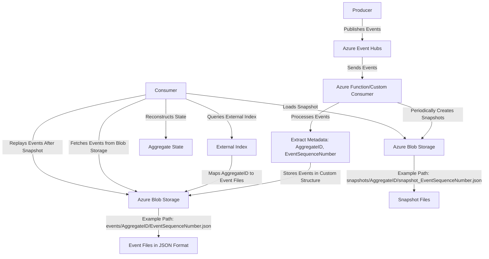

Certainly! Below are Mermaid diagrams that visually represent the flow for both approaches: **Azure Event Hubs Capture** and a **Custom Solution**.

---

### **1. Azure Event Hubs Capture Flow**

#### **Explanation**:
1. **Producer**: Publishes events to Azure Event Hubs.
2. **Azure Event Hubs**: Ingests events and automatically captures them to Blob Storage.
3. **Azure Blob Storage**: Stores events in time-partitioned folders (e.g., `Namespace/EventHub/Partition/Year/Month/Day/Hour`).
4. **Consumer**: Reads events from Blob Storage and reconstructs the state of the aggregate.

---

### **2. Custom Solution Flow**

#### **Explanation**:
1. **Producer**: Publishes events to Azure Event Hubs.
2. **Azure Event Hubs**: Ingests events and sends them to a custom consumer (e.g., Azure Function).
3. **Azure Function/Custom Consumer**:
   - Processes events and extracts metadata (`AggregateID`, `EventSequenceNumber`).
   - Stores events in Blob Storage with a custom structure (e.g., `events/AggregateID/EventSequenceNumber.json`).
   - Periodically creates snapshots and stores them in Blob Storage (e.g., `snapshots/AggregateID/snapshot_EventSequenceNumber.json`).
4. **Azure Blob Storage**:
   - Stores events and snapshots in a custom folder structure.
5. **External Index**: Maintains a mapping of `AggregateID` to event files in Blob Storage (e.g., using Azure Table Storage or Cosmos DB).
6. **Consumer**:
   - Queries the external index to fetch event files for a specific `AggregateID`.
   - Loads the latest snapshot (if available) and replays events after the snapshot to reconstruct the state.

---

### **Key Differences Between the Two Approaches**

| **Aspect**                | **Event Hubs Capture**                          | **Custom Solution**                          |
|---------------------------|------------------------------------------------|---------------------------------------------|
| **Event Storage Structure** | Time-partitioned folders (e.g., by time and partition). | Custom structure (e.g., by `AggregateID` and `EventSequenceNumber`). |
| **Metadata Support**       | Limited (no custom metadata like `AggregateID`). | Fully customizable (e.g., `AggregateID`, `EventSequenceNumber`). |
| **Indexing**               | Not supported.                                 | Supported via external index (e.g., Azure Table Storage). |
| **Snapshotting**           | Not supported.                                 | Supported (snapshots stored in Blob Storage). |
| **Complexity**             | Low (out-of-the-box solution).                 | High (requires custom development).         |
| **Use Case**               | Simple event archiving.                        | Advanced event sourcing with custom requirements. |

---

### **When to Use Which Approach**
- **Event Hubs Capture**:
  - Use when you need a simple, managed solution for archiving events.
  - Suitable for scenarios where custom metadata and indexing are not required.
- **Custom Solution**:
  - Use when you need to store events in a custom structure (e.g., by `AggregateID`).
  - Suitable for advanced event sourcing scenarios with requirements like snapshotting, efficient querying, and custom metadata.

---

These diagrams and explanations should help you visualize and understand the flow for both approaches. Let me know if you need further clarification!