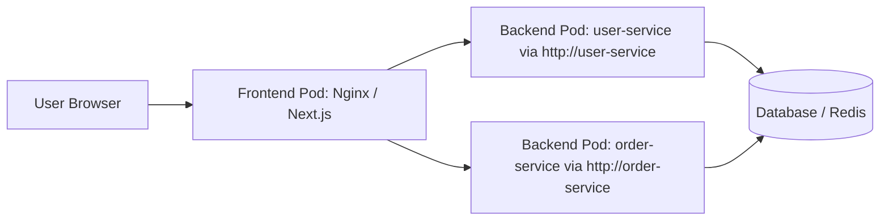

Great question! Let’s break this down clearly.

---

## 3️⃣ What Is a “Frontend Pod”?

In Kubernetes (and cloud-native architecture in general), a **“frontend pod”** typically refers to a pod that runs the **user-facing part of your application** — for example:

- A React, Angular, or Vue.js **SPA (Single Page Application)** server (e.g., served via Nginx or Node.js).
- A server-side rendered web app (e.g., Next.js, Django, Rails).
- A mobile API gateway or BFF (Backend for Frontend) service.
- A public-facing web server or reverse proxy.

> 🖥️ Its job: Serve HTML, CSS, JS to browsers or mobile apps — or expose public REST/GraphQL APIs consumed by clients.

---

## ❓ Why Would a Frontend Pod *Not* Call the Kubernetes API?

Because **it doesn’t need to** — and **it shouldn’t**, for security and architectural reasons.

Here’s why:

---

### ✅ 1. **Architectural Separation of Concerns**

Frontend pods are meant to:
- Handle HTTP requests from users or clients.
- Render UI or proxy API calls to backend services.
- Return responses — nothing more.

> 🚫 They should NOT be managing infrastructure, reading secrets directly, or querying Kubernetes for pod IPs.

That’s the job of:
- Backend services (e.g., user-service, order-service)
- Operators, controllers, CI/CD systems
- Observability or infra tooling (Prometheus, Argo, etc.)

→ Mixing concerns leads to fragile, insecure, hard-to-maintain apps.

---

### ✅ 2. **Security Best Practice: Least Privilege**

If a frontend pod doesn’t need to talk to the Kubernetes API → **don’t give it a Service Account token at all**.

Why?

- If the pod gets compromised (e.g., via XSS, SSRF, RCE), an attacker could steal the SA token → escalate to full cluster access (if RBAC is misconfigured).
- Even read-only access can leak sensitive info: pod names, configmaps, secrets metadata, etc.

> 🔐 Best Practice: Set `automountServiceAccountToken: false` on frontend pods.

```yaml
apiVersion: v1
kind: Pod
metadata:
  name: frontend-app
spec:
  automountServiceAccountToken: false  # ← disables SA token injection
  containers:
  - name: nginx
    image: nginx:latest
```

→ Reduces attack surface significantly.

---

### ✅ 3. **Frontend Pods Talk to Backend Services — Not Kubernetes**

Instead of calling `kubectl get pods` or reading secrets from K8s API, a frontend pod should:

- ✅ Call internal backend services (e.g., `http://user-service/api/profile`)
- ✅ Use environment variables or mounted ConfigMaps/Secrets for config (injected at deploy time — no runtime API calls needed)
- ✅ Use service discovery via Kubernetes **Services** (e.g., DNS: `http://payment-service:8080`)

> 💡 Kubernetes Services abstract away pod IPs — frontend doesn’t need to know or care about them.

---

## 🧩 Example: Typical Frontend Pod Workflow



✅ The frontend pod:
- Serves static files or renders pages.
- Proxies API requests to `user-service`, `order-service`, etc.
- Never calls `https://kubernetes.default.svc` — doesn’t need to!

---

## 🛑 When Might a Frontend Pod *Accidentally* Call K8s API?

Sometimes developers make mistakes:

### ❌ Anti-Pattern 1: Reading Config at Runtime from K8s API

> “Let me call K8s API to get the latest configmap every 5 minutes!”

🚫 Don’t do this — use:
- `envFrom` with ConfigMap
- Volume-mounted ConfigMap → file read (no API needed)
- External config server (Consul, Spring Cloud Config)

### ❌ Anti-Pattern 2: Service Discovery via K8s API

> “Let me list all pods with label app=backend to load balance manually!”

🚫 Don’t do this — use:
- Kubernetes Service (ClusterIP / Headless)
- Let kube-proxy or service mesh handle discovery/load balancing

### ❌ Anti-Pattern 3: Debugging / Logging Pods via K8s API from Frontend

> “I’ll add a /debug/pods endpoint that lists all pods!”

🚫 Huge security risk — exposes internal cluster state to users.

---

## ✅ When *Would* a Frontend-Like Pod Call K8s API?

Rarely — but here are exceptions (still, avoid if possible):

| Use Case | Why It Might Call K8s API | Better Alternative |
|----------|----------------------------|---------------------|
| Admin Dashboard (e.g., custom K8s UI) | Lists pods, logs, deployments for operators | Use `kubectl proxy` or dedicated backend service with strict RBAC |
| Developer Portal / Self-Service UI | Allows devs to view their app’s status | Backend API that proxies K8s calls with user auth + filtering |
| GitOps UI (e.g., ArgoCD UI) | Shows sync status, app health | ArgoCD backend handles K8s calls — UI talks to Argo API, not K8s directly |

→ Even in these cases, the “frontend” pod should still be a **thin client** — actual K8s API calls should be delegated to a **backend service with proper auth and RBAC**.

---

## 🔐 Security Recap: Frontend Pods & K8s API

| Should frontend pods call K8s API? | ❌ Generally NO |
|------------------------------------|-----------------|
| Should they have a Service Account? | ❌ Usually not needed |
| Should SA token be mounted? | ❌ Set `automountServiceAccountToken: false` |
| What if they need config? | ✅ Use ConfigMap/Secret as env or volume |
| What if they need to discover services? | ✅ Use Kubernetes DNS (e.g., `http://my-svc.namespace.svc.cluster.local`) |

---

## ✅ Best Practice Template for Frontend Pods

```yaml
apiVersion: apps/v1
kind: Deployment
metadata:
  name: frontend
spec:
  replicas: 3
  selector:
    matchLabels:
      app: frontend
  template:
    metadata:
      labels:
        app: frontend
    spec:
      automountServiceAccountToken: false  # 👈 Critical!
      containers:
      - name: frontend
        image: my-frontend:latest
        ports:
        - containerPort: 80
        envFrom:
        - configMapRef:
            name: frontend-config
        volumeMounts:
        - name: static-files
          mountPath: /usr/share/nginx/html
      volumes:
      - name: static-files
        configMap:
          name: frontend-static-assets
```

---

## 🧠 Summary

> 🖥️ **Frontend pods = user-facing, no business talking to Kubernetes API.**  
> 🔐 **No SA token needed → disable it for security.**  
> 🔄 **They talk to backend services — not kube-apiserver.**  
> ⚠️ **If you find your frontend calling K8s API — refactor it!**

By keeping frontend pods simple and API-free, you:
- Improve security posture
- Reduce blast radius if compromised
- Follow clean architecture principles
- Make your system easier to debug and scale

---

✅ **Bottom Line**:  
Frontend pods should be **dumb pipes to the user** — serving UI and proxying to backends. Leave Kubernetes API calls to operators, controllers, and backend services that actually need them.