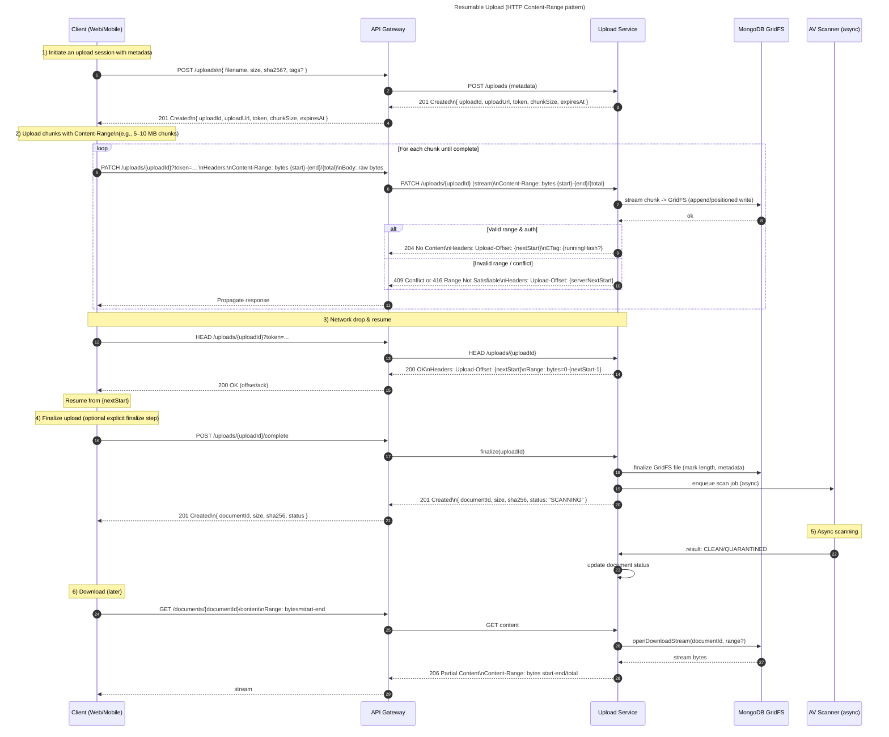

Here’s a clear **API flow diagram** for **resumable uploads** using the `Content-Range` pattern (works great with REST + GridFS). I’ve included both a **sequence diagram** (end-to-end interactions) and a **state machine** (service-side lifecycle). You can paste these Mermaid blocks into tools like Mermaid Live Editor to render them.

---

## 1) Resumable Upload – Sequence Diagram (Content‑Range)



**Notes:**
- **Chunk request** uses `PATCH /uploads/{uploadId}` with `Content-Range: bytes {start}-{end}/{total}` and **raw bytes** body.
- Server responds with **`Upload-Offset`** (custom header) telling the client the **next byte index** expected.  
  - On conflict/mismatch, return **`409`** or **`416`** and the server’s `Upload-Offset`.
- **Resume**: client calls **`HEAD /uploads/{uploadId}`** to discover the next offset.
- **Finalize**: optional explicit **`POST /uploads/{uploadId}/complete`** to mark done and compute the final hash/metadata.  
  (Alternatively, auto-finalize when `Content-Range` equals the total.)
- **Security**: short‑lived `token` on the URL or via `Authorization: Bearer …`.
- **Integrity** (optional but recommended): per‑chunk SHA‑256 in `Digest` or a running hash via `ETag`.

---

## 2) Service-Side Lifecycle – State Machine

```mermaid
flowchart LR
  title Resumable Upload State Machine

  A[INITIATED\n(session created)] -->|first valid chunk| B[UPLOADING]
  B -->|more chunks accepted| B
  B -->|network drop / pause| P[PAUSED]
  P -->|HEAD discover offset + PATCH| B
  B -->|last byte received (offset==total)| F[FINALIZING]
  F -->|GridFS finalize + metadata + enqueue AV| S[SCANNING]
  S -->|CLEAN| V[AVAILABLE]
  S -->|QUARANTINED or FAIL| Q[QUARANTINED/FAILED]

  A -->|timeout/abort| X[CANCELLED]
  B -->|client abort| X
  P -->|timeout| X

  style A fill:#eef,stroke:#447
  style B fill:#efe,stroke:#484
  style F fill:#ffe,stroke:#aa0
  style S fill:#ffd,stroke:#aa0
  style V fill:#def,stroke:#48a
  style Q fill:#fdd,stroke:#a44
  style X fill:#eee,stroke:#999
```

---

## Optional: Headers & Status Codes (quick reference)

- **Initiate**:  
  `POST /uploads` → `201 Created`  
  Body: `{ uploadId, uploadUrl, token, chunkSize, expiresAt }`

- **Upload chunk**:  
  `PATCH /uploads/{uploadId}`  
  Headers:  
  - `Content-Range: bytes {start}-{end}/{total}`  
  - `Content-Type: application/octet-stream`  
  Responses:  
  - `204 No Content` + `Upload-Offset: {nextStart}` (ACK)  
  - `409 Conflict` or `416 Range Not Satisfiable` + `Upload-Offset: {serverNextStart}` (client should realign)

- **Probe progress (resume)**:  
  `HEAD /uploads/{uploadId}` → `200 OK`  
  Headers: `Upload-Offset: {nextStart}`, `Range: bytes=0-{nextStart-1}`

- **Finalize**:  
  `POST /uploads/{uploadId}/complete` → `201 Created`  
  Body: `{ documentId, size, sha256, status: "SCANNING" | "AVAILABLE" }`

---

## Implementation tips (so your diagram maps cleanly to code)

- **Chunk size**: 5–10 MB is a good starting point; tune for your clients/networks.
- **Concurrency**: Prefer sequential chunks to simplify validation; if you need parallelism, require **non-overlapping** ranges and maintain a **bitmap** of received ranges, finalizing only when a single continuous span `[0..total)` exists.
- **Persistence**: Track `{uploadId, total, nextOffset, receivedRanges, createdAt, expiresAt, status}` in a collection or cache (e.g., Redis) to enable fast `HEAD` responses.
- **GridFS**: You can stream straight to GridFS; for parallel chunks, buffer in a temporary store and stitch in order.
- **Resilience**: Set `expiresAt` for dangling sessions; support `DELETE /uploads/{uploadId}` to abort.

---

If you want, I can generate a **second diagram** for the **Tus protocol** variant (with `Upload-Offset`/`Upload-Length` semantics), or tailor this to your **Node.js/Express + MongoDB GridFS** stack with exact handlers and error codes. Prefer that?
