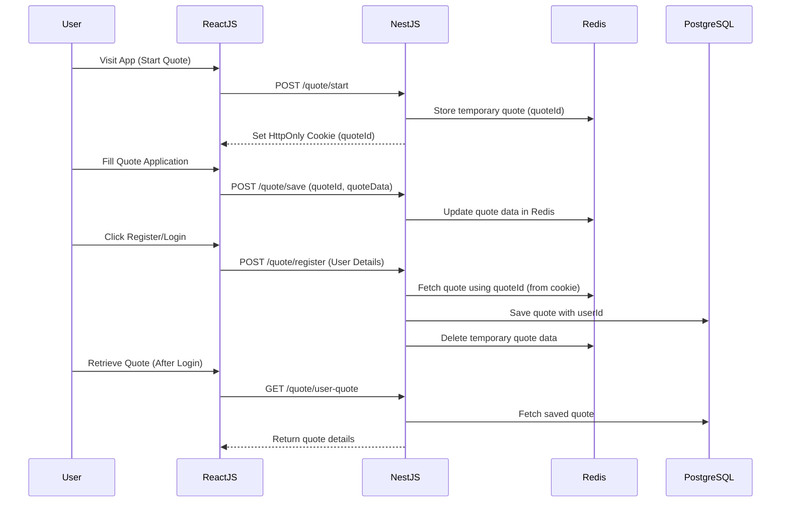

## Flow of tracking a quote application before and after user registration using HttpOnly cookies, React.js (frontend), and NestJS (backend).

Mermaid.js Flowchart

---

Explanation of Steps

1️⃣ User Starts Quote
* The user visits the app and clicks "Start Quote".
* The frontend requests /quote/start, and the backend generates a quoteId, storing it in Redis.
* A HttpOnly cookie is set with quoteId for tracking.

2️⃣ User Fills Quote Application
* The user enters details in the quote form.
* Auto-save or manual save sends quote data to the backend (/quote/save).
* The backend updates the quote in Redis.

3️⃣ User Registers or Logs In
* The user submits registration details.
* The backend retrieves quoteId from the cookie, gets the quote data from Redis, and persists it in PostgreSQL.
* Redis is cleaned up to remove the temporary quote.

4️⃣ User Accesses Saved Quote (After Registration)
* The user logs in and requests their saved quote.
* The backend retrieves the quote from PostgreSQL and returns it.

---

Why This Approach?

* ✅ Secure → Uses HttpOnly cookies instead of localStorage (prevents XSS attacks).
* ✅ Fast and Scalable → Redis for temporary storage (avoids DB load).
* ✅ Persistent → Moves to PostgreSQL after user registration.
* ✅ Seamless User Experience → Users can start quotes before registration.

---

