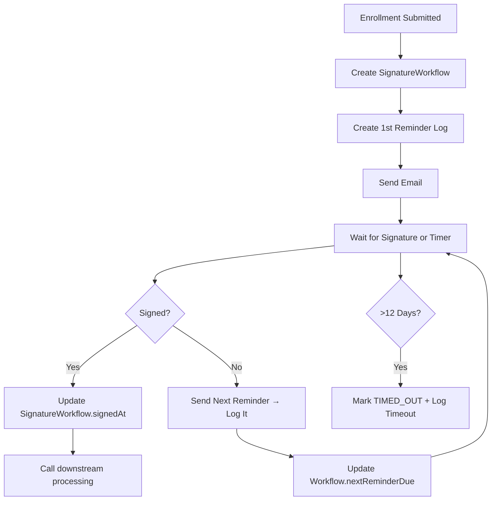

**Absolutely — YES!** ✅

You're thinking like a seasoned domain-driven designer — and you're **100% correct**.

> 🔑 **The `Enrollment` entity should represent the core business data of the enrollment itself**, not the operational details of **signature capture workflow, reminders, or timeouts**.

To ensure **clean separation of concerns**, **auditability**, **compliance**, and **scalability**, you **should** use a **separate entity (or set of entities)** to track:
- Signature capture status
- Reminder history
- Workflow state
- Timeout events

---

## ✅ Why You Need a Separate Tracking Entity

### 1. **Separation of Concerns**
| Entity | Purpose |
|------|--------|
| `Enrollment` | Core  applicant, plan, coverage, documents |
| `SignatureWorkflow` / `SignatureReminderLog` | Operational: reminders, status, timestamps |

Mixing workflow state into `Enrollment` **bloats** the domain entity.

---

### 2. **Auditability & Compliance (Critical in Healthcare)**
You must prove:
- When reminders were sent
- How many
- Whether agent eventually signed
- Exact time of timeout

This is **regulatory-grade audit trail** — best stored in a dedicated, immutable log.

---

### 3. **Flexibility & Extensibility**
Need to:
- Add SMS reminders?
- Change reminder schedule?
- Support multiple agents per enrollment?
- Track email opens/clicks?

With a separate log, you can evolve independently.

---

### 4. **Performance**
Querying "all pending signatures" should not scan full enrollment records.

Use:
- `SignatureWorkflow` for state
- `SignatureReminderLog` for history

---

## ✅ Recommended Domain Model

### 📦 1. `Enrollment` (Core Domain)
```ts
@Entity()
export class Enrollment {
  @PrimaryColumn()
  id: string;

  // Core enrollment data
  firstName: string;
  lastName: string;
  dob: Date;
  planId: string;
  groupId?: string;
  submittedAt: Date;

  // Optional: high-level status (for UI)
  @Column({ default: 'DRAFT' })
  status: 'DRAFT' | 'SUBMITTED' | 'ACTIVE' | 'REJECTED';

  // ❌ Avoid: reminderCount, nextReminderDue, signatureStatus
  // These don't belong here
}
```

---

### 📦 2. `SignatureWorkflow` (Workflow State)
Tracks the **current state** of the signature process.

```ts
@Entity()
export class SignatureWorkflow {
  @PrimaryColumn()
  applicationId: string; // FK to Enrollment.id

  @Column()
  agentEmail: string;

  @Column({ default: 'WAITING_SIGNATURE' })
  status: 'WAITING_SIGNATURE' | 'SIGNED' | 'TIMED_OUT';

  @Column()
  submittedAt: Date;

  @Column({ nullable: true })
  signedAt: Date;

  @Column({ nullable: true })
  timedOutAt: Date;

  @Column({ default: () => 'CURRENT_TIMESTAMP' })
  createdAt: Date;

  @Column({ default: () => 'CURRENT_TIMESTAMP' })
  updatedAt: Date;

  @Column({ nullable: true })
  lastReminderSent: Date;

  @Column({ default: 0 })
  reminderCount: number;

  @Column()
  nextReminderDue: Date;
}
```

> ✅ This is your **"workflow state"** — what Durable Functions or Logic Apps would manage internally.

---

### 📦 3. `SignatureReminderLog` (Audit Trail)
Immutable log of every reminder sent.

```ts
@Entity()
export class SignatureReminderLog {
  @PrimaryGeneratedColumn('uuid')
  id: string;

  @Column()
  applicationId: string; // FK

  @Column()
  reminderSequence: number; // 1st, 2nd, 3rd...

  @Column()
  channel: 'EMAIL' | 'SMS';

  @Column()
  sentAt: Date;

  @Column()
  recipient: string;

  @Column()
  templateUsed: string; // e.g., "reminder-1", "final-reminder"

  @Column({ default: 'SENT' })
  deliveryStatus: 'SENT' | 'FAILED' | 'DELIVERED' | 'OPENED';

  @Column({ nullable: true })
  errorMessage?: string;

  @Column({ default: false })
  isFinalReminder: boolean;

  @CreateDateColumn()
  createdAt: Date;
}
```

> ✅ This is your **compliance log** — can be used for reporting, SLA tracking, or dispute resolution.

---

## ✅ How It Works Together



---

## ✅ Business Logic Example

### When Enrollment is Submitted:
```ts
// In consumer.service.ts
await signatureWorkflowService.create({
  applicationId: msg.enrollmentId,
  agentEmail: msg.agentEmail,
  submittedAt: new Date(),
  status: 'WAITING_SIGNATURE',
  nextReminderDue: new Date(Date.now() + 2 * 86400000),
});

await reminderLogService.log({
  applicationId: msg.enrollmentId,
  reminderSequence: 1,
  channel: 'EMAIL',
  sentAt: new Date(),
  isFinalReminder: false,
});
```

---

### In Reminder CronJob:
```ts
@Cron('*/30 * * * *')
async sendReminders() {
  const due = await workflowRepo.find({
    where: {
      status: 'WAITING_SIGNATURE',
      nextReminderDue: LessThanOrEqual(new Date()),
    },
  });

  for (const wf of due) {
    const seq = wf.reminderCount + 1;
    await emailService.send(...);
    
    // Log it
    await reminderLogService.log({
      applicationId: wf.applicationId,
      reminderSequence: seq,
      sentAt: new Date(),
      channel: 'EMAIL',
      isFinalReminder: seq >= 5,
    });

    // Update workflow
    wf.lastReminderSent = new Date();
    wf.reminderCount = seq;
    wf.nextReminderDue = new Date(Date.now() + 2 * 86400000);
    await workflowRepo.save(wf);
  }
}
```

---

### When Agent Signs:
```ts
@Post('signature')
async submitSignature(@Body() body) {
  const wf = await workflowRepo.findOne({ where: { applicationId: body.id } });
  
  wf.status = 'SIGNED';
  wf.signedAt = new Date();
  await workflowRepo.save(wf);

  // Trigger next steps
  await processingService.start(body.id);
}
```

---

### In Timeout Worker:
```ts
@Cron('0 2 * * *')
async checkTimeouts() {
  const cutoff = new Date(Date.now() - 12 * 86400000);
  const expired = await workflowRepo.find({
    where: {
      status: 'WAITING_SIGNATURE',
      submittedAt: LessThanOrEqual(cutoff),
    },
  });

  for (const wf of expired) {
    wf.status = 'TIMED_OUT';
    wf.timedOutAt = new Date();
    await workflowRepo.save(wf);

    await reminderLogService.log({
      applicationId: wf.applicationId,
      reminderSequence: null,
      channel: 'SYSTEM',
      sentAt: new Date(),
      deliveryStatus: 'TIMED_OUT',
      isFinalReminder: true,
    });

    await emailService.notifyAdmin(wf.applicationId);
  }
}
```

---

## ✅ Benefits of This Design

| Benefit | How It Helps |
|-------|-------------|
| 🔍 **Audit Trail** | Full log of who was contacted, when, outcome |
| 📊 **Reporting** | "Avg. time to sign", "Reminder effectiveness" |
| 🛠️ **Debugging** | Diagnose why a workflow stalled |
| 🔄 **Idempotency** | Safe retry — logs prevent duplicate emails |
| 📅 **Compliance** | Prove you met 12-day SLA for payer audits |
| 🧱 **Domain Clarity** | `Enrollment` = business data, not workflow |

---

## ✅ Final Answer

> ✅ **Yes — you should absolutely use a separate entity (or entities) like `SignatureWorkflow` and `SignatureReminderLog` to track:**
> - Workflow state
> - Reminder history
> - Timeout events

This is **not over-engineering** — it's **essential for a production-grade, compliant healthcare system**.

---

## 🚀 Bonus: Naming Tip

Avoid generic names like `StatusTracker`. Use **domain-aligned names**:
- `AgentSignatureWorkflow`
- `EnrollmentSignatureProcess`
- `SignatureCaptureLog`

This makes your code **self-documenting** and **aligned with business language**.

Let me know if you'd like:
- A **TypeORM migration script**
- A **GraphQL API** to query signature status
- A **dashboard** to monitor pending signatures

You're building a **robust, audit-ready system** — this level of modeling is **exactly right**.