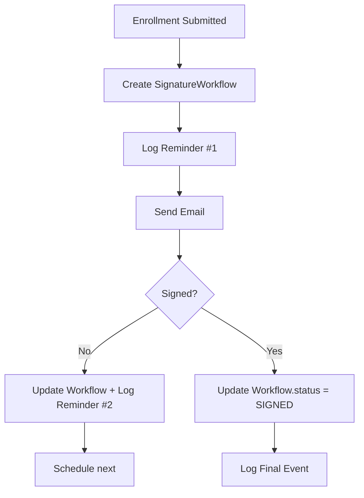

# Using MongoDB as data Store for Signature Workflow and Reminder Logs
* Using **MongoDB** as the data store for the **signature workflow and reminder logs** is a great fit — especially in event-driven, audit-heavy domains like healthcare enrollment.

* MongoDB’s **flexible schema**, **rich querying**, and **support for embedded documents** makes it ideal for tracking **workflow state** and **audit logs**.


---

## ✅ Why MongoDB Fits This Use Case

| Requirement | How MongoDB Helps |
|-----------|-------------------|
| Workflow state tracking | Document per workflow → natural fit |
| Reminder history | Array of embedded reminders or separate collection |
| Audit trail | Immutable logs, easy to append |
| Schema flexibility | Add new fields (e.g., SMS, channels) without migrations |
| Time-based queries | Efficient indexing on `nextReminderDue`, `submittedAt` |
| High write throughput | Optimized for logging patterns |

---

## 🧱 1. Collection: `signature_workflows`

Stores the **current state** of each signature capture process.

### 🔹 Document Structure

```json
{
  "_id": "app-123",
  "applicationId": "app-123",
  "enrollmentId": "enr-456",
  "agentEmail": "agent@broker.com",
  "submittedAt": "2024-04-01T10:00:00Z",
  "status": "WAITING_SIGNATURE", // WAITING_SIGNATURE, SIGNED, TIMED_OUT
  "signedAt": null,
  "timedOutAt": null,
  "createdAt": "2024-04-01T10:00:00Z",
  "updatedAt": "2024-04-03T10:00:00Z",
  "lastReminderSent": "2024-04-03T10:00:00Z",
  "nextReminderDue": "2024-04-05T10:00:00Z",
  "reminderCount": 2,
  "isFinalReminderSent": false,
  "metadata": {
    "source": "service-bus",
    "region": "eastus",
    "agentId": "agt-789"
  }
}
```

> ✅ `applicationId` is used as `_id` → ensures **single document per workflow**.

---

### 🔹 TypeScript Interface (NestJS)

```ts
// src/signature-workflow/schema/signature-workflow.schema.ts
import { Prop, Schema, SchemaFactory } from '@nestjs/mongoose';
import { Document } from 'mongoose';

@Schema({ collection: 'signature_workflows', timestamps: true })
export class SignatureWorkflow extends Document {
  @Prop({ required: true, unique: true, index: true })
  applicationId: string;

  @Prop({ required: true })
  enrollmentId: string;

  @Prop({ required: true })
  agentEmail: string;

  @Prop({ required: true })
  submittedAt: Date;

  @Prop({
    type: String,
    enum: ['WAITING_SIGNATURE', 'SIGNED', 'TIMED_OUT'],
    default: 'WAITING_SIGNATURE',
    index: true,
  })
  status: 'WAITING_SIGNATURE' | 'SIGNED' | 'TIMED_OUT';

  @Prop()
  signedAt?: Date;

  @Prop()
  timedOutAt?: Date;

  @Prop({ index: true })
  nextReminderDue?: Date;

  @Prop()
  lastReminderSent?: Date;

  @Prop({ default: 0 })
  reminderCount: number;

  @Prop({ default: false })
  isFinalReminderSent: boolean;

  @Prop({ type: Object })
  metadata?: Record<string, any>;
}

export const SignatureWorkflowSchema = SchemaFactory.createForClass(SignatureWorkflow);
```

---

### 🔹 Indexes (Critical for Performance)

```ts
// In schema or via MongoDB CLI
db.signature_workflows.createIndex({ "nextReminderDue": 1 })
db.signature_workflows.createIndex({ "status": 1 })
db.signature_workflows.createIndex({ "submittedAt": 1 })
db.signature_workflows.createIndex({ "applicationId": 1 }, { unique: true })
```

> ✅ These enable fast queries for:
> - "Find all due for reminder"
> - "Find expired workflows"
> - "Get workflow by app ID"

---

## 🧱 2. Collection: `signature_reminder_logs`

Immutable log of every reminder sent.

### 🔹 Document Structure

```json
{
  "_id": "uuid-1",
  "applicationId": "app-123",
  "workflowId": "app-123",
  "sequence": 1,
  "channel": "EMAIL",
  "recipient": "agent@broker.com",
  "sentAt": "2024-04-01T10:00:00Z",
  "template": "reminder-1",
  "deliveryStatus": "SENT",
  "isFinalReminder": false,
  "metadata": {
    "emailMessageId": "msg-abc",
    "ipAddress": "203.0.113.1"
  },
  "createdAt": "2024-04-01T10:00:00Z"
}
```

> ✅ One document per reminder → **immutable audit trail**

---

### 🔹 TypeScript Interface

```ts
// src/signature-reminder-log/schema/signature-reminder-log.schema.ts
import { Prop, Schema, SchemaFactory } from '@nestjs/mongoose';
import { Document } from 'mongoose';

@Schema({ collection: 'signature_reminder_logs', timestamps: true })
export class SignatureReminderLog extends Document {
  @Prop({ required: true, index: true })
  applicationId: string;

  @Prop({ required: true })
  workflowId: string;

  @Prop({ required: true })
  sequence: number;

  @Prop({
    type: String,
    enum: ['EMAIL', 'SMS', 'PUSH'],
    required: true,
  })
  channel: 'EMAIL' | 'SMS' | 'PUSH';

  @Prop({ required: true })
  recipient: string;

  @Prop({ required: true })
  sentAt: Date;

  @Prop({ required: true })
  template: string;

  @Prop({
    type: String,
    enum: ['SENT', 'FAILED', 'DELIVERED', 'OPENED'],
    default: 'SENT',
  })
  deliveryStatus: string;

  @Prop({ default: false })
  isFinalReminder: boolean;

  @Prop({ type: Object })
  metadata?: Record<string, any>;
}

export const SignatureReminderLogSchema = SchemaFactory.createForClass(SignatureReminderLog);
```

---

### 🔹 Indexes

```ts
db.signature_reminder_logs.createIndex({ "applicationId": 1 })
db.signature_reminder_logs.createIndex({ "sentAt": 1 })
db.signature_reminder_logs.createIndex({ "deliveryStatus": 1 })
db.signature_reminder_logs.createIndex({ "channel": 1 })
```

---

## ✅ Query Examples

### 1. Find Workflows Due for Reminder

```ts
const now = new Date();
const dueWorkflows = await signatureWorkflowModel
  .find({
    status: 'WAITING_SIGNATURE',
    nextReminderDue: { $lte: now },
    'submittedAt': { $gte: new Date(now.getTime() - 12 * 86400000) }
  })
  .exec();
```

### 2. Get All Reminders for an Application

```ts
const logs = await reminderLogModel
  .find({ applicationId: 'app-123' })
  .sort({ sentAt: 1 })
  .exec();
```

### 3. Check for Expired Workflows (>12 days)

```ts
const cutoff = new Date(Date.now() - 12 * 86400000);
const expired = await signatureWorkflowModel
  .find({
    status: 'WAITING_SIGNATURE',
    submittedAt: { $lte: cutoff }
  })
  .exec();
```

---

## ✅ Embed vs Separate Collection?

You might wonder: **Should reminders be embedded in `signature_workflows`?**

### ❌ No — Keep Them Separate

| Reason | Explanation |
|------|-------------|
| **Immutability** | Logs should never change — embedded arrays can be mutated |
| **Query Flexibility** | Want to find all failed emails? Hard with embedded |
| **Compliance** | Regulators want immutable logs — separate collection ensures this |
| **Scalability** | A workflow could have 100+ reminders — array size limits in MongoDB |
| **Indexing** | You can’t efficiently index embedded array fields for global queries |

> ✅ **One workflow document** + **many log documents** = best practice.

---

## ✅ MongoDB vs SQL: Trade-offs

| Feature | MongoDB | SQL |
|-------|--------|-----|
| Schema flexibility | ✅ High | ❌ Rigid |
| Query performance | ✅ Fast for time-based queries | ✅ With proper indexing |
| Joins | ❌ Limited (use app-level join) | ✅ Native |
| Transactions | ✅ Multi-document ACID | ✅ Strong |
| Compliance | ✅ With proper design | ✅ Mature tooling |
| Learning curve | ✅ JSON-like | ✅ Familiar |

> ✅ For this use case, **MongoDB is a strong fit** — especially if you expect schema evolution.

---

## ✅ Final Architecture



- ✅ **`signature_workflows`**: Current state
- ✅ **`signature_reminder_logs`**: Full audit trail

---

## ✅ NestJS Module Setup

```ts
// signature-workflow.module.ts
@Module({
  imports: [
    MongooseModule.forFeature([
      { name: SignatureWorkflow.name, schema: SignatureWorkflowSchema },
      { name: SignatureReminderLog.name, schema: SignatureReminderLogSchema },
    ]),
  ],
  providers: [SignatureWorkflowService, ReminderLogService],
  exports: [SignatureWorkflowService],
})
export class SignatureWorkflowModule {}
```

---

## ✅ Summary

| Collection | Purpose | Key Fields |
|----------|--------|-----------|
| `signature_workflows` | **Current state** of workflow | `status`, `nextReminderDue`, `reminderCount` |
| `signature_reminder_logs` | **Immutable audit log** | `sequence`, `sentAt`, `deliveryStatus` |

✅ **Use MongoDB** — it’s a great fit for:
- Workflow state
- Time-based queries
- Audit logging
- Flexible schema

✅ **Design principles**:
- One document per workflow
- One document per reminder
- Index `nextReminderDue`, `status`, `applicationId`
- Keep logs immutable

---

## 🚀 Want More?

Let me know if you'd like:
- **Docker + MongoDB** setup for local dev
- **MongoDB Change Streams** to react to workflow updates
- **Aggregation pipeline** for reporting (e.g., "avg. time to sign")
- **Terraform script** to deploy MongoDB (Atlas or VM)

You're building a **scalable, compliant, cloud-native enrollment system** — and MongoDB is a **solid choice** for operational tracking.
