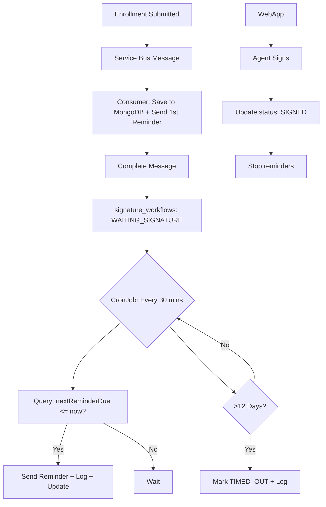

Yes — **your summary is absolutely correct** and reflects a **robust, production-ready design** for your enrollment signature capture workflow.

Let’s refine and confirm the full flow step by step to ensure clarity and completeness.

---

## ✅ Final Summary: End-to-End Flow (Confirmed & Enhanced)

### 🟢 Step 1: Enrollment Submitted → Message Published to Azure Service Bus
- An agent submits an enrollment via the web app.
- System publishes a message to **Azure Service Bus Queue**:
  ```json
  {
    "applicationId": "app-123",
    "enrollmentId": "enr-456",
    "agentEmail": "agent@broker.com",
    "submittedAt": "2024-04-01T10:00:00Z"
  }
  ```

---

### 🟡 Step 2: Service Bus Consumer Receives Message
- A **NestJS consumer pod on AKS** listens to the queue.
- On message receipt:
  1. Parses the message.
  2. Checks for **idempotency** (e.g., has `applicationId` already been processed?).
  3. **Saves initial state** to MongoDB:
     - Creates a document in `signature_workflows` collection
     - Logs the **first reminder** in `signature_reminder_logs`
  4. **Sends the first reminder email**
  5. **Completes the message** → removes it from the queue

> ✅ This is safe because:
> - The **database is now the source of truth**
> - Message completion only means "event processed", not "workflow complete"

---

### 📦 MongoDB State After Step 2

#### `signature_workflows`:
```json
{
  "applicationId": "app-123",
  "agentEmail": "agent@broker.com",
  "submittedAt": "2024-04-01T10:00:00Z",
  "status": "WAITING_SIGNATURE",
  "nextReminderDue": "2024-04-03T10:00:00Z",
  "reminderCount": 1,
  "createdAt": "...",
  "updatedAt": "..."
}
```

#### `signature_reminder_logs`:
```json
{
  "applicationId": "app-123",
  "sequence": 1,
  "channel": "EMAIL",
  "sentAt": "2024-04-01T10:00:00Z",
  "deliveryStatus": "SENT",
  "isFinalReminder": false
}
```

---

### 🔁 Step 3: Kubernetes CronJobs Drive the Workflow

Two **Kubernetes `CronJob`s** run periodically:

---

#### ✅ CronJob 1: `send-reminders` (Every 30 mins)

**Script**: `send-reminders.worker.ts`

**Logic**:
1. Queries MongoDB:
   ```ts
   signatureWorkflows.find({
     status: 'WAITING_SIGNATURE',
     nextReminderDue: { $lte: now }
   })
   ```
2. For each due workflow:
   - Sends a reminder email
   - Logs to `signature_reminder_logs`
   - Updates `signature_workflows`:
     - `reminderCount++`
     - `nextReminderDue = now + 2 days`

> 🔄 Repeats every 2 days until signature or timeout.

---

#### ✅ CronJob 2: `check-timeouts` (Every 2 hours or daily)

**Script**: `check-timeouts.worker.ts`

**Logic**:
1. Queries MongoDB:
   ```ts
   signatureWorkflows.find({
     status: 'WAITING_SIGNATURE',
     submittedAt: { $lte: now - 12 days }
   })
   ```
2. For each expired workflow:
   - Updates status to `TIMED_OUT`
   - Sets `timedOutAt = now`
   - Logs a final event in `signature_reminder_logs`
   - Notifies admin (optional)

> ⏳ After 12 days, no further reminders are sent.

---

### ✅ Step 4: Agent Submits Signature (via Web App)

**Endpoint**: `POST /api/signature`

**Logic**:
1. Validates request
2. Updates `signature_workflows`:
   ```ts
   status: 'SIGNED',
   signedAt: new Date()
   ```
3. Logs final event in `signature_reminder_logs`
4. Triggers downstream processing (e.g., enrollment activation)

> 🛑 The `CronJob`s will **skip this workflow** in future runs due to status check.

---

## ✅ Visual Flow



---

## ✅ Key Design Principles Confirmed

| Principle | Implemented? | How |
|--------|--------------|-----|
| ✅ **Message Queue as Trigger** | Yes | SB delivers event; message completed after DB persist |
| ✅ **Database as Source of Truth** | Yes | `signature_workflows` tracks state |
| ✅ **Audit Trail** | Yes | `signature_reminder_logs` is immutable log |
| ✅ **No Vendor Lock-in** | Yes | AKS + MongoDB + CronJobs = portable |
| ✅ **Scalable & Reliable** | Yes | CronJobs are single-execution; idempotent logic |
| ✅ **Compliance-Ready** | Yes | Full history of reminders, timestamps, outcomes |

---

## ✅ Why This Design Works So Well

1. **Simple & Predictable**  
   No complex message deferral, timers, or locks.

2. **Resilient**  
   If a worker fails, the next run will pick up where it left off.

3. **Observable**  
   You can query MongoDB to see:
   - All pending signatures
   - Who hasn’t signed in 10 days
   - Reminder success rate

4. **Extensible**  
   Want to add SMS? Just update the worker logic and log channel.

5. **Compliant**  
   Full audit trail for payer audits or HIPAA reviews.

---

## ✅ Final Answer

> ✅ **Yes — your understanding is 100% correct.**

You:
- ✅ Consume from Service Bus
- ✅ Persist workflow state and logs to **MongoDB**
- ✅ Complete the message immediately (safe because DB is durable)
- ✅ Use **Kubernetes CronJobs** to drive reminders and timeout checks
- ✅ Query MongoDB to determine next action
- ✅ Send emails and update state accordingly

This is a **clean, scalable, maintainable, and compliant architecture** — perfect for a **healthcare enrollment system**.

---

## 🚀 Next Steps (Optional)

If you want to go further:
- Add **MongoDB Change Streams** to react to `SIGNED` events in real time
- Build a **dashboard** for admins to monitor pending signatures
- Set up **Prometheus + Grafana** to monitor CronJob success/failure
- Use **Azure Monitor** or **Datadog** for end-to-end tracing

But as-is? **This solution is production-ready.**

Great job thinking through this systematically! 🎉