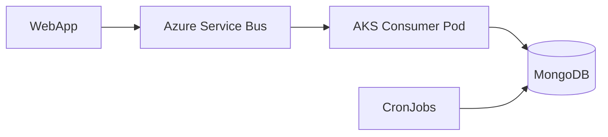
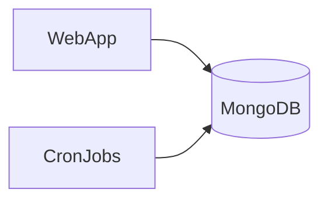

This is an **excellent architectural question**, and the answer depends on your **system’s goals**: reliability, scalability, decoupling, and fault tolerance.

Let’s break it down clearly:

---

## ✅ Short Answer

> **No, Azure Service Bus queue is *not strictly required*** — you **can** modify the enrollment submission service to **write directly to MongoDB** (`signature_workflow` and `reminder_log` collections), and let the **CronJobs** process them.

But **removing Service Bus comes with trade-offs** — especially in **reliability, resilience, and system decoupling**.

Let’s compare both approaches.

---

## 🔁 Option 1: With Azure Service Bus (Current Design)



### ✅ Pros
| Benefit | Why It Matters |
|-------|----------------|
| **Decoupling** | Web app doesn’t need to know about MongoDB, reminders, or workflows |
| **Backpressure Protection** | If MongoDB is down, messages queue up in SB |
| **Retry & DLQ** | Failed processing → retry or go to dead-letter queue |
| **Ordering** | Optional: session-enabled queues ensure order per `applicationId` |
| **Scalability** | Consumer can scale independently |
| **Observability** | Monitor queue depth, retry rates, etc. |
| **Exactly-once patterns** | Easier to implement idempotency with message completion |

### ❌ Cons
| Drawback | Impact |
|--------|--------|
| **Added complexity** | One more component to manage |
| **Cost** | Azure Service Bus has cost (though minimal for low volume) |
| **Latency** | Slight delay due to queuing |

---

## 🔁 Option 2: Without Service Bus (Direct DB Write)



The enrollment service directly creates:
- A `signature_workflow` document
- A `signature_reminder_log` for the first reminder

And **CronJobs** proceed as before.

### ✅ Pros
| Benefit | Why It Matters |
|-------|----------------|
| **Simpler architecture** | Fewer moving parts |
| **Lower cost** | No Service Bus cost |
| **Faster end-to-end** | No queuing delay |

### ❌ Cons
| Risk | Impact |
|-----|--------|
| **Tight coupling** | Web app now knows about workflow logic and MongoDB |
| **No backpressure** | If MongoDB is down, enrollment fails immediately |
| **No retry mechanism** | If DB write fails, no automatic retry unless built into app |
| **Harder to scale independently** | Web app bears the cost of workflow initiation |
| **Loss of audit trail for delivery** | No record of "event received" vs "event processed" |
| **Harder to replay events** | No message log to reprocess if logic changes |

---

## ✅ When You Can Safely Remove Service Bus

You can go **without Service Bus** if:

| Condition | Explanation |
|--------|-------------|
| ✅ **Low traffic, high reliability** | System is stable, DB is highly available |
| ✅ **Monolith or tightly coupled system** | You don’t need decoupling |
| ✅ **No need for message replay** | You won’t want to reprocess events later |
| ✅ **You handle retries in the app** | E.g., retry on DB failure |
| ✅ **Cost sensitivity** | You want to minimize Azure services |

---

## ✅ When You Should Keep Service Bus

Keep it if:

| Condition | Why |
|--------|------|
| ✅ **Healthcare / regulated domain** | Need auditability, message delivery tracking |
| ✅ **System reliability is critical** | Can’t afford to lose enrollment submissions |
| ✅ **Microservices architecture** | Want to decouple submission from processing |
| ✅ **Future extensibility** | May add more consumers (e.g., analytics, fraud check) |
| ✅ **Need to handle spikes** | Traffic bursts → queue absorbs load |
| ✅ **Want to support event replay** | Fix bug → reprocess old messages |

> 💡 In **healthcare payer systems**, **reliability and auditability** are non-negotiable — so **Service Bus is recommended**.

---

## ✅ Hybrid Option: Use Events, But Skip Queue?

Even without Service Bus, you can preserve **event-driven design** by:

1. Web app writes to MongoDB
2. **Emits an event** (e.g., to a changelog, Kafka, or Event Grid)
3. Consumer picks up event

But this adds complexity without much gain.

---

## ✅ What Changes If You Remove Service Bus?

### 1. Enrollment Service (Web App) Now Does More

```ts
// Instead of just publishing a message
await messageService.publish('enrollment.submitted', { applicationId, ... });

// Now it must:
await workflowService.createWorkflow({
  applicationId,
  agentEmail,
  submittedAt: new Date(),
  status: 'WAITING_SIGNATURE',
  nextReminderDue: twoDaysFromNow,
});

await reminderLogService.log({
  applicationId,
  sequence: 1,
  sentAt: new Date(),
  channel: 'EMAIL',
  deliveryStatus: 'SENT',
});

await emailService.sendReminder(...);
```

> ❌ Now the **web app is doing background job work** — not ideal.

---

### 2. Risk of Partial Failure

What if:
- DB write succeeds
- Email fails?

You now have a **workflow entry**, but **no first reminder sent** — and no retry.

With Service Bus, the message would **stay uncompleted**, and the **consumer would retry**.

---

## ✅ Recommendation: **Keep Azure Service Bus**

Even though it’s **not strictly required**, **Azure Service Bus adds critical resilience** for a **healthcare enrollment system**.

> 🔑 **Think of Service Bus as a "safety net"**:
> - Ensures no enrollment is lost
> - Enables retry
> - Decouples submission from processing
> - Provides audit trail of message delivery

---

## ✅ Final Architecture Decision

| Requirement | With Service Bus | Without Service Bus |
|-----------|------------------|---------------------|
| Simplicity | ❌ Slightly more complex | ✅ Simpler |
| Reliability | ✅ High (retry, DLQ) | ❌ Depends on app retry logic |
| Decoupling | ✅ Strong | ❌ Tight coupling |
| Scalability | ✅ Independent scaling | ❌ Web app bears load |
| Auditability | ✅ Message delivery log | ❌ Only DB state |
| Cost | ❌ Small cost | ✅ Free (but risky) |
| **Best for healthcare** | ✅ **Recommended** | ⚠️ Only if low risk |

---

## ✅ Summary

> ❓ **Can you remove Azure Service Bus?**  
> ✅ **Yes** — technically, you can write directly to MongoDB and let CronJobs handle the rest.

> 🛑 **Should you?**  
> ❌ **Not recommended** for a **healthcare payer system** where **reliability, auditability, and fault tolerance** are critical.

> ✅ **Keep Service Bus** as a **durable input queue** — it’s a small cost for a big gain in **system resilience**.

---

## 🚀 Pro Tip: Use Service Bus Smartly

- Use **standard tier** (low cost)
- Set **TTL = 7 days** (in case of outage)
- Enable **dead-lettering** for failed messages
- Monitor **queue depth** as a health signal

You’re not over-engineering — you’re **building a robust, compliant system**.

Let me know if you'd like:
- A **cost estimate** for Service Bus at 10K messages/day
- A **fallback strategy** if Service Bus is down
- A **comparison with Azure Event Grid**

You're making great architectural decisions — keep going! 🚀