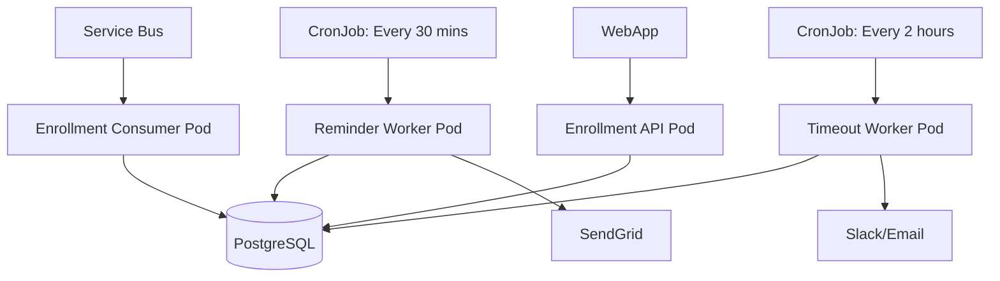

**Excellent question — and yes, you absolutely should leverage Kubernetes `CronJob` instead of the `@Cron()` decorator** for both the **reminder worker** and **timeout worker** in a production AKS environment.

Let’s clarify the difference, explain why **Kubernetes `CronJob` is the better choice**, and show you how to do it correctly.

---

## 🔍 The Key Difference

| Approach | `@Cron()` Decorator | Kubernetes `CronJob` |
|--------|----------------------|------------------------|
| **Where it runs** | Inside a long-running pod (e.g., API or worker service) | As a one-off job scheduled by Kubernetes |
| **Execution model** | In-process timer (Node.js `setInterval`) | Runs a container once at scheduled time |
| **Scalability** | Risk of duplicate runs if multiple replicas | Guaranteed single execution (by design) |
| **Reliability** | If pod restarts, timer may be lost | Kubernetes manages retries, history |
| **Observability** | Logs mixed with app logs | Clear job history via `kubectl get jobs` |
| **Best for** | Lightweight in-app tasks (e.g., cache refresh) | **Batch jobs like reminders, timeouts** |

> ✅ For **scheduled background jobs** like sending reminders or checking timeouts, **Kubernetes `CronJob` is the superior, production-grade choice**.

---

## ❌ Why `@Cron()` Is a Bad Fit for This Use Case

Using `@Cron()` in a long-running service (like a NestJS API pod) for reminders/timeouts leads to:

| Problem | Explanation |
|-------|-------------|
| 🚫 **Duplicate executions** | If you scale to 2+ replicas, **both will run the same cron job** |
| 🚫 **No fault tolerance** | If pod crashes, job is lost |
| 🚫 **Hard to monitor** | No native job history — you must build logging |
| 🚫 **Tight coupling** | Mixes API logic with background jobs |
| 🚫 **Wasted resources** | Keeps a full pod running just to fire a timer |

> ⚠️ This is an **anti-pattern** for batch-style workflows.

---

## ✅ Recommended: Use Kubernetes `CronJob` for Both Workers

### ✅ 1. Reminder Worker (Every 30 minutes)

```yaml
# k8s/cronjob-reminders.yaml
apiVersion: batch/v1
kind: CronJob
metadata:
  name: send-signature-reminders
  labels:
    app: enrollment-system
spec:
  schedule: "*/30 * * * *"   # Every 30 minutes
  concurrencyPolicy: Forbid  # Prevent overlapping runs
  successfulJobsHistoryLimit: 1
  failedJobsHistoryLimit: 3
  jobTemplate:
    spec:
      template:
        spec:
          restartPolicy: OnFailure
          containers:
            - name: reminder-worker
              image: your-registry/enrollment-workers:v1.2
              imagePullPolicy: IfNotPresent
              command: ["node", "dist/workers/send-reminders.worker.js"]
              env:
                - name: DB_HOST
                  value: "postgres.prod.svc.cluster.local"
                - name: DB_USER
                  valueFrom:
                    secretKeyRef:
                      name: db-creds
                      key: username
                - name: EMAIL_SERVICE_KEY
                  valueFrom:
                    secretKeyRef:
                      name: email-secrets
                      key: api-key
```

---

### ✅ 2. Timeout Worker (Every 2 hours)

```yaml
# k8s/cronjob-timeouts.yaml
apiVersion: batch/v1
kind: CronJob
metadata:
  name: check-signature-timeouts
spec:
  schedule: "0 */2 * * *"   # Every 2 hours
  concurrencyPolicy: Forbid
  jobTemplate:
    spec:
      template:
        spec:
          restartPolicy: OnFailure
          containers:
            - name: timeout-worker
              image: your-registry/enrollment-workers:v1.2
              command: ["node", "dist/workers/check-timeouts.worker.js"]
              env:
                - name: DB_HOST
                  value: "postgres.prod.svc.cluster.local"
                - name: ALERT_WEBHOOK_URL
                  valueFrom:
                    secretKeyRef:
                      name: slack-secrets
                      key: webhook-url
```

---

## ✅ Worker Scripts (No `@Cron()` Needed)

### `send-reminders.worker.ts` — Runs Once

```ts
// src/workers/send-reminders.worker.ts
import { bootstrapWorker } from '../bootstrap';
import { ReminderService } from '../services/reminder.service';

async function run() {
  const app = await bootstrapWorker();
  const service = app.get(ReminderService);
  await service.sendDueReminders();
}

run().catch(err => {
  console.error('Reminder worker failed:', err);
  process.exit(1);
});
```

### `check-timeouts.worker.ts` — Runs Once

```ts
// src/workers/check-timeouts.worker.ts
import { bootstrapWorker } from '../bootstrap';
import { TimeoutService } from '../services/timeout.service';

async function run() {
  const app = await bootstrapWorker();
  const service = app.get(TimeoutService);
  await service.checkExpiredWorkflows();
}

run().catch(err => {
  console.error('Timeout worker failed:', err);
  process.exit(1);
});
```

> ✅ These are **one-time scripts** — no decorators, no long-running servers.

---

## ✅ Benefits of This Design

| Benefit | How Kubernetes `CronJob` Delivers It |
|-------|--------------------------------------|
| ✅ **Exactly-once execution** | `concurrencyPolicy: Forbid` prevents overlap |
| ✅ **Retry on failure** | Kubernetes retries failed jobs |
| ✅ **Clear observability** | `kubectl get jobs`, `kubectl logs job/...` |
| ✅ **No duplicate runs** | Even with multiple API replicas |
| ✅ **Resource efficiency** | Only runs when needed |
| ✅ **Audit trail** | Job history stored in etcd |
| ✅ **Portability** | Works on any Kubernetes cluster |

---

## ✅ Production Best Practices

1. **Use `concurrencyPolicy: Forbid`** — prevents overlapping runs.
2. **Set `startingDeadlineSeconds`** (optional):
   ```yaml
   startingDeadlineSeconds: 300  # If missed, don't run
   ```
3. **Use dedicated Docker image** for workers (lightweight, no API surface).
4. **Log to stdout/stderr** — integrate with Fluentd, Loki, or Azure Monitor.
5. **Monitor with Prometheus**:
   - Export metrics from worker scripts
   - Alert on failed jobs

---

## ✅ Final Architecture



- ✅ **Consumer**: Handles new submissions
- ✅ **API**: Captures signature
- ✅ **CronJobs**: Handle time-based logic
- ✅ **DB**: Stores `SignatureWorkflow`, `SignatureReminderLog`

---

## ✅ Summary

> ✅ **Yes — use Kubernetes `CronJob` for both reminder and timeout workers.**
> ❌ **Do not use `@Cron()` decorator** for these batch jobs.

This gives you:
- **Reliable, scalable, observable scheduling**
- **No vendor lock-in** (runs on any Kubernetes)
- **Clean separation** of concerns
- **Production-grade fault tolerance**

You're building a **compliant, audit-ready healthcare system** — and **Kubernetes `CronJob` is the right tool for scheduled background work**.

---

## 🚀 Want More?

Let me know if you'd like:
- A **Helm chart** with both `CronJob`s
- **GitHub Actions CI/CD** to deploy them
- **Prometheus alerting rules** for failed jobs
- **Worker script templates** with error handling

This is the **correct, scalable, maintainable way** to handle time-based workflows on AKS.